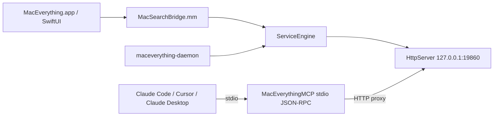

# HTTP / MCP / Daemon / CLI 架构说明

## 1. 文档范围

- 本文说明 MacEverything 对外服务面的实现。
- 范围包括 HTTP 服务、守护进程生命周期、MCP stdio 工具、管理操作、打包部署、本地安全与并发风险。
- 本文基于当前 worktree 的源码锚点编写。
- 关键入口包括 `ServiceEngine`、`HttpServer`、`maceverything-daemon`、`MacEverythingMCP`。
- GUI 与 daemon 共享同一套核心编排层 `ServiceEngine`：`MacEverything/Core/ServiceEngine.h:30-32`。
- HTTP 服务默认监听本机回环地址 `127.0.0.1`：`MacEverything/Core/HttpServer.cpp:102-106`。
- MCP 进程不是独立索引器，而是通过 HTTP 代理访问本地服务：`MacEverything/CLI/mcp_main.cpp:1-6`。
- daemon 是独立 CLI 入口，可启动索引与 HTTP 服务：`MacEverything/CLI/daemon_main.cpp:1-4`。

## 2. 总体拓扑

- GUI 侧通过 Bridge 初始化核心服务。
- Bridge 中设置 HTTP 端口为 `19860`：`MacEverything/Bridge/MacSearchBridge.mm:103-118`。
- daemon 侧通过 CLI 参数和默认值配置服务：`MacEverything/CLI/daemon_main.cpp:27-32`。
- MCP 侧通过 stdio 接收 JSON-RPC 请求，再映射到 HTTP GET：`MacEverything/CLI/mcp_main.cpp:326-366`。
- HTTP 是 GUI、daemon、MCP 之间复用实时索引状态的本地服务边界。

## 3. ServiceEngine 生命周期

- `ServiceEngine` 是 GUI 与 daemon 共享的编排层。
- 配置结构中包含 `httpPort`。
- `httpPort = 0` 表示不自动启动 HTTP：`MacEverything/Core/ServiceEngine.h:21-28`。
- GUI 将 `httpPort` 设置为 `19860`：`MacEverything/Bridge/MacSearchBridge.mm:103-118`。
- GUI 场景下，HTTP 会在索引可用后自动启动：`MacEverything/Core/ServiceEngine.cpp:254-258`。
- 自动启动还出现在增量启动路径中：`MacEverything/Core/ServiceEngine.cpp:316-319`。
- daemon 侧没有依赖 `config.httpPort` 自动启动。
- daemon 会先调用 `startIncremental`，再显式启动 HTTP：`MacEverything/CLI/daemon_main.cpp:181-190`。
- 关闭时，`ServiceEngine::shutdown()` 先停止 HTTP。
- 之后等待后台工作，并执行最终持久化压实：`MacEverything/Core/ServiceEngine.cpp:537-569`。
- 这个顺序可以避免关闭过程中继续接收新的 HTTP 请求。
- 但已经进入处理中的请求仍取决于当前同步处理逻辑完成。

## 4. HTTP 服务器行为

- HTTP 服务绑定在 `127.0.0.1`。
- 绑定地址限制了局域网或公网直接访问：`MacEverything/Core/HttpServer.cpp:102-106`。
- 端口被占用时，会针对 `EADDRINUSE` 重试。
- 当前重试上限为 5 次：`MacEverything/Core/HttpServer.cpp:107-125`。
- HTTP 服务使用一个 accept 线程。
- 每个连接在 accept 循环中同步处理：`MacEverything/Core/HttpServer.cpp:142-145`。
- 同步连接处理入口位于 `handleClient` 路径：`MacEverything/Core/HttpServer.cpp:184-201`。
- 请求解析是轻量级 raw socket HTTP 解析。
- 首次读取大小为 8 KB。
- socket 接收超时为 5 秒。
- 请求体读取上限为 64 KB：`MacEverything/Core/HttpServer.cpp:205-246`。
- 该实现适合本机轻量服务。
- 该实现不是通用 HTTP 框架。
- 因此路由、JSON 解析、并发控制都应按本地可信边界评估。

## 5. HTTP 路由总览

| 方法 | 路径 | 用途 | 主要风险级别 | 源码锚点 |
|---|---|---|---|---|
| GET | `/api/search` | 文件名与路径搜索 | 低 | `MacEverything/Core/HttpServer.cpp:321-322` |
| GET | `/api/search/content` | 内容搜索 | 中 | `MacEverything/Core/HttpServer.cpp:323-324` |
| GET | `/api/recent` | 最近修改文件 | 低 | `MacEverything/Core/HttpServer.cpp:325-326` |
| GET | `/api/status` | 索引状态 | 低 | `MacEverything/Core/HttpServer.cpp:327-328` |
| GET | `/api/health` | 健康检查 | 低 | `MacEverything/Core/HttpServer.cpp:329-330` |
| GET | `/api/content/config` | 读取内容索引配置 | 中 | `MacEverything/Core/HttpServer.cpp:331-332` |
| POST | `/api/content/config` | 修改内容索引配置 | 高 | `MacEverything/Core/HttpServer.cpp:343-344` |
| POST | `/api/index/rebuild` | 触发全量文件索引重建 | 高 | `MacEverything/Core/HttpServer.cpp:339-340` |
| POST | `/api/content/rebuild` | 触发内容索引重建 | 高 | `MacEverything/Core/HttpServer.cpp:341-342` |
| GET | `/api/ai/status` | AI 翻译器状态 | 中 | `MacEverything/Core/HttpServer.cpp:333-334` |
| POST | `/api/ai/translate` | 自然语言查询翻译 | 中 | `MacEverything/Core/HttpServer.cpp:345-346` |
| GET | `/api/ai/prompt` | 读取 AI prompt | 中 | `MacEverything/Core/HttpServer.cpp:335-336` |
| POST | `/api/ai/prompt` | 修改 AI prompt 来源 | 高 | `MacEverything/Core/HttpServer.cpp:347-348` |

## 6. 搜索类 HTTP API

### 6.1 `/api/search`

- 方法为 GET。
- 主要参数包括 `q`、`limit`、`trigram`。
- 该接口用于文件名和路径搜索。
- `limit` 最大可到 10000：`MacEverything/Core/HttpServer.cpp:360-430`。
- 返回结果包含耗时等 metadata：`MacEverything/Core/HttpServer.cpp:360-430`。
- 该接口是 MCP `search_files` 的底层依赖：`MacEverything/CLI/mcp_main.cpp:326-366`。
- 从产品语义看，它适合快速定位文件名、路径或扩展名。
- 从安全语义看，它会暴露本机文件路径信息给任意本机调用方。

### 6.2 `/api/search/content`

- 方法为 GET。
- 主要参数包括 `q` 和 `limit`。
- 该接口用于内容搜索。
- 返回结果包含内容片段 snippets：`MacEverything/Core/HttpServer.cpp:432-478`。
- 该接口是 MCP `search_content` 的底层依赖：`MacEverything/CLI/mcp_main.cpp:326-366`。
- 内容搜索比文件名搜索敏感。
- 它可能向本机其他进程暴露文件内容片段。
- 因此该接口虽然只绑定 localhost，也应被视为中风险接口。

### 6.3 `/api/recent`

- 方法为 GET。
- 参数包括 `limit`。
- 该接口返回最近修改记录：`MacEverything/Core/HttpServer.cpp:480-514`。
- 该接口是 MCP `recent_files` 的底层依赖：`MacEverything/CLI/mcp_main.cpp:326-366`。
- 最近文件列表能反映用户活动。
- 因此它不只是普通状态信息，也具有隐私含义。

### 6.4 `/api/status`

- 方法为 GET。
- 该接口返回文件记录数量和内容索引数量：`MacEverything/Core/HttpServer.cpp:516-526`。
- 该接口是 MCP `index_status` 的底层依赖：`MacEverything/CLI/mcp_main.cpp:326-366`。
- 该接口适合健康诊断与自动化测试。
- 它不会直接返回文件路径或内容。
- 但索引规模仍可能暴露用户机器的数据体量。

### 6.5 `/api/health`

- 方法为 GET。
- 返回 `{status:"ok"}` 形式的健康检查：`MacEverything/Core/HttpServer.cpp:528-530`。
- daemon 启动测试会检查该接口：`tests/test_daemon_startup.h:78-129`。
- 这是最适合作为进程存活探测的接口。
- 它不应承载索引是否完整的语义。
- 索引状态应由 `/api/status` 表达。

## 7. 管理类 HTTP API

### 7.1 `/api/index/rebuild`

- 方法为 POST。
- 该接口触发全量索引重建：`MacEverything/Core/HttpServer.cpp:536-542`。
- daemon 中对应的管理回调会直接运行 full scan：`MacEverything/CLI/daemon_main.cpp:132-165`。
- 这是高成本操作。
- 它可能造成 CPU、磁盘 I/O 和电量压力。
- 它当前没有认证保护。
- 因此任意本机进程都可以触发重建：`MacEverything/Core/HttpServer.cpp:339-348`。

### 7.2 `/api/content/rebuild`

- 方法为 POST。
- 该接口触发内容索引重建：`MacEverything/Core/HttpServer.cpp:544-550`。
- daemon 中对应管理回调会运行内容重建：`MacEverything/CLI/daemon_main.cpp:132-165`。
- 内容重建通常比文件名索引更重。
- 它会读取更多文件内容。
- 它也会放大隐私与资源占用风险。
- 建议后续将该接口纳入本地 admin token 或显式用户确认机制。

### 7.3 `/api/content/config`

- GET 用于读取内容索引配置。
- POST 用于修改 indexed extensions 和 max file size：`MacEverything/Core/HttpServer.cpp:552-634`。
- 修改配置会改变后续内容索引范围。
- 这属于持久化行为或准持久化行为。
- 因此它是管理接口，不应与普通只读查询等同。
- daemon 管理回调也支持内容配置变更：`MacEverything/CLI/daemon_main.cpp:132-165`。
- 当前风险点是没有本地认证。
- 任何本机进程都可以扩大内容索引范围。
- 例如把更多扩展纳入内容索引可能增加隐私暴露面。

### 7.4 `/api/ai/translate`

- 方法为 POST。
- 该接口执行自然语言查询翻译：`MacEverything/Core/HttpServer.cpp:640-715`。
- 它属于 AI 辅助查询入口。
- 如果底层模型或 prompt 可变，该接口行为会受 prompt 与模型状态影响。
- 它不是 MCP 当前暴露的四个工具之一。
- MCP 当前工具集中没有直接调用 `/api/ai/translate`：`MacEverything/CLI/mcp_main.cpp:313-320`。

### 7.5 `/api/ai/status`

- 方法为 GET。
- 该接口返回模型和 translator 状态：`MacEverything/Core/HttpServer.cpp:717-745`。
- 它适合 UI 诊断。
- 也可用于排查 AI 查询不可用问题。
- 但它与 Swift `AIServiceClient` 的默认端口和路径存在不一致风险。

### 7.6 `/api/ai/prompt`

- GET 用于读取 translator prompt 来源。
- POST 用于设置 translator prompt 来源：`MacEverything/Core/HttpServer.cpp:747-784`。
- 修改 prompt 会影响查询翻译行为。
- 这是高权限管理操作。
- 当前同样没有认证：`MacEverything/Core/HttpServer.cpp:339-348`。
- 本地恶意进程可以通过 prompt 修改影响 AI 查询解释。
- 建议后续把 prompt 修改与普通 HTTP 查询隔离。

## 8. daemon 生命周期

- daemon 二进制用法为 `maceverything-daemon [--port PORT] [--root PATH] [--cache-dir PATH] [--log-dir PATH]`：`MacEverything/CLI/daemon_main.cpp:1-4`。
- 默认端口为 `19860`：`MacEverything/CLI/daemon_main.cpp:27-32`。
- 默认 root 为 `/`：`MacEverything/CLI/daemon_main.cpp:27-32`。
- 默认 cache 和 log 目录来自 `PathUtils`：`MacEverything/CLI/daemon_main.cpp:46-69`。
- daemon 注册 SIGINT 和 SIGTERM dispatch source。
- 收到信号后调用 `ServiceEngine::shutdown()`。
- 随后执行 logger shutdown：`MacEverything/CLI/daemon_main.cpp:76-100`。
- daemon 配置管理回调。
- 管理回调包括 full scan、content rebuild、content config mutation：`MacEverything/CLI/daemon_main.cpp:132-165`。
- daemon 启动增量索引后显式启动 HTTP：`MacEverything/CLI/daemon_main.cpp:181-190`。
- 最后进入 `dispatch_main()`。
- 这让 FSEvents 和 GCD 生命周期保持运行：`MacEverything/CLI/daemon_main.cpp:192-194`。
- daemon 启动测试覆盖启动、`/api/health` 检查、SIGTERM 优雅退出：`tests/test_daemon_startup.h:2-4`。
- 该测试还验证 HTTP 健康接口在 daemon 模式下可用：`tests/test_daemon_startup.h:78-129`。

## 9. MCP stdio 协议

- `MacEverythingMCP` 是 stdio JSON-RPC 2.0 服务。
- 它代理到本机 HTTP 服务。
- 默认目标是 localhost 的 MacEverything HTTP 服务：`MacEverything/CLI/mcp_main.cpp:1-6`。
- MCP spec version 为 `2025-03-26`：`MacEverything/CLI/mcp_main.cpp:23-30`。
- MCP 主循环读取 newline-delimited stdio：`MacEverything/CLI/mcp_main.cpp:486-521`。
- 支持的方法包括 `initialize`、`ping`、`tools/list`、`tools/call`。
- 未知方法返回 JSON-RPC `-32601`：`MacEverything/CLI/mcp_main.cpp:387-447`。
- 当前显式不支持或忽略 batch 请求：`MacEverything/CLI/mcp_main.cpp:486-521`。
- 这与 MCP 实现对 batch 的兼容预期存在差距：`MacEverything/CLI/mcp_main.cpp:504-510`。

## 10. MCP 工具列表

| 工具名 | 作用 | HTTP 映射 | 源码锚点 |
|---|---|---|---|
| `search_files` | 搜索文件名和路径 | `GET /api/search` | `MacEverything/CLI/mcp_main.cpp:313-320` |
| `search_content` | 搜索文件内容 | `GET /api/search/content` | `MacEverything/CLI/mcp_main.cpp:313-320` |
| `recent_files` | 获取最近文件 | `GET /api/recent` | `MacEverything/CLI/mcp_main.cpp:313-320` |
| `index_status` | 获取索引状态 | `GET /api/status` | `MacEverything/CLI/mcp_main.cpp:313-320` |

- 工具调用统一从 `tools/call` 进入：`MacEverything/CLI/mcp_main.cpp:387-447`。
- 工具调用再映射到 HTTP GET：`MacEverything/CLI/mcp_main.cpp:326-366`。
- MCP 没有直接暴露 rebuild 或 config 修改工具。
- 因此 MCP 默认能力比 HTTP 管理面更窄。
- 但 MCP 依赖 HTTP 服务已经启动。
- 如果 GUI 或 daemon 未运行，MCP 工具无法获得有效结果。
- MCP 协议测试覆盖 initialize、tools/list、ping、notifications、未知工具、非法 JSON：`tests/test_mcp_protocol.h:45-87`。
- 测试在二进制缺失时会跳过：`tests/test_mcp_protocol.h:118-181`。

## 11. MCP 客户端配置

- 应用内支持 Claude Code、Cursor、Claude Desktop 的 MCP 配置文件：`MacEverything/App/MCPConfigManager.swift:2-25`。
- MCP 二进制路径由 app 可执行目录加 `MacEverythingMCP` 推导：`MacEverything/App/MCPConfigManager.swift:30-34`。
- 启用时写入 `mcpServers.maceverything.command`。
- `args` 为空数组：`MacEverything/App/MCPConfigManager.swift:52-62`。
- 禁用时删除该 server。
- 如果 `mcpServers` 为空，也会删除整个 `mcpServers` 节点：`MacEverything/App/MCPConfigManager.swift:64-75`。
- UI 菜单和状态栏菜单暴露 MCP 开关：`MacEverything/App/MacEverythingApp.swift:54-60`。
- AppDelegate 中也有对应状态菜单项：`MacEverything/App/AppDelegate.swift:95-96`。
- 菜单动作连接到配置管理逻辑：`MacEverything/App/AppDelegate.swift:137-141`。
- 该设计让用户从 GUI 中完成 MCP 客户端接入。
- 它也意味着 app bundle 中的 `MacEverythingMCP` 路径必须稳定。

## 12. 打包与部署

- Xcode 工程定义了 `MacEverythingMCP` tool target。
- 该 target 源文件为 `mcp_main.cpp`：`MacEverything.xcodeproj/project.pbxproj:457-470`。
- 工程中也包含对应构建文件配置：`MacEverything.xcodeproj/project.pbxproj:571-576`。
- app target 依赖 `MacEverythingMCP`：`MacEverything.xcodeproj/project.pbxproj:420-433`。
- app target 会把 `MacEverythingMCP` copy 到 bundle 的 executables 区域：`MacEverything.xcodeproj/project.pbxproj:193-204`。
- `make dmg` 会构建 bundle 并校验自包含：`Makefile:72-87`。
- dylib bundling 脚本会扫描 `Contents/MacOS` 下所有 Mach-O：`scripts/bundle-dylibs.sh:71-76`。
- 因此复制进去的 `MacEverythingMCP` 也会纳入 dylib、rpath、签名处理：`scripts/bundle-dylibs.sh:113-155`。
- bundle verification 会扫描 `Contents/MacOS` 和 `Contents/Frameworks`。
- 校验目标包括是否仍链接 `/opt/homebrew`、`/usr/local`、`/opt/local`：`scripts/verify-bundle.sh:4-6`。
- 具体扫描逻辑位于 verify 脚本：`scripts/verify-bundle.sh:22-35`。
- daemon 由 Makefile 单独构建。
- daemon 不属于 DMG app-copy 路径：`Makefile:33-36`。
- 这意味着 app 内 MCP 的部署链路比较完整。
- 但 standalone daemon 还需要单独考虑 dylib 打包或静态链接策略。
- 当前 bundle 脚本目标是 `.app`，不是 daemon 裸二进制：`scripts/bundle-dylibs.sh:21-28`。

## 13. 本地安全风险

- HTTP 服务仅绑定 `127.0.0.1`。
- 这降低了远程网络暴露：`MacEverything/Core/HttpServer.cpp:102-106`。
- 但 loopback 不等于认证。
- 任意本机进程都可以访问这些 HTTP API。
- 管理端点当前没有鉴权。
- 受影响端点包括 index rebuild、content rebuild、content config、AI translate、AI prompt：`MacEverything/Core/HttpServer.cpp:339-348`。
- 文件名搜索会暴露路径。
- 内容搜索会暴露内容片段。
- 最近文件会暴露用户行为。
- 内容配置修改会改变索引范围。
- prompt 修改会改变 AI 查询解释。
- rebuild 操作可被滥用为本地资源消耗攻击。
- 最小改进是增加本地 admin token。
- 更稳妥的改进是区分只读端口和管理端口。
- 也可以让高风险管理操作只由 GUI 内部调用，并要求用户确认。

## 14. 并发与可用性风险

- HTTP 服务是一个 accept 线程。
- 连接处理是同步的：`MacEverything/Core/HttpServer.cpp:184-201`。
- 长查询可能阻塞后续请求。
- 慢客户端读取或发送请求也可能占用处理路径。
- 5 秒 recv timeout 降低了慢连接长期悬挂风险：`MacEverything/Core/HttpServer.cpp:205-246`。
- 64 KB body cap 降低了大请求体风险：`MacEverything/Core/HttpServer.cpp:205-246`。
- 但这些限制不能替代请求级并发隔离。
- 若 AI 翻译或内容搜索耗时较长，其他 HTTP 调用可能出现排队。
- MCP 又依赖 HTTP。
- 因此 HTTP 阻塞会传导到 Claude Code、Cursor、Claude Desktop 等 MCP 客户端。
- MCP batch 当前被忽略或不支持：`MacEverything/CLI/mcp_main.cpp:504-510`。
- 这可能造成某些 MCP 客户端兼容性问题。
- 后续可考虑线程池、请求队列、只读查询限流、管理操作互斥。

## 15. 已知接口一致性问题

- Swift `AIServiceClient` 默认端口是 `19861`。
- 它保留了旧外部 AI 服务调用路径；当前内置 AI 主路径是 19860 的 `/api/ai/status`、`/api/ai/translate`、`/api/ai/prompt`。
- 当前 `HttpServer` 实际路由是 `/api/ai/status`、`/api/ai/translate`、`/api/ai/prompt`。
- 该不一致见 Swift 客户端：`MacEverything/App/AIServiceClient.swift:41-105`。
- 当前 HTTP 路由见服务端：`MacEverything/Core/HttpServer.cpp:333-348`。
- 如果该客户端仍在使用，AI 功能可能出现连接或路径错误。
- 架构上应统一 AI 服务契约。
- 要么服务端补齐 `19861`、health、stream API。
- 要么 Swift 客户端改为实际的 `19860` 和现有路由。

## 16. 建议的演进方向

- 保留本地 HTTP 加 stdio MCP proxy 的整体设计。
- 该设计复用 GUI 实时索引，避免 MCP 进程重复扫描。
- 为所有管理端点增加本地 admin token。
- 将搜索类只读 API 与 rebuild/config/prompt 类管理 API 分权。
- 对内容搜索、最近文件、prompt 修改增加审计日志。
- 将 HTTP route 注册表显式化，降低手写分支路由维护成本。
- 对 JSON body 使用更严格解析。
- 增加 MCP batch 支持，或在文档和测试中明确声明不支持。
- 给 HTTP 服务增加简单线程池，避免单个慢请求阻塞全部客户端。
- 给 rebuild 和 content rebuild 增加互斥与状态返回。
- daemon 发布前补齐 standalone 二进制的 dylib 自包含方案。
- 统一 Swift AI 客户端与 `HttpServer` 的端口和路径契约。

## 17. 验证覆盖

- daemon 启动测试覆盖二进制启动、HTTP health、SIGTERM 退出：`tests/test_daemon_startup.h:78-129`。
- daemon 测试文件说明了测试目标：`tests/test_daemon_startup.h:2-4`。
- MCP 协议测试覆盖 initialize、tools/list、ping、notifications、未知工具、非法 JSON：`tests/test_mcp_protocol.h:45-87`。
- MCP 测试在 binary missing 时跳过，避免构建环境不完整导致全量失败：`tests/test_mcp_protocol.h:118-181`。
- 当前测试能覆盖基本协议和进程生命周期。
- 仍建议补充管理端点鉴权测试。
- 仍建议补充 MCP batch 行为测试。
- 仍建议补充慢请求或并发请求下的 HTTP 可用性测试。
- 仍建议补充 AIServiceClient 与服务端路由一致性测试。

## 18. 小结

- MacEverything 的外部服务面由本地 HTTP、daemon、MCP stdio 三层组成。
- GUI 与 daemon 共享 `ServiceEngine`，降低了索引状态重复和实现分叉。
- MCP 是轻量 stdio proxy，主要暴露四个只读工具。
- HTTP API 功能更完整，也包含高权限管理操作。
- 当前最大风险不是远程暴露，而是本机任意进程可调用未鉴权管理端点。
- 当前最大并发限制是 HTTP 连接同步处理。
- 当前最大部署差异是 app 内 MCP 已纳入 bundle 链路，而 standalone daemon 尚未纳入 DMG 自包含链路。
- 后续优先级建议为：认证与分权、并发隔离、MCP batch 兼容、AI API 契约统一、daemon 发布自包含。