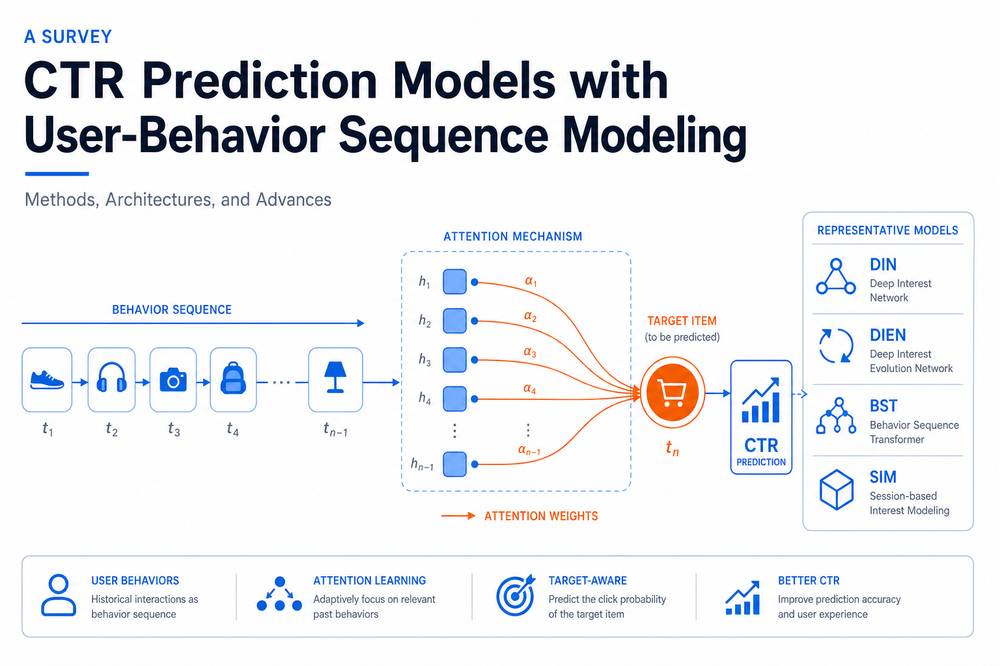
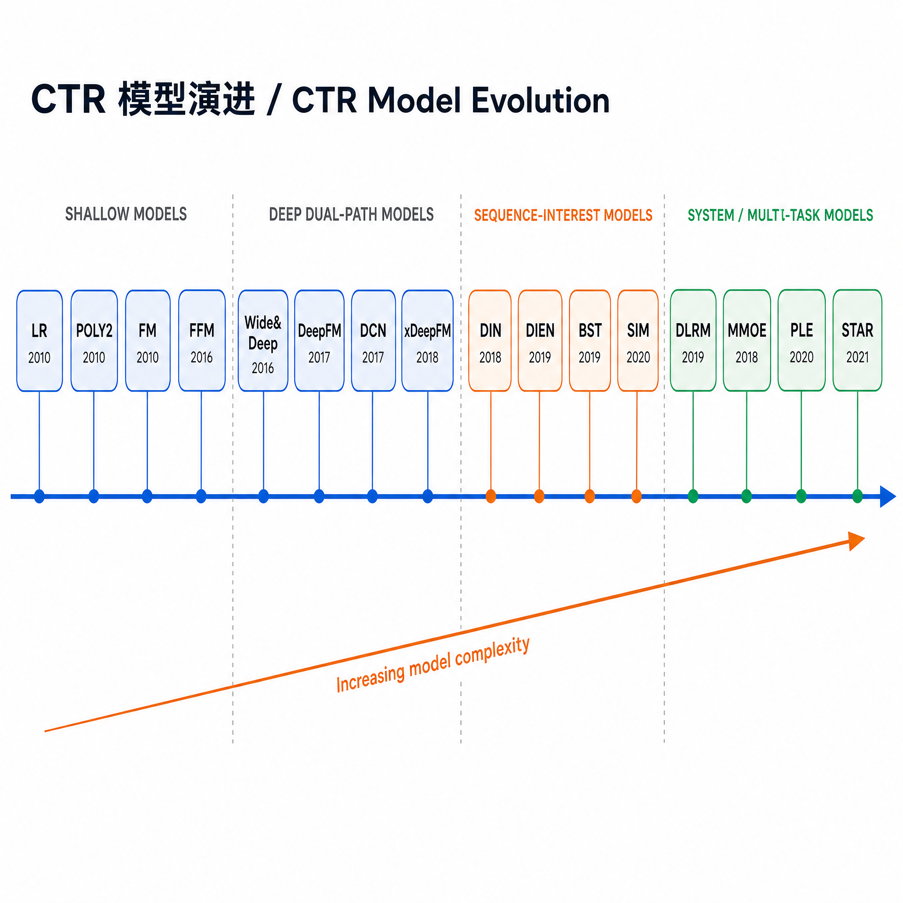

# CTR 模型调研报告

## 目录

1. [CTR 模型背景与问题定义](#1-ctr-模型背景与问题定义)
2. [经典模型演进](#2-经典模型演进)
3. [特征交互方法](#3-特征交互方法)
4. [序列建模方法](#4-序列建模方法)
5. [多任务学习与多场景建模](#5-多任务学习与多场景建模)
6. [前沿方向](#6-前沿方向)
7. [模型对比总结表](#7-模型对比总结表)
8. [总结与展望](#8-总结与展望)

---

## 1. CTR 模型背景与问题定义

### 1.1 什么是 CTR 预估

CTR（Click-Through Rate，点击率）预估是指在给定用户（User）、物品（Item）和上下文（Context）的条件下，预测用户点击某个物品的概率：

$$P(click=1 | user, item, context)$$

这是一个典型的二分类问题，模型输出一个 [0, 1] 之间的概率值，用于排序或过滤候选物品。

### 1.2 应用场景

| 场景 | 具体应用 |
|------|----------|
| 搜索广告 | 预估用户点击某条广告的概率，用于广告排序和计费（CPC） |
| 信息流推荐 | 预估用户对某篇文章/视频的点击概率，用于个性化排序 |
| 电商推荐 | 预估用户点击某商品的概率，结合 CVR 构建完整转化漏斗 |
| 短视频推荐 | 多目标预估（点击、完播、点赞），CTR 是其中核心指标之一 |

### 1.3 核心挑战

1. **高维稀疏特征**：用户和物品的特征通常是高维类别特征（如用户 ID、商品 ID），one-hot 编码后维度极高且极度稀疏。如何在这种条件下有效学习特征表示是核心难题。

2. **特征交互建模**：单一特征的预测能力有限，关键在于建模特征之间的交叉关系。例如"年轻女性"对"美妆品类"的偏好，需要性别×年龄×品类的交叉。如何高效地建模高阶交叉，同时控制参数量和计算复杂度，是 CTR 模型演进的主线。

3. **用户兴趣动态建模**：用户兴趣随时间变化，且对不同候选物品展现不同的兴趣侧面。如何从用户的历史行为序列中提取与当前候选相关的兴趣信号，是近年来研究的重点。

4. **工业部署约束**：线上推理延迟通常要求在 10ms 量级内完成，这限制了模型复杂度。训练数据规模通常在百亿样本级别，要求模型具备良好的可扩展性。

---

## 2. 经典模型演进

本节按时间线介绍 CTR 领域的核心模型，涵盖**浅层线性模型**（LR/POLY2/FM/FFM）、**深度混合模型**（Wide&Deep/DeepFM/DCN/xDeepFM）、**用户行为建模**（DIN/DIEN）以及**工业级架构**（DLRM）。其中，序列建模方法（BST/SIM 等）在第 4 节做专题展开。

### 2.1 Logistic Regression (LR)

**核心思想**：将 CTR 预估建模为线性分类问题，通过手工特征工程构造交叉特征。

$$\hat{y} = \sigma\left(\mathbf{w}^T \mathbf{x} + b\right)$$

其中 $\sigma$ 为 Sigmoid 函数，$\mathbf{x}$ 为特征向量（通常包含大量手工构造的交叉特征）。

**优点**：
- 模型简单，可解释性强
- 训练和推理速度极快，适合大规模在线系统
- 工业界长期的 baseline，Google/Facebook 早期广告系统的核心

**缺点**：
- 依赖手工特征工程，交叉特征的构造需要大量领域知识
- 仅能建模线性关系，无法自动学习特征交互

**洞察**：LR 的瓶颈不在模型本身，而在于特征工程的人力成本和天花板。后续模型的核心动机几乎都是"自动化特征交叉"。

### 2.2 POLY2

**核心思想**：在 LR 基础上显式枚举所有二阶特征交叉，自动建模两两特征的交互。

$$\hat{y} = \sigma\left(\mathbf{w}^T \mathbf{x} + \sum_{i=1}^{n}\sum_{j=i+1}^{n} w_{ij} x_i x_j\right)$$

**优点**：
- 自动建模二阶交叉，减少手工特征工程的负担

**缺点**：
- 参数量为 $O(n^2)$，在高维稀疏场景下参数量爆炸
- 大量交叉对应的样本极少，权重 $w_{ij}$ 难以充分学习（稀疏性问题）
- 无法建模高于二阶的特征交互

**洞察**：POLY2 揭示了一个核心矛盾——直接为每个交叉对分配独立参数在稀疏场景下不可行，这直接催生了 FM 的矩阵分解思路。

### 2.3 Factorization Machines (FM)

**核心思想**：用低维隐向量的内积近似二阶特征交叉的权重，解决 POLY2 的稀疏性和参数量问题。

$$\hat{y} = \sigma\left(w_0 + \sum_{i=1}^{n} w_i x_i + \sum_{i=1}^{n}\sum_{j=i+1}^{n} \langle \mathbf{v}_i, \mathbf{v}_j \rangle x_i x_j\right)$$

其中 $\mathbf{v}_i \in \mathbb{R}^k$ 为特征 $i$ 的隐向量，$k$ 为隐向量维度（通常 8-64）。

关键优化：二阶交叉项可以重写为：

$$\sum_{i=1}^{n}\sum_{j=i+1}^{n} \langle \mathbf{v}_i, \mathbf{v}_j \rangle x_i x_j = \frac{1}{2}\sum_{f=1}^{k}\left[\left(\sum_{i=1}^{n} v_{if} x_i\right)^2 - \sum_{i=1}^{n} v_{if}^2 x_i^2\right]$$

这将时间复杂度从 $O(kn^2)$ 降为 $O(kn)$。

**优点**：
- 参数量 $O(kn)$，远小于 POLY2 的 $O(n^2)$
- 隐向量可以在数据稀疏时也能有效学习（通过共享参数泛化）
- 线性时间复杂度，适合大规模部署

**缺点**：
- 所有特征域共享相同的隐向量维度 $k$，灵活性不足
- 仅建模二阶交叉，高阶交互仍需依赖其他方法

**洞察**：FM 的核心贡献是将"为每个交叉对分配权重"转化为"为每个特征学习隐向量表示"，这种 embedding 的思想后来成为了深度 CTR 模型的基石。可以说，FM 是连接传统机器学习与深度学习 CTR 模型的关键桥梁。

### 2.4 Field-aware Factorization Machines (FFM)

**核心思想**：FM 中每个特征只有一个隐向量，与不同域的特征交互时用同一个表示。FFM 为每个特征在不同域上分配不同的隐向量，增强交互的表达力。

$$\hat{y} = \sigma\left(w_0 + \sum_{i=1}^{n} w_i x_i + \sum_{i=1}^{n}\sum_{j=i+1}^{n} \langle \mathbf{v}_{i,f_j}, \mathbf{v}_{j,f_i} \rangle x_i x_j\right)$$

其中 $\mathbf{v}_{i,f_j}$ 表示特征 $i$ 与域 $f_j$ 交互时的隐向量。

**优点**：
- 比 FM 有更强的表达力，在多个 Kaggle 竞赛中取得优胜
- 考虑了特征域的概念，更符合实际特征组织方式

**缺点**：
- 参数量增加到 $O(knf)$（$f$ 为域数量），存储和计算开销显著增大
- 无法像 FM 一样利用公式化简到线性复杂度，时间复杂度为 $O(kn^2)$
- 工业部署中需要做大量工程优化

**洞察**：FFM 揭示了一个重要观察——特征在不同交互语境下应有不同的表示。这个思想在后续的注意力机制和多头机制中得到了更优雅的体现。

### 2.5 Wide & Deep

**核心思想**（Google, 2016）：将宽线性模型（Wide）和深度神经网络（Deep）联合训练，同时捕获记忆（memorization）和泛化（generalization）能力。

$$\hat{y} = \sigma\left(\mathbf{w}_{wide}^T [\mathbf{x}, \boldsymbol{\phi}(\mathbf{x})] + \mathbf{w}_{deep}^T \mathbf{a}^{(L)} + b\right)$$

其中：
- Wide 部分：$[\mathbf{x}, \boldsymbol{\phi}(\mathbf{x})]$ 为原始特征和手工交叉特征的拼接
- Deep 部分：$\mathbf{a}^{(L)}$ 为多层 DNN 的最后一层输出

**优点**：
- 开创了"双路"架构范式，影响了后续大量模型设计
- Wide 部分保留了可解释性和记忆能力，Deep 部分提供泛化能力
- Google Play 应用推荐中验证了在线效果

**缺点**：
- Wide 部分仍需手工特征工程来构造交叉特征
- Wide 和 Deep 的分工不够清晰，可能存在信息冗余

**洞察**：Wide&Deep 的最大贡献不是模型本身，而是提出了"记忆+泛化"的双路范式。但其 Wide 部分仍依赖手工交叉特征，这直接催生了 DeepFM——用 FM 替换 Wide 来实现全自动化。

### 2.6 DeepFM

**核心思想**（Huawei, 2017）：用 FM 替换 Wide&Deep 中的 Wide 部分，实现端到端学习，无需手工特征工程。

$$\hat{y} = \sigma\left(y_{FM} + y_{DNN}\right)$$

其中：
- FM 部分：$y_{FM} = w_0 + \sum_{i} w_i x_i + \sum_{i}\sum_{j>i} \langle \mathbf{v}_i, \mathbf{v}_j \rangle x_i x_j$
- DNN 部分：输入为所有特征的 embedding 拼接，经过多层全连接网络

关键设计：FM 部分和 DNN 部分共享底层 embedding，减少参数量并实现联合学习。

**优点**：
- 完全端到端，不需要手工特征工程
- FM 负责显式二阶交叉，DNN 负责隐式高阶交叉，分工明确
- 共享 embedding 减少参数量，训练效率高

**缺点**：
- DNN 学到的"高阶交叉"是隐式的，缺乏可控性
- FM 部分只能建模二阶显式交叉

**洞察**：DeepFM 的成功说明"显式低阶交叉 + 隐式高阶交叉"的组合是有效的。但这也引出了一个问题——DNN 真的在学习有意义的高阶交叉吗？DCN 和 xDeepFM 试图回答这个问题。

### 2.7 Deep & Cross Network (DCN)

**核心思想**（Google, 2017）：设计专门的 Cross Network 来显式建模有界高阶特征交叉，替代手工特征工程。

Cross Network 的第 $l+1$ 层：

$$\mathbf{x}_{l+1} = \mathbf{x}_0 \mathbf{x}_l^T \mathbf{w}_l + \mathbf{b}_l + \mathbf{x}_l$$

其中 $\mathbf{x}_0$ 为原始输入，$\mathbf{w}_l, \mathbf{b}_l$ 为该层参数。

每增加一层，交叉阶数增加一阶。$L$ 层 Cross Network 可以建模最高 $L+1$ 阶的特征交叉。

**优点**：
- 显式建模高阶特征交叉，交叉阶数由网络深度控制
- 每层参数量仅为 $O(d)$（$d$ 为输入维度），非常轻量
- 交叉操作保留了 bit-wise 的交互信息

**缺点**：
- DCN-v1 的交叉形式受限——每层输出是 $\mathbf{x}_0$ 的标量倍数加偏置，表达力有限
- 交叉模式是固定的（由 $\mathbf{x}_0$ 决定），缺乏灵活性

DCN-v2 通过将 $\mathbf{w}_l$ 替换为矩阵 $\mathbf{W}_l$ 改进了这一问题：

$$\mathbf{x}_{l+1} = \mathbf{x}_0 \odot (\mathbf{W}_l \mathbf{x}_l + \mathbf{b}_l) + \mathbf{x}_l$$

**洞察**：DCN 提出了一种参数高效的显式交叉范式，但 v1 的"有界交叉"表达力受限的问题值得注意。这提示我们，高阶交叉的"显式"未必等于"有效"——关键在于交叉的表达空间是否足够丰富。

### 2.8 xDeepFM (eXtreme Deep Factorization Machine)

**核心思想**（Microsoft, 2018）：提出 Compressed Interaction Network (CIN)，在 vector-wise 层面显式建模有界高阶特征交叉。

CIN 的核心操作：

$$X_{h,*}^k = \sum_{i=1}^{H_{k-1}} \sum_{j=1}^{m} W_{ij}^{k,h} (X_{i,*}^{k-1} \circ X_{j,*}^0)$$

其中 $\circ$ 为 Hadamard 积，$X^0$ 为原始 embedding 矩阵，$X^k$ 为第 $k$ 层的输出。

**优点**：
- 在 vector-wise（embedding 级别）进行交叉，比 DCN 的 bit-wise 交叉更符合 FM 的语义
- 显式建模高阶交叉，且保持了交叉的可解释性
- 结合 DNN 部分同时捕获显式和隐式交互

**缺点**：
- CIN 的计算复杂度为 $O(mHkD)$，在特征数量大时开销显著
- 实际工业部署中，CIN 的计算成本往往限制了其层数

**洞察**：xDeepFM 揭示了 bit-wise 和 vector-wise 交叉的重要区别。FM 的成功源于 vector-wise 的交叉（内积），而 DCN 退化为 bit-wise 操作损失了这种语义。这为后续设计提供了重要参考。

### 2.9 Deep Interest Network (DIN)

**核心思想**（Alibaba, 2018）：用户兴趣是多样的，对不同候选物品应激活不同的兴趣表示。用注意力机制从历史行为中提取与候选物品相关的兴趣。

$$\mathbf{v}_U = f(\mathbf{v}_A, \mathbf{e}_1, \mathbf{e}_2, ..., \mathbf{e}_H) = \sum_{j=1}^{H} a(\mathbf{e}_j, \mathbf{v}_A) \cdot \mathbf{e}_j$$

其中 $\mathbf{v}_A$ 为候选广告的 embedding，$\mathbf{e}_j$ 为历史行为的 embedding，$a(\cdot)$ 为注意力函数。

注意力函数的设计：

$$a(\mathbf{e}_j, \mathbf{v}_A) = \text{MLP}([\mathbf{e}_j, \mathbf{v}_A, \mathbf{e}_j \odot \mathbf{v}_A, \mathbf{e}_j - \mathbf{v}_A])$$

**优点**：
- 打破了"用一个固定向量表示用户"的范式，引入 candidate-aware 的用户表示
- 注意力权重提供了可解释性——可以看到哪些历史行为与当前候选最相关
- 在阿里巴巴展示广告系统中验证了在线效果

**缺点**：
- 不考虑行为的时序关系，将行为序列视为无序集合
- 注意力机制没有引入位置信息
- 对于长行为序列，计算开销线性增长

**洞察**：DIN 的核心贡献不仅是注意力机制，更是"用户兴趣的多样性"这一认知。传统方法用 sum/mean pooling 压缩行为序列，丢失了兴趣的多面性。DIN 用 target attention 解决了这个问题，但忽略了序列中的时序信号——这正是 DIEN 的动机。

### 2.10 Deep Interest Evolution Network (DIEN)

**核心思想**（Alibaba, 2019）：在 DIN 基础上引入序列建模，显式捕获用户兴趣的演化过程。

两层 GRU 结构：

1. **兴趣抽取层**（Interest Extractor）：用 GRU 建模行为序列，辅以辅助损失确保隐状态捕获兴趣信息。

$$\mathbf{h}_t = \text{GRU}(\mathbf{h}_{t-1}, \mathbf{e}_t)$$

辅助损失：用 $\mathbf{h}_t$ 预测下一个行为 $\mathbf{e}_{t+1}$，正样本为实际的下一个行为，负样本通过采样获得。

2. **兴趣演化层**（Interest Evolution）：用带注意力的 GRU（AUGRU）建模与候选物品相关的兴趣演化。

$$\tilde{\mathbf{h}}_t' = \text{AUGRU}(\tilde{\mathbf{h}}_{t-1}', \mathbf{h}_t, \mathbf{v}_A)$$

AUGRU 通过注意力分数调控更新门，使得与候选无关的行为对兴趣演化的影响被抑制。

**优点**：
- 显式建模兴趣的时间演化，捕获兴趣漂移
- 辅助损失提升了 GRU 隐状态的表征质量
- AUGRU 结合了序列建模和 target attention 的优势

**缺点**：
- GRU 的序列化计算限制了并行性和推理效率
- 对于超长行为序列（数百以上），计算成本高
- 辅助损失的负采样策略对效果有影响，需要仔细调参

**洞察**：DIEN 的设计体现了一个重要原则——不是所有行为都对当前预测有贡献，兴趣的演化是有方向的。AUGRU 的设计思路（用 target attention 引导序列建模）影响了后续的 BST 和 SIM 等工作。但 GRU 的序列化计算也促使了基于 Transformer 的方案（BST）出现。

### 2.11 Deep Learning Recommendation Model (DLRM)

**核心思想**（Meta/Facebook, 2019）：面向工业级推荐系统的统一架构，重点优化稀疏特征和稠密特征的交互方式及系统效率。

架构流程：
1. 稀疏类别特征通过 embedding 表，稠密连续特征通过 MLP（bottom MLP）映射到相同维度
2. 所有特征向量两两做内积，得到交互矩阵
3. 交互结果拼接原始特征，经过 top MLP 输出预测

$$\hat{y} = \sigma\left(\text{MLP}_{top}\left([\mathbf{x}_{dense}', \text{Interact}(\mathbf{e}_1, ..., \mathbf{e}_n, \mathbf{x}_{dense}')]\right)\right)$$

其中 $\text{Interact}$ 为特征间的成对内积。

**优点**：
- 架构简洁统一，系统工程友好
- 明确区分了稀疏和稠密特征的处理方式
- 提出了 embedding 表的模型并行方案，支持超大规模训练
- 开源实现成为推荐系统 benchmark

**缺点**：
- 特征交互仍停留在二阶（内积），高阶依赖 top MLP
- 缺乏对用户行为序列的专门建模
- 所有特征对等地做交互，没有利用领域知识

**洞察**：DLRM 的贡献更多在系统层面而非模型层面。它明确了工业推荐系统的核心瓶颈——embedding 表的存储和通信，而非模型结构本身。这促使业界将更多注意力放在系统优化（混合并行、embedding 压缩）上。

---

## 3. 特征交互方法

特征交互是 CTR 模型的核心问题。根据交互是否在模型设计中被显式建模，可以分为**显式交叉**和**隐式交叉**两大类。

### 3.1 显式交叉

显式交叉在模型结构中直接定义特征的组合方式，交叉的形式和阶数可控。

| 方法 | 交叉形式 | 阶数 | 粒度 | 代表模型 |
|------|----------|------|------|----------|
| 内积 | $\langle \mathbf{v}_i, \mathbf{v}_j \rangle$ | 二阶 | vector-wise | FM, FFM, DLRM |
| Hadamard 积 | $\mathbf{v}_i \circ \mathbf{v}_j$ | 二阶 | vector-wise | PNN（Product-based Neural Network，通过内积/外积层显式建模二阶交互后接 DNN） |
| Cross Network | $\mathbf{x}_0 \mathbf{x}_l^T \mathbf{w}_l$ | $L+1$ 阶 | bit-wise | DCN, DCN-v2 |
| CIN | $W(X^{k-1} \circ X^0)$ | $K+1$ 阶 | vector-wise | xDeepFM |

此外，**AutoInt**（2019）通过多头自注意力机制自动学习特征交互，将每个特征 embedding 作为 token 输入 Transformer 层，实现了可解释的高阶显式交叉。

**核心权衡**：显式交叉的优势在于可控和可解释，但表达空间受限于预定义的交叉形式。bit-wise 交叉（DCN）参数效率高但语义不如 vector-wise 交叉（CIN/FM）清晰。

### 3.2 隐式交叉

隐式交叉依赖 DNN 从数据中自动学习任意复杂的特征组合，不显式定义交叉形式。

**标准 MLP**：

$$\mathbf{a}^{(l+1)} = \text{ReLU}(\mathbf{W}^{(l)} \mathbf{a}^{(l)} + \mathbf{b}^{(l)})$$

所有特征的 embedding 拼接后输入 MLP，理论上可以逼近任意函数（万能近似定理）。

**代表模型**：Wide&Deep（Deep 部分）、DeepFM（DNN 部分）、所有"Deep+X"模型的 Deep 分支。

**核心问题**：DNN 是否真的能有效学习特征交叉？

研究表明，标准 MLP 在学习乘法关系（交叉的本质）方面效率低下——需要大量参数和样本才能近似简单的特征交叉。这解释了为什么"显式交叉 + 隐式交叉"的双路架构（DeepFM、DCN）通常优于纯 DNN 方案。

### 3.3 显式 vs 隐式：如何选择

| 维度 | 显式交叉 | 隐式交叉（DNN） |
|------|----------|-----------------|
| 可控性 | 高——交叉阶数和形式可设计 | 低——黑盒学习 |
| 可解释性 | 高——可以分析特征交互权重 | 低——难以理解学到了什么 |
| 表达能力 | 受限于预设形式 | 理论上无限（足够大的网络） |
| 参数效率 | 高——对交叉结构有归纳偏置 | 低——需要大量参数学习乘法 |
| 实践建议 | 低阶交叉为主 | 高阶非线性为主 |

**实践结论**：两者互补而非替代。工业实践中，"显式低阶交叉 + DNN 隐式高阶交叉"的双路架构是最稳健的选择。

---

## 4. 序列建模方法

用户行为序列蕴含丰富的兴趣信号。从简单池化到复杂的序列模型，建模能力逐步增强。

### 4.1 方法演进

| 方法 | 序列感知 | Target-aware | 长序列支持 | 代表模型 |
|------|---------|-------------|-----------|----------|
| Sum/Mean Pooling | 否 | 否 | 是 | DeepFM 等 |
| Target Attention | 否 | 是 | 中等 | DIN |
| GRU + Attention | 是 | 是 | 中等 | DIEN |
| Transformer | 是 | 是 | 中等 | BST |
| 检索式 | 是 | 是 | 是 | SIM |

### 4.2 Behavior Sequence Transformer (BST)

**核心思想**（Alibaba, 2019）：用 Transformer 替代 GRU 建模用户行为序列，利用自注意力机制捕获行为间的全局依赖。

$$\text{Attention}(Q, K, V) = \text{softmax}\left(\frac{QK^T}{\sqrt{d_k}}\right) V$$

其中行为序列的 embedding 加上位置编码后作为 Transformer 的输入。

**优势对比 DIEN**：
- 自注意力机制可以并行计算，训练效率高
- 直接建模任意两个行为之间的依赖，不受序列距离影响
- 位置编码自然引入了时序信息

**局限**：注意力的计算复杂度为 $O(L^2)$（$L$ 为序列长度），限制了可处理的序列长度。

### 4.3 Search-based Interest Model (SIM)

**核心思想**（Alibaba, 2020）：面对超长用户行为序列（数千到数万），先用高效检索筛选与候选相关的子序列，再用精确模型建模。

两阶段：

1. **General Search Unit (GSU)**：用内积或类别匹配从全量行为中检索 Top-K 相关行为
2. **Exact Search Unit (ESU)**：对 Top-K 行为用 target attention（类似 DIN）或序列模型精确建模

$$\text{GSU}: S_k = \text{TopK}_{b_i \in B} \text{sim}(\mathbf{e}_{b_i}, \mathbf{v}_A)$$
$$\text{ESU}: \mathbf{v}_U = \text{Attention}(S_k, \mathbf{v}_A)$$

**关键价值**：
- 将长序列建模从 $O(L)$ 降为 $O(K)$（$K \ll L$），支持长达数万的行为序列
- GSU 的检索可以离线或异步完成，不增加在线推理延迟
- 在阿里巴巴多个业务中验证了长序列带来的增益

**洞察**：SIM 揭示了 CTR 领域的一个重要趋势——当模型结构趋于成熟，数据的利用深度成为关键变量。能处理更长的行为历史就能捕获更丰富的兴趣信号，这驱动了"检索 + 精排"的两阶段范式。

### 4.4 注意力机制在 CTR 中的应用总结

注意力机制在 CTR 领域有三种主要用法：

1. **Target Attention**（DIN）：以候选物品为 query，从行为序列中检索相关兴趣
2. **Self-Attention**（BST）：行为序列内部的全局依赖建模
3. **Cross-Attention**（部分多模态模型）：不同特征域之间的交互

Target attention 是 CTR 特有且最具影响力的用法——它将推荐问题的本质（"用户对这个物品感不感兴趣"）直接编码到了注意力的 query-key 结构中。

---

## 5. 多任务学习与多场景建模

真实推荐系统通常需要同时预估多个目标（点击、转化、观看时长等），并在多个场景/业务之间复用模型能力。

### 5.1 Mixture-of-Experts (MMOE)

**核心思想**（Google, 2018）：用多个 Expert 网络共享底层表示，每个任务通过独立的 Gate 网络选择性地融合 Expert 输出。

$$\mathbf{f}^k(\mathbf{x}) = \sum_{i=1}^{n} g_i^k(\mathbf{x}) \cdot f_i(\mathbf{x})$$

其中 $f_i$ 为第 $i$ 个 Expert 网络，$g^k$ 为任务 $k$ 的 Gate 网络，$g^k(\mathbf{x}) = \text{softmax}(\mathbf{W}_{g}^k \mathbf{x})$。

**优点**：
- 多任务间自适应地共享和分离表示
- Gate 机制自动学习每个任务应该依赖哪些 Expert
- 当任务相关性较低时仍能保持良好性能（相比 Shared-Bottom）

**缺点**：
- 所有 Expert 被所有任务共享，当任务冲突严重时仍可能相互干扰
- Gate 的 softmax 可能导致所有 Expert 权重趋同（退化为共享）

### 5.2 Progressive Layered Extraction (PLE)

**核心思想**（Tencent, 2020）：在 MMOE 基础上，为每个任务引入专属 Expert，并通过多层渐进式提取建立层间连接。

$$\mathbf{f}^k = \text{Gate}^k([\text{Shared Experts}, \text{Task-k Experts}])$$

多层堆叠：每一层的 Expert 输入包含上一层所有 Expert（共享和专属）的输出。

**对比 MMOE 的改进**：
- 任务专属 Expert 保证了每个任务的独立建模能力
- 多层渐进式提取允许不同层学习不同粒度的共享/专属表示
- "Seesaw Effect"（跷跷板效应）得到显著缓解

**洞察**：PLE 的成功源于对"共享什么、分离什么"这个问题给出了更精细的答案。MMOE 的 all-shared 策略过于粗糙，PLE 通过显式划分 shared/specific Expert 提供了更好的归纳偏置。

### 5.3 STAR (Star Topology Adaptive Recommender)

**核心思想**（Alibaba, 2021）：面向多业务/多场景的统一模型，用星型拓扑结构实现场景间的知识共享。

核心操作——参数的逐元素乘法融合：

$$W_{scene} = W_{shared} \odot W_{specific}$$
$$b_{scene} = b_{shared} + b_{specific}$$

每个场景的 FCN 参数由共享参数和场景专属参数的逐元素乘法得到。

**优点**：
- 一个模型服务所有场景，降低维护成本
- 共享参数学习跨场景通用知识，专属参数捕获场景差异
- 参数融合方式简单高效，易于工业部署

**洞察**：STAR 的逐元素乘法融合是一种"低秩调制"——场景专属参数调制（放大或缩小）共享参数的不同维度。这与 adapter/LoRA 等参数高效微调方法在思路上有相通之处，都是通过少量专属参数调制共享的基础表示。

---

## 6. 前沿方向

### 6.1 大模型在 CTR 中的应用

随着 LLM（大语言模型）的兴起，CTR 领域出现了将大模型能力引入推荐的新趋势：

**主要路径**：

| 路径 | 方法 | 优缺点 |
|------|------|--------|
| 特征增强 | 用 LLM 生成文本特征（商品描述、用户画像摘要），作为 CTR 模型的额外输入 | 简单有效，但增加特征工程成本 |
| 知识蒸馏 | 用 LLM 作为 teacher，将其对用户/物品的理解蒸馏到轻量 CTR 模型（如 KAR） | 可离线处理，不影响推理效率 |
| 端到端预测 | 直接用 LLM 做 CTR 预测，如 P5（统一推荐 prompt 框架）、TALLRec（LLM 微调推荐） | 推理成本极高，目前难以在线部署 |
| Embedding 增强 | 用预训练语言模型的表征增强 item/user embedding | 提升冷启动效果，但需要对齐语义空间 |

**核心挑战**：推理效率。CTR 系统的 QPS 通常在万级以上，而 LLM 的推理成本远超传统 CTR 模型。当前的主流方案是将 LLM 用于离线特征生成或知识蒸馏，避免在线推理瓶颈。

### 6.2 特征工程自动化（AutoML for CTR）

自动化搜索最优的特征交互方式和模型结构：

- **AutoFIS**（Huawei, 2020）：自动选择有效的特征交互对，剪枝无效交叉
- **NASREC**：用神经架构搜索（NAS）设计 CTR 模型的网络结构
- **AutoGroup**：自动发现最优的特征分组方式

**关键洞察**：自动化的价值不仅在于找到更好的模型，更在于减少对领域专家的依赖。在业务快速迭代的场景中，模型的自动优化能力比绝对性能更重要。

### 6.3 图神经网络（GNN）

将用户-物品交互建模为图结构，利用 GNN 学习高阶关联：

- **Fi-GNN**：将特征交互建模为图上的消息传递
- **Graph-Enhanced CTR**：用用户-物品二部图的邻域信息增强 embedding
- **Social-aware CTR**：引入社交关系图建模用户的社交影响力

**适用场景**：社交推荐、冷启动（通过图上的信息传播缓解稀疏性）、跨域推荐。

**局限**：图的构建和更新成本高，实时性不如序列模型。工业部署中通常用于离线预训练 embedding，而非在线推理。

### 6.4 其他前沿方向

- **多模态 CTR**：融合文本、图像、视频等多模态信息，利用预训练多模态模型增强物品表示
- **因果推断**：去除数据中的偏差（位置偏差、曝光偏差），实现更准确的 CTR 预估
- **联邦学习 CTR**：跨平台 / 跨设备协同训练 CTR 模型，保护用户隐私
- **实时特征工程**：基于流式计算的实时特征更新，捕获用户最新行为信号

---

## 7. 模型对比总结表

| 模型 | 年份 | 特征交互方式 | 交互阶数 | 序列建模 | 参数规模 | 部署友好度 | 核心贡献 |
|------|------|-------------|---------|---------|---------|----------|---------|
| LR | - | 无（手工交叉） | 依赖特征工程 | 无 | $O(n)$ | ★★★★★ | 工业 baseline |
| POLY2 | - | 显式枚举 | 二阶 | 无 | $O(n^2)$ | ★★★★ | 自动二阶交叉 |
| FM | 2010 | 隐向量内积 | 二阶 | 无 | $O(kn)$ | ★★★★★ | embedding 范式 |
| FFM | 2016 | 域感知隐向量 | 二阶 | 无 | $O(knf)$ | ★★★ | 域感知交互 |
| Wide&Deep | 2016 | Wide(手工)+Deep(隐式) | 混合 | 无 | 中等 | ★★★★ | 双路范式 |
| DeepFM | 2017 | FM(显式)+DNN(隐式) | 二阶+高阶 | 无 | 中等 | ★★★★ | 端到端双路 |
| DCN | 2017 | Cross Network | $L+1$ 阶 | 无 | $O(dL)$ | ★★★★ | 参数高效交叉 |
| xDeepFM | 2018 | CIN | $K+1$ 阶 | 无 | $O(mHkD)$ | ★★★ | vector-wise 交叉 |
| DIN | 2018 | DNN | 隐式高阶 | Target Attention | 中等 | ★★★★ | 兴趣多样性 |
| DIEN | 2019 | DNN | 隐式高阶 | GRU+AUGRU | 中等 | ★★★ | 兴趣演化 |
| BST | 2019 | DNN | 隐式高阶 | Transformer | 中等 | ★★★ | 并行序列建模 |
| DLRM | 2019 | 成对内积 | 二阶 | 无 | 大（embedding 表） | ★★★★ | 系统级优化 |
| SIM | 2020 | DNN | 隐式高阶 | 检索+Attention | 中等 | ★★★★ | 长序列建模 |
| MMOE | 2018 | 依赖 Expert 结构 | 依赖 Expert | 无 | 中等 | ★★★★ | 多任务 Expert 融合 |
| PLE | 2020 | 依赖 Expert 结构 | 依赖 Expert | 无 | 中大 | ★★★ | 渐进式共享/分离 |
| STAR | 2021 | 参数调制 | 依赖基础模型 | 无 | 中等 | ★★★★ | 多场景统一模型 |

---

## 8. 总结与展望

### 8.1 发展脉络回顾

CTR 模型的发展可以归纳为三条主线：

1. **特征交互主线**：LR → FM → DeepFM → DCN → xDeepFM。核心问题是"如何更高效、更高阶地建模特征交叉"。从手工交叉到自动交叉，从二阶到高阶，从 bit-wise 到 vector-wise，每一步都在追求更好的交叉表达力和参数效率的平衡。

2. **用户建模主线**：Pooling → DIN → DIEN → BST → SIM。核心问题是"如何从用户行为序列中提取更丰富的兴趣信号"。从无序集合到有序序列，从固定表示到 candidate-aware 表示，从短序列到长序列，每一步都在追求更深入的用户理解。

3. **系统架构主线**：单任务 → 多任务（MMOE/PLE）→ 多场景（STAR）。核心问题是"如何在一个模型中高效服务多个业务目标和场景"。

### 8.2 关键洞察

1. **Embedding 是基石**：从 FM 开始，为每个特征学习稠密向量表示成为所有深度 CTR 模型的共同基础。embedding 的质量直接决定了模型上限。

2. **显式+隐式互补**：纯 DNN 难以高效学习特征交叉，纯显式交叉表达力受限。两者的结合是目前最稳健的方案。

3. **数据利用深度 > 模型复杂度**：当模型结构趋于成熟（DeepFM/DCN 级别已足够），能处理更长的行为序列、更丰富的上下文往往比更复杂的模型结构带来更大的收益。

4. **工程约束塑造模型设计**：FM 的线性复杂度化简、SIM 的检索+精排两阶段、DLRM 的模型并行——许多模型创新的驱动力来自工程约束而非纯学术追求。

### 8.3 未来展望

1. **大模型 × CTR 的落地**：当前的主要挑战是推理效率。随着模型压缩和推理加速技术的进步，LLM 的语义理解能力有望更深入地融入 CTR 系统，尤其在冷启动和跨域推荐场景。

2. **统一建模框架**：特征交互、序列建模、多任务学习目前相对独立。未来可能出现像 Transformer 统一 NLP 一样的统一架构，端到端地处理 CTR 中的所有子问题。

3. **实时性与个性化的深化**：随着流式计算和在线学习能力的提升，CTR 模型将更加实时地响应用户的即时兴趣变化，而非依赖小时/天级别的离线更新。

4. **可解释性与可控性**：监管和用户信任的需求推动 CTR 模型走向更可解释的方向。如何在保持模型性能的同时提供可信的推荐理由，是重要的研究方向。
