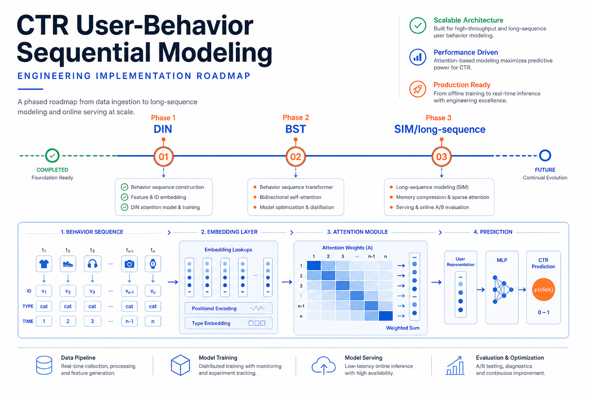

# 推荐CTR模型的序列建模方法规划



## 一、背景与动机

### 1.1 业务背景

在推荐系统中，点击率（CTR）预估是连接用户与内容的核心环节。传统的CTR模型（如Wide&Deep、DeepFM）将用户行为序列通过简单的Sum/Mean Pooling压缩为固定向量，丢失了行为的时序性和与目标物品的相关性差异，导致用户兴趣表征不够精细。

### 1.2 序列建模的价值

用户行为序列天然包含丰富的兴趣演化信息：
- **时序依赖**：用户兴趣随时间动态变化，近期行为往往更能反映当前偏好
- **目标相关性**：不同历史行为对不同候选物品的贡献度差异显著
- **兴趣多样性**：用户可能同时存在多个兴趣方向，需要细粒度建模

### 1.3 核心挑战

| 挑战维度 | 具体问题 | 详细说明 |
|---------|---------|---------|
| 精度 vs 效率 | 更复杂的序列建模能提升精度，但推理延迟和计算资源成正比增长 | 以DIEN为例，AUGRU的串行计算导致推理延迟相比DIN增加3-5倍，但AUC仅提升0.1-0.2%。如何在有限延迟预算内最大化模型收益，是工程落地的核心矛盾。 |
| 短序列 vs 长序列 | 短序列（<50）Attention可直接处理；长序列（>1000）需要检索或哈希等加速策略 | 短序列场景下DIN/BST的O(L)/O(L²)复杂度可接受；但当序列扩展到千级别，全量Attention的计算量和内存占用会呈线性甚至平方增长，必须引入检索（SIM）或哈希（SDIM/ETA）等子线性方法，这涉及完全不同的技术栈和系统架构。 |
| 在线服务约束 | P99延迟通常需控制在10-30ms，限制了模型复杂度 | 推荐系统的在线serving通常要求单次请求在10-30ms内完成模型推理（含特征查询），这意味着模型的FLOPs和内存访问量受到硬约束。过于复杂的序列建模模块可能导致P99延迟超标，触发SLA告警甚至影响用户体验。 |
| 工程落地 | 需要与现有特征工程、训练框架、在线serving架构兼容 | 序列建模的引入不仅是模型层面的改动，还涉及行为数据的实时采集与存储、特征pipeline的改造（变长序列特征的处理）、serving框架对动态shape输入的支持等。这些工程依赖的就绪程度往往决定了方案能否按期落地。 |

---

## 二、主流序列建模方法综述

### 2.1 DIN（Deep Interest Network）

**提出背景**：阿里巴巴，2018年，KDD

**核心思想**：引入Target Attention机制，根据候选物品自适应地为不同历史行为分配权重，替代传统的等权Pooling。

**技术细节**：
- 注意力权重计算：`a(e_i, e_ad) = softmax(MLP([e_i, e_ad, e_i ⊙ e_ad, e_i - e_ad]))`
- 其中 `e_i` 为第i个历史行为的embedding，`e_ad` 为候选物品的embedding
- 实际实现中使用加权求和（非严格softmax归一化），保留了兴趣强度信息
- 引入Dice激活函数，根据数据分布自适应调整激活阈值

**优势**：
- 实现简单，易于在现有DNN模型上改造
- 无需额外的序列模型结构，推理开销小
- 在短序列场景下效果显著

**局限**：
- 仅建模行为与目标的相关性，未考虑行为间的时序演化关系
- 序列长度受限于Attention的O(L)计算复杂度
- 对于兴趣演化和迁移的建模能力不足

### 2.2 DIEN（Deep Interest Evolution Network）

**提出背景**：阿里巴巴，2019年，AAAI

**核心思想**：显式建模用户兴趣的演化过程，引入两层GRU结构实现兴趣提取和兴趣演化。

**技术架构**（两层结构）：

**第一层——兴趣提取层**：
- 使用GRU对行为序列建模：`h_t = GRU(h_{t-1}, e_t)`
- 引入辅助损失（Auxiliary Loss）：用下一个实际点击行为作为正样本，随机采样作为负样本，监督每一步的隐状态
- 辅助损失有效提升了GRU每步隐状态的表征质量

**第二层——兴趣演化层（AUGRU核心设计）**：
- 使用AUGRU（Attention-based GRU with Update gate），这是DIEN最关键的创新
- **核心机制**：用Target Attention分数直接缩放GRU的更新门（update gate），公式为：`u'_t = a_t * u_t`
- 其中 `a_t = softmax(W · [h_t, e_ad])` 是第t步隐状态与目标物品的注意力权重
- **设计意图**：当某一步行为与目标物品不相关时，`a_t`趋近于0，更新门`u'_t`也趋近于0，GRU几乎不更新隐状态——相当于"跳过"了这个不相关行为。反之，高相关性的行为会充分更新隐状态
- 这种设计使得兴趣演化路径只沿着与目标相关的行为子序列推进，有效过滤了噪声行为的干扰
- 最终取最后一步隐状态作为用户兴趣表征

**AUGRU与其他变体对比**：
| 变体 | 注意力融合方式 | 效果 |
|------|-------------|------|
| AIGRU | 直接用注意力分数缩放输入embedding | 信息损失较大 |
| AGRU | 用注意力分数替换GRU更新门 | 过于激进，丢失门控灵活性 |
| AUGRU | 用注意力分数缩放GRU更新门 | 保留门控机制的同时融入target信息，效果最优 |

**优势**：
- 同时建模了兴趣提取和兴趣演化两个过程
- AUGRU设计优雅地将target信息融入序列建模，在不破坏GRU门控机制的前提下实现了目标感知的兴趣演化
- 辅助损失显著提升序列建模质量

**局限**：
- GRU的串行特性导致训练和推理效率较低
- 对超长序列的扩展性差
- 模型结构复杂，调参和工程落地难度较高

### 2.3 BST（Behavior Sequence Transformer）

**提出背景**：阿里巴巴，2019年，DLP-KDD

**核心思想**：将Transformer的Self-Attention机制引入用户行为序列建模，捕捉行为间的全局依赖关系。

**技术细节**：
- 使用1-2层Transformer Block（实践表明更多层收益递减）
- 位置编码采用时间间隔方式：`pos(v_i) = t(v_t) - t(v_i)`，其中`t(v_t)`为推荐请求时间，`t(v_i)`为行为发生时间
- Self-Attention捕获行为间的两两关系，而非仅关注行为与目标的关系
- 输出拼接目标物品embedding后进入MLP

**优势**：
- 并行计算，训练效率高于DIEN
- Self-Attention能捕捉任意两个行为之间的依赖关系
- 结构简洁，工程实现成熟（可复用NLP领域Transformer经验）

**局限**：
- Self-Attention的O(L²)复杂度限制序列长度（通常<150）
- 缺乏显式的Target Attention机制（依赖后续MLP学习）
- 位置编码策略对效果影响大，需要针对场景调优

### 2.4 SIM（Search-based Interest Model）

**提出背景**：阿里巴巴，2020年，CIKM

**核心思想**：通过两阶段检索策略，从超长行为序列（1000-10000+）中高效筛选出与目标相关的子序列，再用精细模型建模。

**技术架构**（GSU + ESU两阶段）：

**第一阶段——通用搜索单元（GSU）**：
- **Hard Search**：基于类目ID等离散特征精确匹配，O(1)复杂度，简单高效
- **Soft Search**：基于embedding内积计算Top-K，O(L)复杂度但更准确
- 实际部署中Hard Search更常用（延迟可控）

**第二阶段——精确搜索单元（ESU）**：
- 对GSU筛选出的K个行为（K<<L）进行精细的Multi-Head Target Attention
- 引入时间信息编码，增强时序感知
- 复杂度从O(L)降至O(K)

**优势**：
- 支持超长行为序列（10000+），挖掘长期兴趣
- 两阶段架构在效果和效率间取得良好平衡
- 已在阿里主搜、推荐等核心场景大规模验证

**局限**：
- Hard Search依赖特征工程质量，可能遗漏跨品类兴趣
- 需要额外维护用户行为索引（UB Server），增加系统复杂度
- GSU和ESU的联合训练存在一定难度

### 2.5 SDIM（Sampling-based Deep Interest Modeling）

**提出背景**：美团，2022年，CIKM

**核心思想**：利用SimHash（局部敏感哈希）实现O(1)的长序列兴趣检索，且天然支持GPU并行。

**技术细节**：
- 对候选物品和历史行为分别进行多轮SimHash签名
- 哈希函数：随机超平面投影 + 符号函数
- 签名匹配即为近似近邻，直接聚合匹配行为的embedding
- 多轮哈希提升召回率（类似Bloom Filter思想）

**优势**：
- O(1)检索复杂度，无需Top-K排序
- 纯矩阵运算，完美适配GPU并行（无分支/循环）
- 无需外部索引服务，部署架构简单
- 适合长序列（1000+）场景

**局限**：
- 哈希函数固定（非学习型），匹配精度受限
- SimHash对embedding分布敏感，需要careful tuning
- 相比SIM的精确检索，可能存在一定的召回损失

### 2.6 ETA（End-to-End Target Attention）

**提出背景**：华为，2022年，SIGIR

**核心思想**：用可学习的哈希函数替代固定哈希，通过端到端训练提升长序列检索的精度。

**技术细节**：
- 学习型哈希：通过MLP将embedding映射到哈希码
- 使用STE（Straight-Through Estimator）解决符号函数不可导问题
- Hamming距离快速筛选Top-K候选
- 筛选后的候选再做精细Attention

**优势**：
- 哈希函数可学习，比固定哈希更精准
- 端到端训练，无需分阶段优化
- 保持了较低的在线推理延迟

**局限**：
- STE引入的梯度近似可能影响训练稳定性
- 哈希码位数的选择需要权衡精度和效率
- 工程实现复杂度高于SDIM

### 2.7 TWIN（Target-aware Window Interest Network）

**提出背景**：阿里巴巴，2023年

**核心思想**：对SIM的改进，解决GSU阶段target-aware能力不足的问题。提出一致性搜索单元，使检索阶段也具备target感知能力。

**技术细节**：
- 提出Consistency Search Unit（CSU），统一GSU和ESU的目标感知逻辑
- 引入滑动窗口机制，在保证效率的同时捕捉局部序列模式
- 改进的时间位置编码，增强对行为间隔的建模能力
- 支持与SIM同等量级的长序列（10000+）

**优势**：
- 解决了SIM中GSU与ESU目标不一致的问题
- 检索质量优于SIM Hard Search
- 在阿里核心场景上实现了对SIM的显著提升

**局限**：
- 方案复杂度进一步增加
- 工业界复现资料相对较少
- 系统架构依赖与SIM类似（仍需UB Server）

### 2.8 LLM-based 序列建模趋势

**发展方向**：2023-2024年，大语言模型（LLM）在推荐系统中的应用逐渐成为研究热点。

**主要范式**：
- **LLM as Feature Encoder**：利用LLM对物品文本描述生成语义embedding，增强行为序列中的语义表征（如UniSRec、VQ-Rec）
- **LLM as Recommender**：将用户行为序列格式化为自然语言prompt，直接用LLM生成推荐结果（如P5、InstructRec）
- **LLM-enhanced Sequential Modeling**：用LLM提取的知识增强传统序列模型，如用LLM生成物品间的语义关系，辅助Attention权重学习

**当前状态与建议**：
- LLM-based方法在学术界表现活跃，但在工业级CTR预估中仍处于探索阶段
- 主要挑战：推理延迟（百ms级 vs 十ms级）、训练成本、与现有特征体系的融合
- **建议**：作为长期技术储备关注，短期内不纳入主线技术路径；可在Phase 2后期启动小规模POC验证LLM embedding增强的可行性

### 2.9 其他代表性方法简述

| 方法 | 年份 | 核心思想 | 适用场景 |
|------|------|---------|---------|
| MIMN | 2019 | NTM记忆网络 + UIC异步更新 | 超长序列 + 严格延迟要求 |
| CAN | 2020 | 基于micro-MLP的co-action关系建模：为每个特征域学习一个轻量MLP，对候选物品和历史行为的特征进行细粒度交叉，捕捉不同特征域间的协同作用关系 | 需要细粒度特征交叉 |
| DSIN | 2019 | Session切分 + 会话内Self-Attention + 跨会话BiLSTM | 具有明显session结构的场景 |

---

## 三、对比分析

### 3.1 多维度对比表

| 方法 | 序列长度 | 时间复杂度 | 是否需要Target | 并行友好 | 实现难度 | 在线延迟影响 | 适用阶段 |
|------|---------|-----------|---------------|---------|---------|-------------|---------|
| DIN | <50 | O(L) | 是 | 高 | ★☆☆ | 低 | 入门/短序列 |
| DIEN | <100 | O(L) | 是 | 低 | ★★★ | 中-高 | 需要兴趣演化建模 |
| BST | <150 | O(L²) | 否（Self-Att） | 高 | ★★☆ | 中 | 中等序列 |
| SIM | 1000-10000+ | O(K) | 是 | 中 | ★★★ | 中（需UB Server） | 超长序列 |
| SDIM | 1000+ | O(1) | 是（Hash匹配） | 高 | ★★☆ | 低 | 长序列 + GPU serving |
| ETA | 1000+ | O(K) | 是（学习Hash） | 中 | ★★★ | 中 | 长序列 + 精度要求高 |
| TWIN | 1000-10000+ | O(K) | 是 | 中 | ★★★ | 中（需UB Server） | SIM升级方案 |

### 3.2 关键维度分析

**精度维度**：
- 短序列（<50）：DIN ≈ BST > DIEN（DIEN优势需更长序列体现）
- 中等序列（50-200）：BST > DIN > DIEN
- 长序列（200-1000）：SIM-Soft > ETA > SDIM > SIM-Hard
- 超长序列（>1000）：TWIN ≥ SIM > ETA ≈ SDIM（长期兴趣的增量收益）

**效率维度**：
- 训练效率：BST > DIN > SDIM > SIM > DIEN（并行度决定）
- 推理延迟：SDIM ≈ DIN < BST < ETA < SIM-Hard < SIM-Soft < DIEN

**工程落地难度**：
- 低门槛：DIN（改造现有模型即可）
- 中等：BST、SDIM（需要Transformer/Hash基础设施）
- 较高：SIM/TWIN（需要UB Server）、ETA（STE训练）、DIEN（GRU效率优化）

### 3.3 场景推荐

| 业务场景 | 推荐方案 | 理由 |
|---------|---------|------|
| 初次引入序列建模 | DIN | 投入产出比最高，验证序列建模价值 |
| 需要捕捉行为间关系 | BST | Self-Attention建模全局依赖，工程成熟 |
| 长序列 + GPU serving | SDIM | O(1)复杂度，GPU友好，部署简单 |
| 长序列 + 精度优先 | SIM/TWIN | 两阶段检索精度最高，大厂验证充分 |
| 长序列 + 端到端训练 | ETA | 可学习哈希，精度优于固定哈希 |
| 兴趣演化建模 | DIEN | 显式演化建模，适合强时序场景 |

---

## 四、推荐技术方案与实施路径

### 4.1 总体策略：渐进式演进

采用"由简到繁、逐步验证"的策略，分三个阶段推进：

```
Phase 1: DIN（基础能力建设）→ Phase 2: BST（能力升级）→ Phase 3: SIM/SDIM（长序列突破）
```

**Phase 2 选择 BST 而非 DIEN 的论证**：

尽管DIEN在兴趣演化建模方面具有理论优势，本方案的Phase 2选择BST而非DIEN，基于以下综合判断：

1. **工程效率优先**：BST基于Transformer，天然支持并行计算。DIEN的GRU串行计算在训练阶段难以利用GPU并行性（尤其是长序列），训练throughput通常比BST低2-3倍。在快速迭代验证的阶段，训练效率至关重要。

2. **推理延迟可控**：DIEN的AUGRU需要逐步计算，P99延迟相比DIN增加显著（实测通常3-5倍），可能逼近或超出在线延迟预算。BST虽然O(L²)复杂度更高，但在序列长度<150时实际延迟可控（并行计算抵消了复杂度劣势），且可以通过序列截断灵活调节。

3. **技术栈连续性**：BST的Self-Attention与Phase 3中SIM/SDIM的ESU模块共享相同的Attention技术栈，Phase 2积累的Transformer工程经验（KV Cache优化、混合精度、Attention kernel调优）可直接复用于Phase 3。而DIEN的GRU技术栈与Phase 3完全不同，无法形成技术积累。

4. **序列长度扩展性**：Phase 2的目标之一是将序列长度从50扩展至100-150。在这个范围内，BST的表现通常优于DIEN（多项公开benchmark验证），且BST可以通过增加Transformer层数平滑扩展能力，而DIEN在序列变长时性能退化（长距离依赖遗忘问题）。

5. **行业趋势**：2020年后的工业实践中，BST已逐步替代DIEN成为主流的中等序列建模方案。阿里、美团、快手等公司的公开分享中，BST作为baseline的频率远高于DIEN。

**DIEN的定位**：DIEN更适合作为特定场景的补充方案——当业务对兴趣演化的显式建模有强需求（如用户兴趣迁移分析、兴趣衰减预测）时，可在Phase 2完成后作为独立专项引入。

### 4.2 数据与基础设施前置条件

在启动Phase 1之前，需确认以下前置条件就绪：

**数据层**：

| 条件 | 要求 | Phase 1 | Phase 2 | Phase 3 |
|------|------|---------|---------|---------|
| 行为日志采集 | 用户点击/购买等行为的实时或准实时采集 | 必须 | 必须 | 必须 |
| 行为序列构建 | 按用户聚合、按时间排序的行为序列特征 | 30-50条 | 100-150条 | 1000+ |
| 特征存储 | 支持变长序列特征的在线存储（如Redis/Tair） | 必须 | 必须 | 必须 |
| 实时行为流 | 近实时（分钟级）行为更新能力 | 建议 | 建议 | 必须 |
| 长期行为归档 | 用户历史行为的离线归档与索引 | 不需要 | 不需要 | 必须 |

**基础设施层**：

| 条件 | 要求 | Phase 1 | Phase 2 | Phase 3 |
|------|------|---------|---------|---------|
| 训练框架 | 支持变长序列输入（padding/mask） | 必须 | 必须 | 必须 |
| GPU资源 | 训练GPU | 基础 | 中等 | 较多 |
| Serving框架 | 支持动态shape推理 | 必须 | 必须 | 必须 |
| KV存储/UB Server | 用户行为索引服务 | 不需要 | 不需要 | SIM方案必须 |
| 特征pipeline | 支持序列特征的实时拼接和截断 | 必须 | 必须 | 必须 |

**Phase 3特有前置条件**：
- **选择SIM方案时**：需要提前搭建用户行为索引服务（UB Server），支持按用户ID快速检索历史行为，建议基于Redis Cluster或自建KV存储，预估存储量 = 用户数 × 平均序列长度 × 单条行为大小
- **选择SDIM方案时**：需要GPU serving环境（如TensorRT/ONNX Runtime），确保SimHash的矩阵运算可在GPU端高效执行

### 4.3 Phase 1：DIN — 基础序列建模（第1-4周）

**目标**：在现有CTR模型基础上引入Target Attention，验证序列建模的业务价值。

**技术方案**：
1. **特征准备**：构建用户最近30-50条行为序列特征（item_id, category_id, brand_id, timestamp）
2. **模型改造**：
   - 在现有模型的Embedding层之后，加入DIN Attention模块
   - Attention输入：行为序列embedding + 候选物品embedding
   - Attention输出：加权求和的用户兴趣向量
   - 拼接原有特征后进入MLP
3. **训练策略**：
   - Dice激活函数替换PReLU
   - Mini-batch Aware正则化
   - 序列长度padding/mask处理

**里程碑**：
- W1：数据pipeline搭建，行为序列特征构建
- W2：DIN模型开发与离线训练
- W3：离线评估（AUC/GAUC提升目标 ≥0.3%）
- W4：在线A/B测试

**Go/No-Go检查点**（第4周末，2周观测期）：

| 指标 | 通过标准 | 回滚标准 | 观测方法 |
|------|---------|---------|---------|
| 离线AUC | 提升 ≥0.2% | 提升 <0.1% 则不上线 | 离线测试集评估 |
| 在线CTR | 提升显著（p<0.05） | 提升 <0.5% 且 p>0.1 则回滚 | A/B实验2周观测 |
| P99延迟 | 增加 <5ms | 增加 >8ms 则回滚 | 在线监控 |
| 服务SLA | ≥99.9% | <99.8% 则立即回滚 | 在线监控 |
| 内存/CPU | 增加 <20% | 增加 >50% 则回滚 | 资源监控 |

**决策规则**：所有"通过标准"满足 → 进入Phase 2；任一"回滚标准"触发 → 回滚并分析原因；介于两者之间 → 延长观测1周，仍不达标则回滚。

### 4.4 Phase 2：BST — 序列建模升级（第5-8周）

**目标**：引入Transformer结构，捕捉行为间的全局依赖关系，支持更长序列。

**技术方案**：
1. **模型升级**：
   - 1层Transformer Block（Multi-Head Attention + FFN）
   - Head数量：4-8（根据embedding维度调整）
   - 时间间隔位置编码：`pos(v_i) = t(v_t) - t(v_i)`
   - 序列长度扩展至100-150
2. **工程优化**：
   - Attention计算的KV Cache优化
   - 混合精度训练（FP16）
   - Sequence Padding批处理优化
3. **对比实验**：BST vs DIN，控制序列长度变量

**里程碑**：
- W5：BST模型开发，Transformer模块实现
- W6：离线训练与超参调优（层数、head数、序列长度）
- W7：离线评估（相对DIN的增量提升 ≥0.1%）
- W8：在线A/B测试

**Go/No-Go检查点**（第8周末，2周观测期）：

| 指标 | 通过标准 | 回滚标准 | 观测方法 |
|------|---------|---------|---------|
| 离线AUC（增量） | 相对DIN ≥0.1% | <0.05% 则保留DIN | 离线测试集评估 |
| 在线CTR（增量） | 相对DIN正向（p<0.05） | 负向或不显著（p>0.1）则保留DIN | A/B实验2周观测 |
| P99延迟 | 绝对值 <15ms | >20ms 则回滚至DIN | 在线监控 |
| GPU利用率 | 在预算范围内（<80%） | >95% 则回滚 | 资源监控 |
| 服务SLA | ≥99.9% | <99.8% 则立即回滚 | 在线监控 |

### 4.5 Phase 3：SIM/SDIM — 长序列突破（第9-16周）

**目标**：支持1000+长行为序列，挖掘用户长期兴趣。

#### 4.5.1 SIM vs SDIM 选择决策树

在进入Phase 3之前，根据以下决策树选择具体方案：

```
                    ┌─ 是否已有/可建 UB Server（KV存储）？
                    │
              ┌─ 是 ─┤─ 延迟预算是否充足（P99可接受>10ms）？
              │      │    ├─ 是 → SIM（精度最优）
              │      │    └─ 否 → SDIM（延迟更低）
              │      │
              │      └─ 是否需要跨品类兴趣捕捉？
              │           ├─ 是 → SIM-Soft（embedding检索更全面）
              │           └─ 否 → SIM-Hard（类目匹配即可）
              │
              └─ 否 ─┤─ Serving环境是否为GPU？
                     │    ├─ 是 → SDIM（GPU并行友好，无需外部服务）
                     │    └─ 否 → 先建设UB Server，再选SIM
                     │
                     └─ 是否追求端到端训练？
                          ├─ 是 → ETA（可学习哈希）
                          └─ 否 → SDIM（固定哈希更简单）
```

**关键判断条件汇总**：

| 判断条件 | 选SIM | 选SDIM |
|---------|-------|--------|
| KV存储基础设施 | 已有或可在2周内搭建 | 没有且不计划短期搭建 |
| Serving环境 | CPU或混合 | GPU为主 |
| 延迟敏感度 | P99可接受15-20ms | P99需控制在10ms以内 |
| 精度要求 | 追求最优精度 | 可接受一定召回损失 |
| 运维复杂度 | 可接受UB Server运维成本 | 希望架构尽量简单 |
| 序列长度 | 5000-10000+ | 1000-3000 |

**技术方案**（根据决策选择执行A或B）：

**方案A：SIM**
1. 构建用户行为索引服务（UB Server）
2. GSU：Hard Search（基于类目ID）
3. ESU：Multi-Head Target Attention（K=50-100）
4. 序列长度扩展至1000-5000

**方案B：SDIM**
1. SimHash模块实现（3-5轮哈希）
2. 哈希签名匹配与聚合
3. 纯GPU端实现，无需外部服务
4. 序列长度扩展至1000-3000

**里程碑**：
- W9-10：基础设施搭建（UB Server或Hash模块）
- W11-12：模型开发与离线训练
- W13-14：离线评估与优化
- W15-16：在线A/B测试与全量

**Go/No-Go检查点**（第16周末，2周观测期）：

| 指标 | 通过标准 | 回滚标准 | 观测方法 |
|------|---------|---------|---------|
| 离线AUC（增量） | 相对BST ≥0.1% | <0.05% 则保留BST | 离线测试集评估 |
| 在线CTR | 相对BST正向（p<0.05） | 负向或不显著则保留BST | A/B实验2周观测 |
| 在线GMV/RPM | 非负向 | 显著负向（p<0.05）则回滚 | A/B实验2周观测 |
| P99延迟 | SIM<20ms / SDIM<12ms | 超标则先优化，优化后仍超标则回滚 | 在线监控 |
| 系统稳定性 | SLA ≥99.9% | <99.8% 则立即回滚 | 在线监控 |
| 存储/资源 | 在预算范围内 | 超预算>30% 则回滚 | 资源监控 |

### 4.6 A/B 实验设计框架

所有阶段的在线实验遵循统一的A/B实验框架：

**分桶策略**：
- 采用用户维度分桶（user-level randomization），避免同一用户在实验期间被分到不同组
- 实验组/对照组各占50%流量（或根据风险评估先用10%小流量验证，确认无重大问题后扩至50%）
- 分桶前进行AA测试（至少3天），验证分桶均匀性

**观测指标体系**：

| 指标类别 | 具体指标 | 优先级 |
|---------|---------|-------|
| 核心指标 | CTR、CVR、GMV、RPM（Revenue Per Mille） | P0 |
| 用户体验指标 | 人均点击数、session时长、次日留存 | P1 |
| 系统指标 | P50/P99延迟、QPS、错误率、资源利用率 | P0 |
| 模型指标 | AUC、GAUC、LogLoss | P1 |

**统计显著性要求**：
- 核心指标要求 p<0.05（双侧检验），观测期≥2周
- 使用Bootstrap或Delta方法计算置信区间
- 对多指标同时检验时，采用Bonferroni或FDR校正避免假阳性
- 关注指标的日粒度趋势，排除节假日/促销等外部因素干扰

**实验周期**：
- 小流量验证：3-5天（主要观测系统指标和异常）
- 全量观测：2周（统计显著性评估）
- 延长观测：当指标波动较大或接近显著性边界时，延长至3-4周

### 4.7 实施时间线总览

```
Week:  1  2  3  4  5  6  7  8  9 10 11 12 13 14 15 16
       |-- Phase 1: DIN --|-- Phase 2: BST --|---- Phase 3: SIM/SDIM ----|
       [数据] [开发] [评估] [AB]              [基建] [开发] [评估] [AB+全量]
                          ↑                  ↑                          ↑
                     Go/No-Go           Go/No-Go                  Go/No-Go
                     (2wk观测)          (2wk观测)                (2wk观测)
```

---

## 五、预期收益与风险评估

### 5.1 预期收益

| 阶段 | 预期AUC提升 | 预期在线CTR提升 | 额外收益 |
|------|-----------|---------------|---------|
| Phase 1 (DIN) | +0.3~0.5% | +1~3% | 序列建模基础能力建设，数据pipeline成熟 |
| Phase 2 (BST) | +0.1~0.3%（增量） | +0.5~1.5% | 行为间关系建模，Transformer工程经验积累 |
| Phase 3 (SIM/SDIM) | +0.1~0.2%（增量） | +0.5~1% | 长期兴趣挖掘，用户理解深度提升 |

**累计预期**：AUC +0.5~1.0%，在线CTR +2~5%

### 5.2 风险评估矩阵

| 风险ID | 风险描述 | 概率 | 影响 | 风险等级 | 缓解措施 | 应急预案 |
|--------|---------|------|------|---------|---------|---------|
| R1 | 序列特征质量不足（数据缺失、时间戳不准、行为去重不完整） | 中 | 高 | **高** | Phase 1前2周重点投入数据质量审计，建立数据质量监控看板；离线验证序列覆盖率≥95% | 若数据质量不达标，暂停模型开发，优先修复数据问题 |
| R2 | 在线推理延迟超标 | 中 | 高 | **高** | 每阶段预留延迟优化buffer（目标延迟设为预算的70%）；提前进行serving性能压测 | 序列长度动态截断（如100→50）；开启模型蒸馏（Teacher-Student），用小模型替代 |
| R3 | 增量收益不显著 | 中 | 中 | **中** | 每阶段设Go/No-Go节点，2周观测期；离线先充分验证再上线 | 及时止损，保留上一阶段模型；分析原因（数据问题 vs 模型问题 vs 场景不适配），调整方向 |
| R4 | GPU资源不足（Phase 2/3） | 低 | 高 | **中** | Phase 3可选SDIM方案降低GPU需求；提前规划资源预算并预申请 | 模型量化（INT8 quantization）降低推理资源消耗；混合精度推理（FP16）；延迟上线等待资源到位 |
| R5 | 训练不稳定（梯度爆炸/消失、loss震荡） | 低 | 中 | **低** | 辅助损失（DIEN）、学习率warmup、梯度裁剪（max_grad_norm=1.0）；Transformer层使用Pre-LN | 降低学习率，增加warmup步数；减少模型复杂度（减少层数/head数） |
| R6 | 特征穿越/信息泄露（离线指标虚高、在线无效） | 低 | 高 | **中** | 严格的时间切分（T日特征预测T+1行为）；离线/在线一致性校验（对比离线AUC和在线AUC） | 回滚模型，排查泄露特征；引入在线学习减小离线/在线gap |
| R7 | UB Server稳定性问题（Phase 3 SIM方案） | 中 | 高 | **高** | UB Server多副本部署，读写分离；设置超时熔断机制 | 超时fallback到短序列模型（BST）；降级为SIM-Hard（减少检索开销） |
| R8 | 团队技术栈不匹配（Transformer/Hash经验不足） | 低 | 中 | **低** | Phase 1/2阶段逐步积累经验；参考开源实现（如DeepCTR、FuxiCTR） | 引入外部技术支持或咨询；选择技术门槛更低的方案 |

**风险等级定义**：高 = 概率×影响均高，需主动管理；中 = 需关注并准备预案；低 = 接受并监控

### 5.3 降级与回滚策略

- **模型降级**：每阶段保留上一版本作为fallback，可随时一键回滚（通过模型版本管理实现）
- **延迟降级**：序列长度动态截断（如从150→50），通过配置中心实时调整，无需重新部署
- **服务降级**：在serving层设置超时阈值（如20ms），超时则使用缓存结果或fallback模型
- **资源降级**：通过模型蒸馏（Knowledge Distillation）将复杂模型压缩为轻量版本；INT8量化降低推理成本

---

## 六、总结

本规划针对CTR模型序列建模，提出了DIN → BST → SIM/SDIM的三阶段渐进式演进路径，预期在16周内实现AUC累计提升0.5-1.0%、在线CTR提升2-5%。

**方案核心决策及其依据**：
1. **Phase 2选择BST而非DIEN**：基于工程效率（BST并行训练快2-3倍）、推理延迟可控、与Phase 3的Attention技术栈连续性三方面考量。DIEN作为兴趣演化建模的补充方案，可在主线之外独立评估。
2. **Phase 3提供SIM/SDIM双方案**：SIM适合有KV存储基础设施且追求精度的场景，SDIM适合GPU serving且追求部署简洁的场景。通过决策树和判断条件表，在Phase 2结束后根据实际基础设施和业务需求做出选择。
3. **每阶段设量化Go/No-Go标准**：明确了通过标准和回滚标准的数值门槛，避免主观判断导致的沉没成本。

**关键成功因素**：
- 数据质量是地基：序列特征的完整性、准确性和时效性直接决定模型收益上限
- 工程与模型并重：在线serving的延迟和稳定性与模型精度同等重要
- 灵活应变：Phase 3的方案选择、各阶段的Go/No-Go决策均基于前序阶段的实际数据，而非预设假设

---

以上是根据评审意见修改后的完整文档，主要修改点：
1. 补充了Phase 2选BST而非DIEN的5点论证理由
2. 新增SIM vs SDIM选择决策树和判断条件表
3. 所有Go/No-Go检查点增加了量化标准（通过/回滚标准+观测方法）
4. 新增"数据与基础设施前置条件"章节
5. 风险评估改为风险矩阵，每项包含概率、影响、缓解措施和应急预案
6. 补充了DIEN AUGRU的核心设计说明和变体对比
7. 新增TWIN（2023）和LLM-based序列建模趋势
8. 新增A/B实验设计框架（分桶策略、指标体系、显著性要求）
9. 扩展了核心挑战的论述
10. 修正CAN描述为micro-MLP co-action关系建模
11. 重写第六节总结为具体方案总结

请 teacher 复审。
