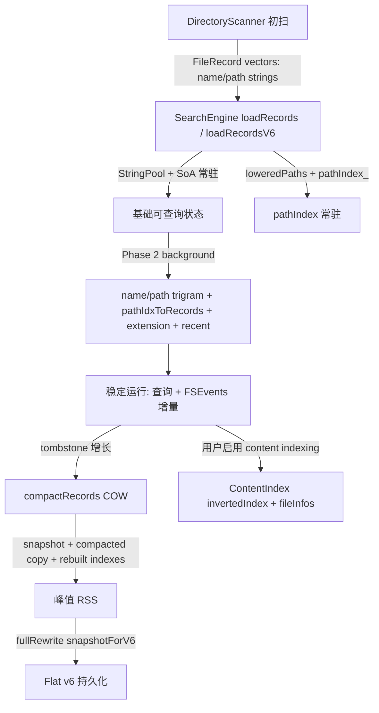

# Issue #3：内存结构、用途与优化建议

> 背景：Issue #3 关注 MacEverything 启动后 RSS 明显高于同类工具。本文只分析**现有内存中的数据结构和用途**，并给出按收益/风险排序的优化建议；数值为基于源码布局的估算，最终结论应以运行期采样验证。

## 1. 结论摘要

当前内存占用不是单点泄漏，更像是多层“常驻索引 + 临时峰值”叠加：

1. **最高优先级：`pathIndex_`**。它用 `std::unordered_map<std::string, uint32_t>` 常驻保存“lowercase full path → record index”。这会在 `origNamePool_`、`namePool_`、`pathPool_`、`lowerPathPool_` 已经保存名称/目录的基础上，再为每条记录复制一份完整路径字符串，是最可疑的常驻热点。证据见 `MacEverything/Core/SearchEngine.h:392-394`、`MacEverything/Core/SearchEngineV6.cpp:53-83`。
2. **第二优先级：Phase 2 / compaction / full rewrite 的瞬时峰值**。Phase 2 会复制 `types_`、`modTimes_`、`namePool_`、`lowerPathPool_`、`pathIndices_`，同时构建 name/path trigram、path-to-record、extension、recent cache；COW compaction 还会同时持有快照、压缩副本、旧 live 状态和新索引。证据见 `MacEverything/Core/SearchEngineV6.cpp:152-198`、`MacEverything/Core/SearchEngine.cpp:590-690`、`MacEverything/Core/FlatIndexWriter.cpp:156-158`。
3. **`StringPool` 与 SoA 本身方向正确**。文件名、目录、metadata 已经由连续内存和列式数组承载，单位成本可估算、局部性较好；不应优先回退到 per-record `std::string`。证据见 `MacEverything/Core/StringPool.h:10-19`、`MacEverything/Core/SearchEngine.h:380-391`。
4. **`ContentIndex` 是可选但可能很重的独立维度**。构造函数明确“内容索引 opt-in”，默认不是 issue #3 的首要解释；但一旦启用，它会同时持有内容 trigram inverted index 和每文件 trigram 列表。证据见 `MacEverything/Core/ContentIndex.cpp:20-23`、`MacEverything/Core/ContentIndex.h:134-143`。
5. **当前源码与历史 changelog 存在不一致**。`docs/changelog/159-engine-startup-phase2-oom.md:17-36` 记录 Phase 2 真实峰值约 `800B/record`，但当前 `MacEverything/Core/SearchEngineV6.cpp:127` 仍是 `recordCount * 200`。这会低估 Phase 2 风险，应单独核查是否为回归或分支差异。

## 2. 读表前提与估算口径

源码没有集中输出每个结构的 `capacity()`、bucket 数、allocator overhead、RSS delta，因此本文给出两类数字：

- **公式**：从源码字段和容器类型推导，可用于加 instrumentation 后复核。
- **5M 示例估算**：为了比较量级，假设 `N=5,000,000` record slots，`P=500,000` unique directories，平均 filename `20B`，平均 directory path `70B`，平均 full path `90B`。这是说明性样例，不是生产测量。

估算时还需注意：

- `StringPool::Entry` 由 `{uint32_t offset, uint16_t length}` 组成，实际 `sizeof` 很可能因对齐为 8B，文件写入也使用 `sizeof(StringPool::Entry)`；见 `MacEverything/Core/StringPool.h:16-19`、`MacEverything/Core/FlatIndexWriter.cpp:20-33`。
- `std::string` / `std::unordered_map` 的节点、bucket、allocator 开销与 libc++ 实现有关。长路径字符串通常会额外 heap allocate，RSS 可能显著高于“payload bytes”。
- `vector` 表格主要按 `capacity * sizeof(T)` 估算；capacity 不等于 size。
- tombstone 会让 `N` 持续高于 live count，所有按 `N` 缩放的结构都会被放大。

## 3. 内存生命周期图

## 4. `SearchEngine` 常驻结构表

### 4.1 Canonical storage：文件名、路径与 SoA

这些结构是搜索引擎的主数据，不是冗余缓存。优化方向应是压缩字段宽度、降低 tombstone 膨胀，而不是删除。

| 结构 | 源码位置 | 用途 | 生命周期 | 主要公式 | 5M 示例量级 | 优化优先级 |
|---|---|---|---|---|---:|---|
| `origNamePool_` | `SearchEngine.h:380` | 保存原始大小写文件名，用于结果展示与 v6 持久化 | load 后常驻，compaction 重建 | `N * (avgName + sizeof(Entry))` | `5M*(20+8)=~140MB` | 中：可考虑只对需要展示的路径延迟取原名，但风险较高 |
| `namePool_` | `SearchEngine.h:381` | 保存 lowercase 文件名，用于搜索匹配与索引构建 | load 后常驻，Phase 2/compaction 使用 | `N * (avgNameLower + sizeof(Entry))` | `~140MB` | 中：保留；可测是否能从 origName on-demand lower，但会牺牲查询速度 |
| `pathIndices_` | `SearchEngine.h:382` | 每条记录指向唯一目录路径 | 常驻 | `N * 4B` | `~20MB` | 低：已经紧凑 |
| `pathPool_` | `SearchEngine.h:383` | unique directory path 原文 | 常驻 | `P * (avgPath + sizeof(Entry))` | `500k*(70+8)=~39MB` | 低：路径去重方向正确 |
| `lowerPathPool_` | `SearchEngine.h:384` | unique lowercase directory path，用于路径查询、path trigram | 常驻 | `P * (avgPath + sizeof(Entry))` | `~39MB` | 中：可用 lazy lower / mmap / hash 辅助权衡内存与 path 搜索速度 |
| `types_` | `SearchEngine.h:387` | 文件类型与 tombstone 标记 | 常驻 | `N * 1B` | `~5MB` | 低 |
| `sizes_` | `SearchEngine.h:388` | 文件大小过滤 | 常驻 | `N * 8B` | `~40MB` | 中：可评估 varint / 分桶 / 32-bit 快路径，但会增加复杂度 |
| `modTimes_` | `SearchEngine.h:389` | 修改时间过滤、recent cache | 常驻 | `N * 8B` | `~40MB` | 中：可评估 32-bit delta/epoch 压缩 |
| `inodes_` | `SearchEngine.h:390` | FSEvents / 去重 / 持久化身份 | 常驻 | `N * 8B` | `~40MB` | 中：如仅特定路径需要，可评估稀疏化，但风险需验证 |
| `devIds_` | `SearchEngine.h:391` | 设备 ID，与 inode 组合唯一身份 | 常驻 | `N * 4B` | `~20MB` | 低 |
| `dirtyPages_` | `SearchEngine.h:501` | 分页持久化脏页 bitmap | 常驻 | `ceil(N/1024) * sizeof(bool/vector specialization)` | 通常 KB 级 | 低 |

**判断**：Canonical storage 在 5M 记录下约数百 MB，属于可解释成本。若实际 RSS 接近或超过 1GB，优先看 full-path map、trigram postings 与峰值叠加，而不是先动这些列式主数据。

### 4.2 路径查找与 mutation 索引

| 结构 | 源码位置 | 用途 | 生命周期 | 主要公式 | 5M 示例量级 | 优化优先级 |
|---|---|---|---|---|---:|---|
| `pathLookup_` | `SearchEngine.h:392` | 原始目录路径 → `pathPool_` index，用于 intern 去重 | 常驻 | `P * (avgPath + map node + bucket + string overhead)` | `~60-100MB` | 中：可用 string_view/offset-key 或 open addressing 降低节点开销 |
| `lowerPathLookup_` | `SearchEngine.h:393` | lowercase 目录路径 → path index，辅助 lower path intern | 常驻 | 与 `pathLookup_` 类似 | `~60-100MB` | 中：可与 path pool hash 合并，避免两份 string-key map |
| `pathIndex_` | `SearchEngine.h:394` | lowercase full path → record index；FSEvents remove/update、WAL replay、dedup last-wins 都依赖它 | 常驻，也是 load/compaction 峰值核心 | `liveFullPaths * (avgFullPath + map node + bucket + allocator)` | `~700MB-1.2GB+` | **最高**：应替换为 hash/fingerprint + collision fallback，或 pathIdx+name-key 二级索引 |
| `sessionGenerations_` | `SearchEngine.h:519` | 每个查询 session 的取消 generation | 常驻但按 session 数缩放 | `sessionCount * (map node + shared_ptr + atomic)` | 通常 KB 级 | 低 |
| `wal_` / `compactionGen_` | `SearchEngine.h:507-508` | WAL 追加和 compaction generation | 常驻 | 指针与 atomic | 忽略不计 | 低 |

`pathIndex_` 的证据链：

- v6 load 会先构造 `std::vector<std::string> loweredPaths(n)`，再 `pathIndex_.reserve(n)`，把每条 live record 的完整 lower path 移入 map；见 `MacEverything/Core/SearchEngineV6.cpp:53-83`。
- COW compaction 会复制 `snapPathIndex = pathIndex_`，再构建 `cdPathIndex`，短时间内存在旧 map、snapshot map、compacted map；见 `MacEverything/Core/SearchEngine.cpp:602-618`、`MacEverything/Core/SearchEngine.cpp:646-672`。
- 增量路径依赖它做 O(1) 查找：`addRecord`、`removeByPathUnlocked`、`batchRescanPrefix`、`updateByPathUnlocked`、`replayWALEntries` 均围绕 full path map 更新；典型位置见 `MacEverything/Core/SearchEngine.cpp:329-357`、`MacEverything/Core/SearchEngine.cpp:884-957`。

### 4.3 查询加速索引

| 结构 | 源码位置 | 用途 | 生命周期 | 主要公式 | 5M 示例量级 | 优化优先级 |
|---|---|---|---|---|---:|---|
| `nameTrigramIndex_` | `SearchEngine.h:398-400` | filename trigram → record postings，加速普通文件名搜索 | Phase 2 后常驻；新增记录增量插入 | `sum(uniqueNameTrigramsPerRecord) * 4B + map/vector overhead` | 常见为数百 MB，取决于文件名长度和字符集 | 高：可压缩 postings、分块编码、或对低选择性 trigram 做稀疏策略 |
| `pathTrigramIndex_` | `SearchEngine.h:401-402` | path trigram → path index postings，加速路径段/斜杠查询 | Phase 2 后常驻 | `sum(uniqueTrigramsPerUniquePath) * 4B + overhead` | 可达数百 MB，随目录路径长度增长 | 高：可按需加载/按 query 热度构建、压缩 postings |
| `pathIdxToRecords_` | `SearchEngine.h:403` | path index → 该目录下 record list；path 命中后展开到 records | Phase 2 后常驻 | `P * sizeof(vector) + liveRecords*4B` | vector object: `500k*24=~12MB` + postings `~20MB` | 中：结构本身可接受，但 `vector<vector>` 有碎片和 allocator 开销 |
| `extensionIndex_` | `SearchEngine.h:405-406` | extension → record postings，加速 `ext:` 过滤 | Phase 2 后常驻 | `numExt * key + filesWithExt*4B + overhead` | 通常几十 MB 内 | 中：可用 interned extension id / sorted ext table |
| `recentCache_` | `SearchEngine.h:522-531` | 最近修改 top 200 | 常驻 | `200 * sizeof(RecentEntry)` | KB 级 | 低 |
| `ShortQueryCache` | `ShortQueryCache.h:40-49` | 1-2 字母查询 top 100 预计算结果 | Phase 2 / compaction 后常驻 | `702 * (100 * sizeof(ScoredResult) + vector object)` | 约 0.6-1MB | 低 |

`nameTrigramIndex_` 和 `pathTrigramIndex_` 当前都使用 `unordered_map<Trigram, vector<uint32_t>>`。构建路径见 `MacEverything/Core/SearchEngineIndex.cpp:113-131`、`MacEverything/Core/SearchEngineIndex.cpp:241-257`。它们的 postings payload 是 `uint32_t`，但 map bucket、vector object、capacity slack、allocator metadata 也会计入 RSS。

## 5. `ContentIndex` 结构表

内容索引不是默认元数据搜索的必要成本，但启用后会成为另一个大内存源。

| 结构 | 源码位置 | 用途 | 生命周期 | 主要公式 | 示例量级 | 优化优先级 |
|---|---|---|---|---|---:|---|
| `invertedIndex_` | `ContentIndex.h:134-136` | 内容 trigram → fileIndex postings | 内容索引 load 后常驻 | `sum(uniqueContentTrigramsPerIndexedFile) * 4B + map/vector overhead` | 若 100k 文件、每文件 2k unique trigrams，payload 就约 `800MB` 前的上限风险；实际因共享 postings/文件大小限制而变化 | 高（仅内容索引场景）：posting 压缩、分段落盘、按扩展名预算 |
| `fileInfos_` | `ContentIndex.h:138-139` | fileIndex → hash、trigram list、mtime | 内容索引常驻 | `indexedFiles * node + sum(perFileTrigrams)*4B` | 与 `invertedIndex_` 形成“正排 + 倒排”双份 trigram 元数据 | 高：可只持久化正排，运行期按需重建/分块卸载 |
| `extensions_` | `ContentIndex.h:141-143` | 用户选择的内容索引扩展名 | 常驻 | `extCount * string/map overhead` | KB 级 | 低 |
| `thread_local seen bitmap` | `ContentIndex.cpp:170-197` | trigram 去重 bitmap，避免每次分配 2MB | 每个调用过 extract 的线程常驻 | `2^24 bits ≈ 2MB/thread`（`vector<bool>` bitset）+ dirty vector | 几 MB 到几十 MB，随线程数 | 中：这是用内存换 CPU；总体可接受，但要计入多线程峰值 |
| `readFileIfText` content string | `ContentIndex.cpp:138-166` | 读取待索引文件文本 | 单文件临时 | `min(fileSize, maxFileSize_)` | 默认最大 1MB/并发任务 | 中：并发 content indexing 时会叠加 |

内容索引还有两个明显临时结构：

- `setupContentPersistence()` 会构造 `validFileIndices` 并 `reserve(total)`，扫描全部 records 来 prune stale content entries；见 `MacEverything/Core/ServiceEngine+Content.cpp:31-47`。
- `startContentIndexing()` 会构造 `std::vector<FileEntry>`，每项包含 `idx + fullPath string + modTime`；首次 full scan 会对全部普通文件 staging full path；见 `MacEverything/Core/ServiceEngine+Content.cpp:82-115`。

## 6. 启动、持久化、压缩的瞬时峰值表

| 阶段 | 临时结构 | 源码位置 | 峰值公式 | 风险判断 | 优化方向 |
|---|---|---|---|---|---|
| 初扫 `DirectoryScanner` | `threadResults_` per-thread `vector<FileRecord>` | `DirectoryScanner.h:58`、`DirectoryScanner.cpp:50-53` | `N * (2 std::string object + metadata + path/name payload/capacity)` | 高：初扫期间和后续 load 可能重叠 | 流式导入 SearchEngine，或 per-directory path interning 后再 push |
| 初扫 `DirectoryScanner` | 每线程 1MB getattr buffer | `DirectoryScanner.cpp:13`、`DirectoryScanner.cpp:87-89` | `numThreads * 1MB`，线程上限 32 | 中低：最多约 32MB | 保留；这是 I/O 性能换内存，收益明确 |
| 初扫 merge | `takeResults()` merged vector | `DirectoryScanner.cpp:71-84` | per-thread results + merged vector 同时存在 | 高：百万级记录有双份 vector 窗口 | 使用 move range 仍需要 merged capacity；可改为逐块 load |
| v6 load | `loweredPaths(n)` | `SearchEngineV6.cpp:53-83` | `N * std::string object + liveFullPathPayload` | 高：随后还进入 `pathIndex_` | 避免先建完整 vector；直接分块构建 hash-key index |
| v6 Phase 2 | snapshot copies | `SearchEngineV6.cpp:152-169` | `types + modTimes + namePool + lowerPathPool + pathIndices` copy | 高：与 live storage 同时存在 | 分阶段构建、只复制必要列、使用 immutable shared snapshot |
| v6 Phase 2 | rebuilt indices | `SearchEngineV6.cpp:174-198` | name trigram + path trigram + pathIdxToRecords + extension + recent | 高：历史 changelog 指出约 `800B/record` 级别 | 修正估算、预算门控、分块/压缩 postings |
| COW compaction | full snapshot | `SearchEngine.cpp:590-618` | SoA + pools + `pathIndex_` copy | 很高：`pathIndex_` 被完整复制 | compaction 前先消除 string-key `pathIndex_`，或增量 compaction |
| COW compaction | compacted copy + rebuilt indexes | `SearchEngine.cpp:630-690` | compacted SoA/pools/maps + all indices | 很高：旧、快照、新三套短暂共存 | 限制 compaction 条件、分代回收、先落盘再换指针 |
| full rewrite | `snapshotForV6()` | `FlatIndexWriter.cpp:156-158`、`SearchEngineV6.cpp:255-270` | v6 snapshot copy of pools and arrays | 中高：紧接 compaction 后又复制主数据 | writer 支持 shared/move snapshot 或 page-by-page stream |
| content prune | `validFileIndices` | `ServiceEngine+Content.cpp:31-47` | `totalRecords` hash set | 中：内容索引启动时突增 | 改为 bitmap/vector bool，或让 ContentIndex 按类型回调验证 |
| content indexing | `vector<FileEntry>` | `ServiceEngine+Content.cpp:82-115` | `regularFiles * (fullPath string + idx + mtime)` | 中高：全量内容索引首次运行明显 | 分批枚举 + bounded queue，不一次 staging 全部 full paths |

## 7. 优化建议（按收益/风险排序）

### P0 — 用紧凑 key 替换 `pathIndex_` 的 full-path string map

**现状**：`pathIndex_` 需要支持 O(1) full path lookup、last-wins dedup、FSEvents update/remove、WAL replay。当前做法为每条 live record 常驻一份 lowercase full path string。

**建议方案**：

1. 将 key 改为 64-bit/128-bit fingerprint：`hash(lowerPathPool[pathIdx], '/', lowerName)` → record index。
2. collision fallback 使用小型 side table：只有 hash collision 时保存完整 key 或 `{pathIdx, namePool view}` 比对。
3. 对 prefix remove / batch rescan 保留 path-aware 路径：依赖 `pathIdxToRecords_`、目录树或按 path pool segment 遍历，而不是遍历 full-path string map。

**收益**：理论上把 `pathIndex_` 从 `O(total full path bytes + unordered_map string nodes)` 降到 `O(N * (8-16B key + 4B value + table overhead))`，且 compaction snapshot 也同步降低。

**风险**：必须严谨处理 collision 与 rename/delete 语义，不能为了内存牺牲索引正确性。

**验收指标**：

- 5M 记录启动稳定 RSS 下降明显。
- FSEvents remove/update/rename、WAL replay、dedup last-wins 测试通过。
- collision 注入测试证明 fallback 正确。

### P1 — 修复/校准 Phase 2 OOM guard

**现状**：当前源码 `SearchEngineV6.cpp:127` 仍使用 `recordCount * 200` 估算 Phase 2 峰值；历史 changelog 159 记录真实使用接近 `800B/record`。这两者冲突。

**建议方案**：

- 先确认 master 上实际代码是否回归；如果确实为 `200B/record`，恢复到 `800B/record` 或改成动态估算：`snapshotBytes + estimatedPostingBytes + mapOverhead`。
- 输出日志同时记录 `N`、`namePool.rawSize()`、`lowerPathPool.rawSize()`、各 index build 后的 capacity 估算。

**收益**：避免低内存机器在 Phase 2 直接 OOM；也为后续优化提供可比指标。

### P1 — 压缩 trigram postings，而不是删除 trigram 索引

**现状**：trigram 是 <5ms 搜索体验的核心。直接禁用会把问题转移成查询延迟问题，不符合项目“小巧精确快速”的原则。

**建议方案**：

- 将 sorted `vector<uint32_t>` postings 改为 block delta encoding（例如每 128/256 个 doc id 一块，块内 varint/delta）。
- 对极高频 trigram 设置“低选择性标记”：查询时不把它作为锚点，避免维护/使用超大 postings。
- path trigram 可按目录 path index 编码，通常比 record postings 更适合 delta。

**收益**：降低 `nameTrigramIndex_` / `pathTrigramIndex_` 常驻内存，同时保持查询路径。

**风险**：会增加解码 CPU。需要 benchmark 验证“内存下降”没有换来不可接受的查询延迟。

### P1 — 降低 compaction 与 full rewrite 的峰值

**现状**：COW compaction 有意避免长时间阻塞查询，但代价是快照和新副本叠加。`snapshotForV6()` 在 full rewrite 时又复制一次主数据。

**建议方案**：

- 优先在 `pathIndex_` 优化后再动 compaction，因为当前峰值最大部分来自 string-key map copy。
- `fullRewrite()` 支持只在 shared lock 下 page-by-page 写出，避免完整 `V6Snapshot` 深拷贝。
- compaction 触发阈值加入 memory budget：低可用内存时推迟或分批 compact。

**收益**：降低后台维护操作导致的 RSS 尖峰。

**风险**：streaming writer 会拉长锁或要求版本化视图，需要谨慎设计。

### P2 — 内容索引做预算化与分批 staging

**现状**：内容索引 opt-in，但启用时 `invertedIndex_` 与 `fileInfos_` 同时持有正排/倒排 trigram；首次 full scan 还会 staging full path list。

**建议方案**：

- `FileEntry` 列表改为 bounded batch queue，一批枚举、一批 index。
- `validFileIndices` 改 bitmap/bitset，避免 hash set per-record node overhead。
- 对 `fileInfos_.trigrams` 做压缩或改为“持久化正排，运行期按需加载”。

**收益**：降低启用内容索引时的额外峰值。

**风险**：内容搜索性能和 WAL replay 复杂度会变化，应作为单独 issue。

## 8. 建议的测量计划

为了把“估算”变成“可验收指标”，建议新增一个 debug-only memory report：

| 指标 | 采样点 | 需要输出 |
|---|---|---|
| `StringPool` bytes | v6 load 后、Phase 2 后、compaction 后 | `rawSize`, `entryCount`, `entries bytes`, `capacity` |
| SoA bytes | 同上 | 每列 `size/capacity/sizeof(T)` |
| unordered_map bytes proxy | 同上 | `size`, `bucket_count`, load factor，key payload 总长 |
| posting list bytes proxy | Phase 2 后 | map size、posting 总 entries、vector capacity 总和 |
| RSS | 每个阶段前后 | `mach_task_basic_info.resident_size` |
| peak event | Phase 2 / compact / fullRewrite | start/end RSS + elapsed + record count |

最小验证脚本可沿用已有性能报告习惯：启动 app，等待 v6 load、Phase 2、compaction 日志，然后记录 `/api/status` 与进程 RSS。若要验证 issue #3，必须用同一份索引、同一台机器、同一内容索引配置，对比优化前后。

## 9. 推荐实施顺序

1. **先补测量**：没有 per-structure 数据时，所有优化只能靠推断。
2. **修 `pathIndex_`**：收益最大，同时减少 compaction/Phase 2 周边峰值。
3. **修 Phase 2 guard**：避免低估内存导致 OOM。
4. **压缩 postings**：在确认 `pathIndex_` 后仍高 RSS 时推进。
5. **streaming rewrite / 分批 compaction**：降低维护阶段峰值。
6. **内容索引预算化**：作为独立 opt-in 内存治理。

## 10. 证据索引

| 证据 | 说明 |
|---|---|
| `MacEverything/Core/SearchEngine.h:380-406` | SearchEngine 主存储、lookup maps 与查询加速索引字段 |
| `MacEverything/Core/SearchEngineV6.cpp:53-83` | v6 load 构造 full-path `loweredPaths` 并写入 `pathIndex_` |
| `MacEverything/Core/SearchEngineV6.cpp:122-145` | Phase 2 memory guard 当前源码仍按 `recordCount * 200` 估算 |
| `MacEverything/Core/SearchEngineV6.cpp:152-198` | Phase 2 snapshot 与索引构建 |
| `MacEverything/Core/SearchEngine.cpp:590-690` | COW compaction snapshot 与 compacted data/index build |
| `MacEverything/Core/FlatIndexWriter.cpp:156-158` | full rewrite 调用 `snapshotForV6()` 深拷贝 |
| `MacEverything/Core/DirectoryScanner.cpp:50-53` | 初扫 per-thread `FileRecord` vector 预留 |
| `MacEverything/Core/DirectoryScanner.cpp:87-89` | 每线程 1MB getattr buffer |
| `MacEverything/Core/ContentIndex.h:134-143` | 内容索引 inverted index、fileInfos、extensions |
| `MacEverything/Core/ServiceEngine+Content.cpp:31-47` | 内容索引 prune 时构造 `validFileIndices` |
| `docs/changelog/019-内存优化550MB.md:7-23` | 历史上路径去重、移除 per-record trigram 曾节省约 550MB |
| `docs/changelog/159-engine-startup-phase2-oom.md:17-36` | 历史记录 Phase 2 OOM 与 `800B/record` 级别估算 |
