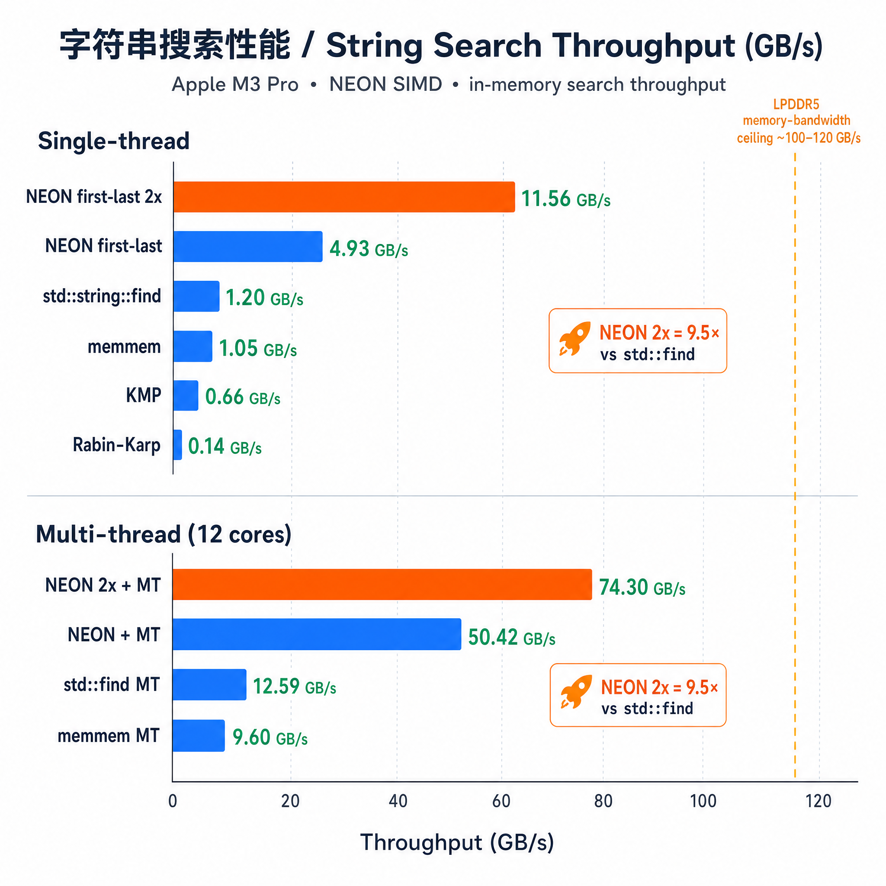

# 5GB 内存字符串搜索性能测试报告

**测试日期**：2026-04-18  
**测试平台**：Apple M3 Pro (ARM64, NEON/AdvSIMD 128-bit)  
**CPU**：12 核 (6P + 6E)  
**内存**：18GB LPDDR5  
**编译器**：clang++ -std=c++20 -O2  
**操作系统**：macOS (Darwin 24.3.0)

---

## 测试概述

在 5GB 随机小写字母（a-z）数据中搜索 query `"hello"` 的所有出现位置。数据中预先插入了 1000 个已知副本（随机种子固定为 42），实际匹配数为 1540（含随机碰撞匹配）。

每种算法执行 3 次，记录最小值、平均值、最大值。

---

## 测试算法

| # | 算法 | 类型 | 核心思路 |
|---|------|------|---------|
| 1 | `std::string::find` | 标准库 | C++ 标准库字符串查找 |
| 2 | `memmem` | POSIX | C 库级别内存搜索 |
| 3 | KMP | 经典 | Knuth-Morris-Pratt，O(n+m) 线性扫描 |
| 4 | Boyer-Moore-Horspool | 经典 | 坏字符跳转表，平均亚线性 |
| 5 | Rabin-Karp | 经典 | 滚动多项式哈希 |
| 6 | NEON first-last | SIMD | 广播 needle 首尾字节到 128-bit NEON 向量，AND 比较 |
| 7 | NEON first-last (2x) | SIMD | 同 #6，手动 2x 循环展开 |

多线程版本：使用通用多线程包装器，将 5GB 数据分割为重叠块（重叠长度 = needle_len - 1），每个线程独立搜索后合并去重。

---

## 单线程测试结果

| 算法 | 匹配数 | Min(ms) | Avg(ms) | Max(ms) | Avg 吞吐量(GB/s) |
|------|--------|---------|---------|---------|-----------------|
| std::string::find | 1540 | 3547 | 4087 | 4449 | 1.22 |
| memmem | 1540 | 4185 | 4762 | 5736 | 1.05 |
| KMP | 1540 | 7502 | 7574 | 7638 | 0.66 |
| Boyer-Moore-Horspool | 1540 | 3979 | 4281 | 4532 | 1.17 |
| Rabin-Karp | 1540 | 34329 | 34795 | 35090 | 0.14 |
| **NEON first-last** | 1540 | 759 | 1015 | 1510 | **4.93** |
| **NEON first-last (2x)** | 1540 | 429 | 433 | 437 | **11.56** |

### 单线程分析

- **NEON 2x 展开** 以 11.56 GB/s 领先，是 `std::string::find` 的 **9.5 倍**
- **NEON 非展开** 为 4.93 GB/s，展开带来 **2.3 倍** 提升
- 传统算法（std::find、memmem、Horspool）在 1.0-1.2 GB/s 范围，差距不大
- **KMP** 因缓存局部性差（每步访问 failure 表）仅 0.66 GB/s
- **Rabin-Karp** 表现最差（0.14 GB/s），哈希计算开销远超查找节省

---

## 多线程测试结果（12 线程）

| 算法 | 匹配数 | Min(ms) | Avg(ms) | Max(ms) | Avg 吞吐量(GB/s) |
|------|--------|---------|---------|---------|-----------------|
| std::string::find [MT] | 1540 | 377 | 397 | 417 | 12.59 |
| memmem [MT] | 1540 | 506 | 521 | 535 | 9.60 |
| KMP [MT] | 1540 | 887 | 955 | 1071 | 5.23 |
| Boyer-Moore-Horspool [MT] | 1540 | 412 | 846 | 1440 | 5.91 |
| **NEON first-last [MT]** | 1540 | 94 | 99 | 105 | **50.42** |
| **NEON first-last (2x) [MT]** | 1540 | 63 | 67 | 74 | **74.30** |

### 多线程分析

- **NEON 2x + MT** 达到 **74.30 GB/s**，接近 M3 Pro LPDDR5 的理论内存带宽上限（~100-120 GB/s）
- **NEON 非展开 + MT** 为 50.42 GB/s，已达内存带宽的约 50%
- **std::find + MT** 达到 12.59 GB/s，12 线程相对单线程有约 **10.3 倍** 加速
- **Horspool + MT** 方差较大（412ms ~ 1440ms），可能与分支预测和缓存争用有关
- KMP 和 Horspool 的多线程加速比约 8-10 倍，低于 NEON 的线性加速

---

## 总排名（按吞吐量降序）

| 排名 | 算法 | Avg(ms) | Avg(GB/s) | vs Baseline |
|------|------|---------|-----------|-------------|
| 1 | NEON first-last (2x) [MT] | 67 | 74.30 | **60.7x** |
| 2 | NEON first-last [MT] | 99 | 50.42 | 41.2x |
| 3 | std::string::find [MT] | 397 | 12.59 | 10.3x |
| 4 | NEON first-last (2x) | 433 | 11.56 | 9.4x |
| 5 | memmem [MT] | 521 | 9.60 | 7.8x |
| 6 | Boyer-Moore-Horspool [MT] | 846 | 5.91 | 4.8x |
| 7 | KMP [MT] | 955 | 5.23 | 4.3x |
| 8 | NEON first-last | 1015 | 4.93 | 4.0x |
| 9 | std::string::find | 4087 | 1.22 | 1.0x (baseline) |
| 10 | Boyer-Moore-Horspool | 4281 | 1.17 | 1.0x |
| 11 | memmem | 4762 | 1.05 | 0.9x |
| 12 | KMP | 7574 | 0.66 | 0.5x |
| 13 | Rabin-Karp | 34795 | 0.14 | 0.1x |

---

## 关键结论

1. **SIMD 是内存密集型字符串搜索的决定性优化**：NEON 2x 单线程（11.56 GB/s）已超过所有传统算法的多线程版本（最高 12.59 GB/s）。

2. **循环展开效果显著**：NEON 2x 比 NEON 1x 快 2.3 倍（单线程）和 1.5 倍（多线程），利用了 M3 Pro 每周期 4 次 load 的能力。

3. **多线程 + SIMD 可逼近内存带宽**：74.30 GB/s 已达 LPDDR5 理论带宽的 60-70%，进一步提升需要考虑 prefetch、更大 SIMD 宽度（SVE2）或内存通道利用率。

4. **传统经典算法在大规模数据上无优势**：
   - Horspool 的亚线性理论优势在短 needle（5 字节）下几乎不体现
   - KMP 的 failure 表访问模式对 L1 cache 不友好
   - Rabin-Karp 的乘法和取模开销远超其理论收益

5. **M3 Pro 的 12 核并行效率**：
   - 内存密集型任务（NEON）：~6.4 倍加速（受内存带宽限制）
   - 计算密集型任务（std::find）：~10.3 倍加速（接近理论 12 倍）

---

## 测试程序

- 源文件：`string_search_bench.cpp`
- 编译：`clang++ -std=c++20 -O2 -o string_search_bench string_search_bench.cpp`
- 运行：`./string_search_bench "hello"`（可替换为任意 query）
- 数据大小：5GB，随机小写字母 + 1000 个预插入 needle
- 随机种子：42（可复现）
