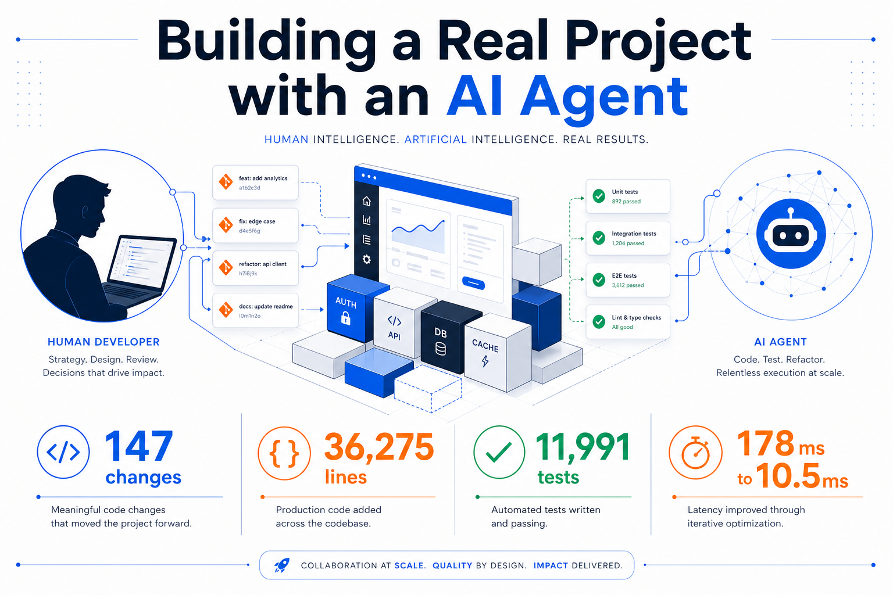
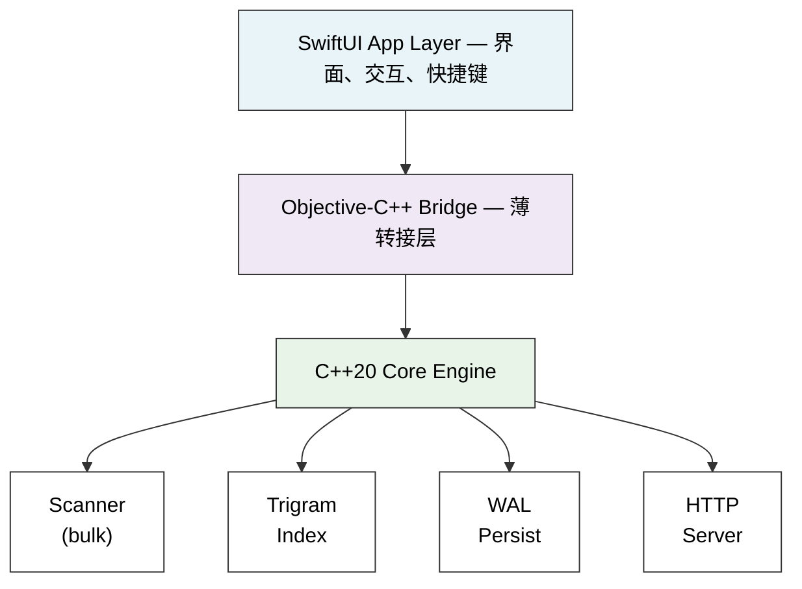
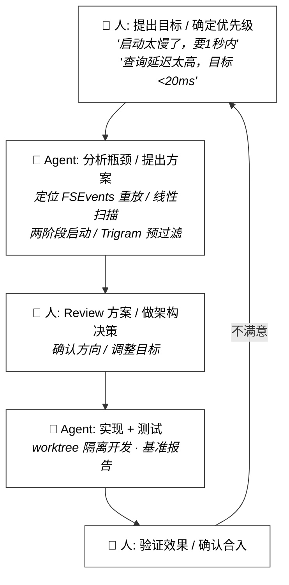
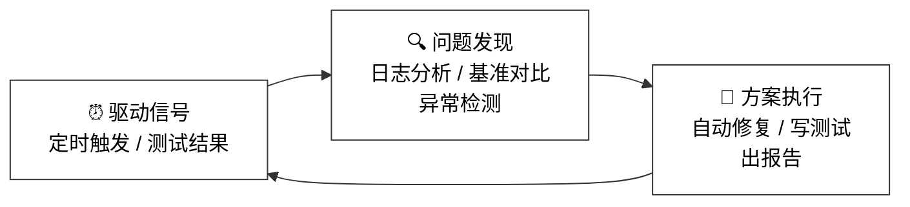
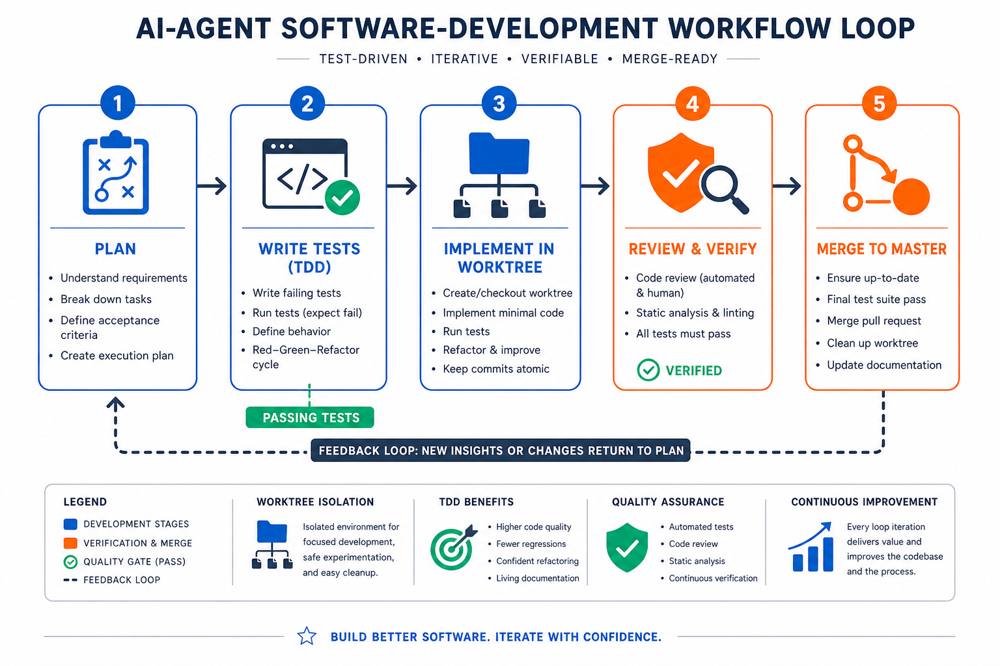
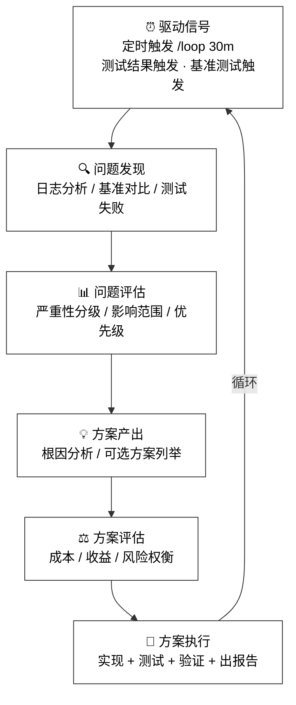
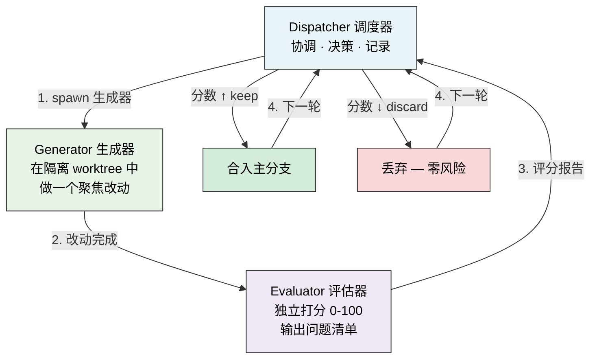
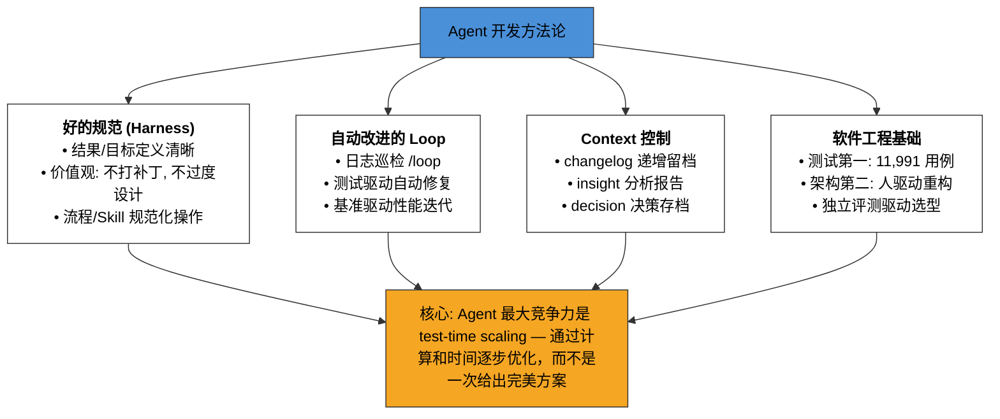

# 用 Agent 做一个真实项目：MacEverything 开发实战

> 面向推荐算法同学的技术分享 | 2026-04-21



---

## TL;DR

**Rule number1: show demo** 
这个文档98%是claude code生成


1 个人 + 1 个 AI Agent（Claude Opus），从零到发布了一个 macOS 全盘文件搜索工具。**人基本没看过代码。**

```
147 个功能变更 | 36,275 行源码 | 11,991 个测试用例 | 33 轮基准测试
查询延迟: 178ms → 10.5ms (17x↑)  |  启动时间: 50s → 200ms (250x↑)
```

**核心问题：怎么让 Agent 帮你把一个项目做出来？有哪些可复用的经验？**

---

## 1. 项目是什么

MacEverything = macOS 版的 Everything（Windows 上的秒搜工具），索引 500 万文件，毫秒级搜索。



> **术语速查**（本文涉及的系统编程概念，按首次出现顺序）

| 术语 | 解释 | 类比 |
|------|------|------|
| **SoA** (Structure of Arrays) | 把同类字段连续存放（所有 name 放一起、所有 size 放一起），而非每条记录的字段交错存放 (AoS)。类似列存 vs 行存 | 推荐系统中特征存储：按特征列存放（列式）vs 按样本行存放（行式） |
| **SIMD** (Single Instruction Multiple Data) | 一条 CPU 指令同时处理多个数据，如一次比较 16 个字节 | 向量化计算：一次 matmul 操作处理整个 batch |
| **NEON** | ARM 芯片（Apple M 系列）的 SIMD 指令集，128-bit 宽 | 类似 x86 的 AVX/SSE |
| **Trigram** | 3 字符子串倒排索引。"hello" → {"hel","ell","llo"}，查询时取交集快速缩小候选集 | 类似推荐中的倒排索引召回：先用简单特征粗筛，再精排 |
| **WAL** (Write-Ahead Log) | 先写日志再改数据，崩溃后可从日志恢复 | 类似 checkpoint + replay 机制 |
| **FSEvents** | macOS 的文件系统变更通知 API，类似 Linux 的 inotify | 类似消息队列的变更事件流 |
| **dispatch_apply** | macOS GCD 的并行 for 循环，自动分配到多核 | 类似 `parallel_for` 或 `multiprocessing.Pool.map` |
| **mmap** | 内存映射文件，让文件内容像内存数组一样直接访问，无需 read/parse | 类似 numpy 的 memmap，直接从磁盘映射 ndarray |
| **RE2** | Google 的正则引擎，保证 O(n) 时间复杂度，无回溯 | 相比 Python `re` 的回溯式引擎，RE2 不会因恶意 pattern 卡死 |
| **DFA** (Deterministic Finite Automaton) | RE2 内部用确定性有限自动机匹配，每个状态只有一个转移 | NFA→DFA 的编译过程类似模型编译优化（如 TorchScript/TensorRT） |

---

## 2. 项目演进全景：按功能里程碑看

### 2.1 功能演进路径
按**功能里程碑**看——每个里程碑解锁新的能力层：

```mermaid
flowchart LR
    M1["<b>M1 能搜</b><br/>批量扫盘 ~6s<br/>FSEvents 监听"]
    M2["<b>M2 能用</b><br/>WAL 持久化<br/>Compaction"]
    M3["<b>M3 搜得快</b><br/>Trigram 120x↑<br/>SoA+SIMD"]
    M4["<b>M4 能复用</b><br/>HTTP·MCP·CLI"]
    M5["<b>M5 能表达</b><br/>AST 查询语法<br/>Boolean 过滤器"]
    M6["<b>M6 结构化 ★</b><br/>过滤器下推<br/>1,522x↑"]
    M7["<b>M7 秒开</b><br/>v6 SoA 落盘<br/>250x↑"]
    M8["<b>M8 生产可用</b><br/>RE2 34x↑<br/>开源发布"]
    M1 -->|崩溃| M2 -->|太慢| M3 -->|复用| M4
    M4 -.->|表达力| M5
    M5 -->|性能崩| M6 -->|启动慢| M7 -->|正则| M8
    style M1 fill:#fff,stroke:#333,color:#000
    style M2 fill:#fff,stroke:#333,color:#000
    style M3 fill:#fff,stroke:#333,color:#000
    style M4 fill:#fff,stroke:#333,color:#000
    style M5 fill:#fff,stroke:#333,color:#000
    style M6 fill:#fff3cd,stroke:#ffc107,stroke-width:3px,color:#000
    style M7 fill:#fff,stroke:#333,color:#000
    style M8 fill:#fff,stroke:#333,color:#000
```



**关键观察：** 这 8 个里程碑不是预先规划好的，而是在开发过程中逐步涌现的。每个里程碑的完成会暴露下一个瓶颈——"能搜"之后发现"搜太慢"，"搜得快"之后发现"表达力不够"，"能表达"之后发现"结构化查询性能崩了"。**项目是被瓶颈驱动前进的。**

### 2.2 功能变更分类

```
147 个功能变更的类型分布:

Bug 修复 (根因分析型)   ████████████████████████████████████ 50 个  (34%)
新功能                  ██████████████████████████ 33 个  (22%)
性能优化                ████████████████████████ 31 个  (21%)
架构重构                ████████████████ 17 个  (12%)
测试                    ████ 5 个  (3%)
基准测试                ████ 5 个  (3%)
文档/发布               ████████ 6 个  (4%)
```

### 2.3 性能优化里程碑

性能不是线性优化出来的，而是由几次**范式转变**阶梯式推进的。每次大的性能突破背后都有一个架构级决策：

```
查询延迟演进:

  178ms ┤ ● 线性扫描 (baseline)
        │  ↓
        │  M3: Trigram 倒排索引
        │  "别遍历 500 万条，先用 3-gram 缩小候选集"
  79ms  ┤  ●
        │  ↓
        │  M3: 独立评测 → SoA + SIMD
        │  "评测证明 SIMD 单线程 > 传统算法多线程，改数据布局"
  35ms  ┤  ●
        │  ↓
        │  M6: Node-Centric Query ← 范式转变
        │  "别让每个过滤器都扫全量，下推到最近数据层"
  10.5ms┤  ●
        └────────────────────────────────────────────
```

**四次关键的性能范式转变, 大的架构变更：**

| #   | 范式转变                     | 核心思路                                                  | 效果              | 驱动方      |
| --- | ------------------------ | ----------------------------------------------------- | --------------- | -------- |
| 1   | Trigram 倒排索引             | 别遍历 500 万条，先用 3-gram 缩小候选集                            | 路径查询 120x↑      | Agent 自主 |
| 2   | SoA 列存 + SIMD            | 独立评测证明 SIMD 单线程 > 传统多线程，改数据布局解锁 NEON 16 路并行（架构详见 4.1） | 35ms → 10.5ms   | 人推动      |
| 3   | **Node-Centric Query ★** | 过滤器下推到最近数据层，不再全量扫（见下方详解）                              | path 查询 1,522x↑ | 人推动      |
| 4   | v6 Flat SoA 持久化          | 列存直接落盘，跳过解析和索引重建（架构详见 4.1）                            | 启动 250x↑        | 人推动      |

**★ 为什么 Node-Centric Query 是最关键的范式转变？**

```
之前 (Query-Centric):
  搜索 = "拿着查询去匹配每条记录"
  ext:cpp AND path:src → 两次全量扫描 500 万条再取交集

之后 (Node-Centric):
  搜索 = "让每个条件找自己的数据源"
  Anchor Selection: 选最具选择性的过滤器先执行
  ext:cpp AND size:>1mb → 先用 ext: 索引过滤(几千条)
                        → 再对候选集检查 size(跳过字符串列)

这和数据库从全表扫描到查询优化器的演进是同一个思路。
一旦有了这个架构，新增过滤器只需注册数据源，
查询优化器自动选择最优执行计划。
```

**规律：** 前两次（Trigram、SoA+SIMD）是对"怎么扫"的优化——扫得更聪明、扫得更快。第三次（Node-Centric）是对"扫什么"的重新定义——根本不该全量扫。**从优化执行到优化执行计划，这是质的飞跃。**

---

## 3. 两种驱动模式：人驱动 vs Agent 自驱动

### 3.1 人驱动的优化循环

人提出方向和目标，Agent 执行并迭代：



**性能优化的 33 轮迭代就是这个模式的典型：**

```
查询平均延迟变化:

178ms ┤ ●
      │  \
      │   \
      │    ● 79ms (缓存稳定)
80ms  ┤     \
      │      \
      │       ● 35ms (Trigram + 并发修复)
40ms  ┤        \_____● 40ms (阈值调优)
      │              \
      │               \
10ms  ┤                ● 10.5ms (SoA + SIMD + 并行)
      └─────────────────────────────────────────
       R1    R5    R15    R24    R29
```

### 3.2 Agent 自驱动的优化循环（/loop）

这是本项目的一个核心设计：**Agent 不只是被动执行命令，还能自己发现问题并修复。**

通过 `/loop` 命令，设置了一个每 30 分钟自动执行的巡检任务：

```
┌─────────────────────────────────────────────────────────┐
│                   /loop 30m 自动巡检                      │
│                                                         │
│   每 30 分钟自动执行:                                      │
│   1. 启动 App，抓取运行日志                                │
│   2. 通过 HTTP API 跑一组标准查询                          │
│   3. 分析日志中的异常（崩溃/性能退化/锁等待/内存异常）        │
│   4. 如果发现问题：                                       │
│      → 自动创建 worktree                                 │
│      → 分析根因                                          │
│      → 实现修复 + 写测试                                  │
│      → 合入 master                                      │
│   5. 输出分析报告到 docs/performance_ana/                  │
│                                                         │
│   结果: 产出了 27 份性能分析报告，多个 P0 bug 被自动发现     │
└─────────────────────────────────────────────────────────┘
```

**实际产出：**
- `docs/performance_ana/` 下 27 份自动分析报告
- 自动发现了 Phase 2 trigram 部分索引导致搜索结果缺失的 Bug（搜 "test" 只返回 2 条而非 94,245 条）
- 自动发现了 lockWait 异常、CJK Unicode 搜索 0 结果等问题
- 人睡觉/开会期间，Agent 持续在后台巡检和优化

**自驱动循环的设计模式：**



**核心洞察：Agent 最大的竞争力是 test-time scaling —— 通过计算和时间逐步产出和优化方案，而不是执着于一开始给出一个完美方案。** 让 Agent 不断跑、不断试、不断改，比试图一次性写出完美代码要靠谱得多。

---

## 4. 人驱动的大架构变更

Agent 在架构方面有一个明显的弱点：**倾向于打补丁，缺乏推倒重来的勇气。** 每次大的架构跃迁，都是人观察到瓶颈后主动推动的。

### 4.1 三次关键架构变更

> 这三次架构变更的性能影响已在 2.3 节量化，本节聚焦于**架构决策过程**：人看到了什么、Agent 倾向做什么、为什么必须人来推动。

```
架构变更 1: 从 Bridge 到 ServiceEngine（Day 3）
───────────────────────────────────────────────
问题: ~850 行核心逻辑混在 ObjC++ Bridge 层，无法做 CLI/Server
人的判断: "这个架构撑不住了，需要把核心逻辑下沉到纯 C++ 层"
Agent 倾向: 在 Bridge 上继续加功能（打补丁）
人的推动: 要求提取 ServiceEngine，Bridge 只做类型转换

           Before                      After
    ┌──────────────┐           ┌──────────────┐
    │   SwiftUI    │           │   SwiftUI    │
    ├──────────────┤           ├──────────────┤
    │   Bridge     │ ← 850行   │ Bridge (薄)  │ ← 类型转换
    │ (逻辑混杂)    │           ├──────────────┤
    ├──────────────┤           │ServiceEngine │ ← 纯 C++
    │   Core       │           │ (可复用)      │
    └──────────────┘           ├──────────────┤
                               │   Core       │
                               └──────────────┘
                               ↗      ↑      ↖
                            GUI    CLI daemon  MCP Server
```

**结果：** 一次架构重构解锁了 HTTP Server、CLI Daemon、MCP Server 三个新形态。

```
架构变更 2: 从 vector<Record> 到 SoA 列存（Day 5-6）
────────────────────────────────────────────────────
问题: 500 万条记录的线性扫描是性能天花板
人的判断: "数据结构不对，需要从 AoS 改 SoA，能做 SIMD",  CPU cache miss — L1 ~1ns, L2 ~4ns, L3 ~10-40ns, 主存 ~100ns
Agent 倾向: 在现有 vector 上加缓存和索引（打补丁）
人的推动: 要求改底层存储结构

           Before (AoS)                   After (SoA)
    struct Record {               struct SoAColumns {
      string name;                  StringPool names;      // 连续内存
      string path;                  StringPool paths;
      uint8_t type;                 uint8_t[] types;       // SIMD 友好
      int64_t size;                 int64_t[] sizes;
      time_t modTime;               time_t[] modTimes;
    };                              Bitset tombstones;     // 16 路并行
    vector<Record> records_;        // → dispatch_apply 多核
                                  };
```

**结果：** 搜索延迟从 35ms 降到 10.5ms，纯过滤查询 (size:>1mb) 直接跳过 StringPool。

```
架构变更 3: 从增量持久化到 v6 Flat SoA（Day 7）
────────────────────────────────────────────────
问题: 启动需要 50s 等 FSEvents 重放 + trigram 重建
人的判断: "启动体验不可接受，需要一种能直接 mmap 就搜的格式"
Agent 倾向: 优化现有 v5 格式的加载速度（打补丁）
人的推动: 设计全新的 v6 flat 格式，直接列存落盘

           Before (v5 Paged)              After (v6 Flat SoA)
    ┌─────────────────────┐       ┌───────────────────────────┐
    │ Page 1 (records)    │       │ Header (magic + version)  │
    │ Page 2 (records)    │       │ Section: names (bulk)     │
    │ ...                 │       │ Section: paths (bulk)     │
    │ Path Dictionary     │       │ Section: types (array)    │
    │ Index               │       │ Section: sizes (array)    │
    └─────────────────────┘       │ Section: modTimes (array) │
    加载: 解析每页 + 重建索引       │ Section: pathIndex        │
    耗时: ~6.3s                   └───────────────────────────┘
                                  加载: 按 section 直读
                                  Phase 1: ~200ms (可搜索)
                                  Phase 2: ~6.7s (后台建 trigram)
```

**结果：** 启动到可搜索从 50s 降到 200ms (250x)。

### 4.2 人在架构中的角色

```
Agent 的架构倾向(改良):             人需要做的事(忍/掀桌革命):
─────────────────                ─────────────
• 在现有代码上加 if/else          • 判断"这条路走不通了"
• 加缓存、加索引来绕过问题         • 决定"需要改底层数据结构"
• 保持兼容性，不敢删旧代码         • 拍板"旧格式不要了，全部迁移"
• 顺着你的话说，很少反驳           • 提出不同意见，推动推倒重来
• 压缩上下文后明显降智             • 在关键节点重新注入架构上下文,重构
```

**Agent 每次都倾向打补丁，没有推倒重来的勇气。主体架构决策要人来驱动。**

### 4.3 为什么 Agent 无法主动提出大架构变革？

这不是个别 Agent 的问题，而是当前 LLM Agent 的**结构性局限**：

```
┌──────────────────────────────────────────────────────────────┐
│          Agent 无法驱动大架构变革的 5 个根因                    │
│                                                              │
│  1. 局部视野 vs 全局判断                                      │
│     ─────────────────────                                    │
│     Agent 每次对话只看到当前上下文窗口内的代码。               │
│     它能看到 vector<Record> 的实现细节，                      │
│     但看不到"这个数据结构在 500 万规模下注定是瓶颈"。          │
│     大架构决策需要跨模块、跨时间维度的全局判断——                │
│     这需要对整个系统的心智模型，而非对单个文件的理解。          │
│                                                              │
│  2. 讨好倾向 (Sycophancy)                                    │
│     ────────────────────                                     │
│     Agent 倾向于顺着用户的思路走，很少主动说"你的方向错了"。   │
│     当你说"帮我优化这个函数"，Agent 不会回答                   │
│     "这个函数不该存在，你需要重新设计数据模型"。               │
│     它把你的问题当作约束，而不是当作可以挑战的假设。            │
│                                                              │
│  3. 风险规避                                                  │
│     ────────                                                 │
│     "推倒重来"意味着大量代码变更和潜在的回归风险。              │
│     Agent 天然倾向最小化变更范围——                             │
│     改 10 行比改 1000 行"安全"，加个 if 比重写数据结构"安全"。 │
│     这在日常 bugfix 中是优点，但在架构决策中是致命缺陷。       │
│                                                              │
│  4. 缺乏性能直觉                                              │
│     ──────────────                                           │
│     Agent 知道 O(n) < O(n²) 的理论，                          │
│     但不知道"500 万条记录的线性扫描在 M3 Pro 上要 35ms，       │
│     换成 SoA + SIMD 可以到 3ms"这种工程直觉。                 │
│     它缺乏对具体硬件、具体规模下的性能感知，                   │
│     所以无法判断"当前方案的天花板在哪"。                       │
│                                                              │
│  5. 上下文压缩后降智                                           │
│     ────────────────                                         │
│     长对话中早期的架构讨论会被压缩甚至丢失。                    │
│     Agent 对系统的理解随着对话推进而退化，                      │
│     越到后面越倾向于在眼前的代码上做局部修改，                  │
│     而不是回想起"我们当初为什么选了这个架构"。                  │
└──────────────────────────────────────────────────────────────┘
```

**实际案例对比：**

```
  场景: 启动耗时 50 秒

  Agent 的思路 (打补丁):              人的思路 (架构变革):
  ─────────────────────              ─────────────────────
  "v5 加载慢，优化解析逻辑"           "v5 格式本身就不对"
  "加并行加载，多线程解析"            "需要列存直接落盘，mmap 就能搜"
  "加进度条，让用户感知快一点"         "200ms 内必须可搜索，剩下后台建"
       ↓                                  ↓
  预计优化到 ~10s                     实际做到 200ms (250x↑)

  差距来源: Agent 在"怎么更快地加载 v5"的框架内思考
           人跳出来问"为什么一定要加载 v5？"
```

**对策：** 不要期望 Agent 自己提出"推倒重来"。人需要在关键节点做三件事：

```
  1. 判断天花板  — "当前方案还能优化多少？够不够？"
  2. 质疑前提    — "为什么一定要用这个数据结构/格式/算法？"
  3. 设定目标    — "我要 200ms，不是 10s" → 倒逼架构级变更
```

### 4.4 用独立评测做架构决策

既然 Agent 不会主动提出架构变革，人怎么获得"推倒重来"的信心？**答案：跳出项目代码，写独立基准测试，用数据说话。**

本项目中两次关键的独立评测直接驱动了架构变更（性能数据见 2.3）：

| 评测 | 做了什么 | 关键发现 | 驱动的架构决策 |
|------|---------|---------|--------------|
| 字符串搜索算法对比 | 独立 C++ 程序，5GB 数据对比 7 种算法 | NEON SIMD 单线程(11.56GB/s) > 传统算法多线程；Rabin-Karp 理论漂亮但实测最差 | 引入 SoA 列存 + NEON SIMD |
| RE2 正则引擎对比 | 在同一基准程序中增加 8 种 RE2 模式 | RE2 case-insensitive 竟比 literal 更快；需要 per-thread 克隆消除 DFA 互斥锁 | 用 RE2 替换 std::regex (17s→500ms) |

**为什么不在项目代码里评测？**

```
  在项目代码里优化:                    独立基准测试:
  ─────────────────                   ─────────────
  • 变量太多，难以归因                 • 控制变量，结论可信
  • Agent 容易在细节里打转              • 聚焦算法本身的极限性能
  • 优化方向可能一开始就错              • 先确认"天花板在哪"再动手
```

**这个模式可复用：** 当你面临"用 A 还是 B"的技术选型时，让 Agent 写一个独立的评测程序，在受控环境下对比，用数据做决策。Agent 很擅长写这种一次性的基准测试代码。

---

## 5. Agent 踩过的坑（失败案例）

成功案例容易事后总结，但真正有价值的是**失败**——这些坑决定了前面所有方法论为什么长成那个样子。

### 5.1 改 A 崩 B：SIMD 优化引入堆损坏崩溃

```
  事件经过:
  ───────────────────────────────────────────────────────────
  Agent 任务: 引入 NEON SIMD 加速搜索
  Agent 产出: SIMD 搜索逻辑正确，单线程测试全部通过 ✅
  
  上线后:   App 随机崩溃 💥
  崩溃栈:   nanov2_find_zone_and_free — Apple 小对象分配器堆元数据损坏
  
  根因:
  ┌──────────────────────────────────────────────────────────┐
  │ dispatch_apply 创建 ~10 个线程并行搜索                     │
  │ 每个线程每次迭代产生 2-3 个临时 std::string 分配            │
  │ ~10 线程 × 数百万记录 × 3 次分配 = 数千万次跨线程小对象操作  │
  │ 超过 nanov2 分配器的 magazine 传输能力 → 堆元数据损坏       │
  └──────────────────────────────────────────────────────────┘
  
  为什么 Agent 没发现？
  • Agent 写了单线程测试，通过了 → "功能正确"
  • Agent 没想到多线程下的内存分配器压力问题
  • 这是硬件级别的工程直觉，不是逻辑错误
  
  修复: 消除热循环中所有 per-iteration 堆分配，改用线程局部 buffer
  教训: → 加入了并发压力测试，此后类似问题都能被测试捕获
```

### 5.2 优化引入回归：管线统一后 GLOB 查询性能暴跌 1380x

```
  事件经过:
  ───────────────────────────────────────────────────────────
  Agent 任务: 统一 Simple/Advanced 两条查询管线，消除重复代码
  Agent 产出: 管线统一成功，删除 ~700 行重复代码，全量测试通过 ✅
  
  上线后:   *.txt 查询从 0.1ms 暴增到 138ms (1,380x 退化) 💥
  
  根因:
  ┌──────────────────────────────────────────────────────────┐
  │ 旧 Simple 管线有 GLOB 专用的 trigram 预过滤              │
  │ 新统一管线的 trigram 选择器只认 SUBSTRING 模式             │
  │ GLOB 模式的字面段（*.txt 中的 ".txt"）被拒绝              │
  │ → 所有 GLOB 查询退化为全量线性扫描                        │
  └──────────────────────────────────────────────────────────┘
  
  为什么 Agent 没发现？
  • 测试验证的是"结果正确性"，没有验证"查询路径"和"执行耗时"
  • Agent 认为 "测试全通过 = 没问题"，忽略了性能回归
  • 统一管线时 Agent 没有逐一对比旧管线的每个优化路径
  
  修复: trigram 选择器增加 GLOB 支持 + 竞争选择算法
  教训: → 加入了性能回归测试（不只验证结果对不对，还验证走了哪条查询路径）
```

### 5.3 系统性 Bug：Compaction 写文件 → 触发 FSEvents → 触发重扫 → 正反馈循环

```
  事件经过:
  ───────────────────────────────────────────────────────────
  现象: App 运行约 1 小时后，索引从 430 万暴涨到 2630 万条
         最终 OOM 崩溃

  根因（三层正反馈循环）:
  ┌──────────────────────────────────────────────────────────┐
  │                                                          │
  │  Compaction 写文件 ──→ 产生文件系统变更事件                │
  │        ↑                        │                        │
  │        │                        ▼                        │
  │  新记录增加            FSEvents 接收到变更                 │
  │  触发更多 Compaction            │                        │
  │        ↑                        ▼                        │
  │        │              触发 MustScanSubDirs                │
  │        └──────────── 全盘重扫，产生大量新记录 ←────────────┘
  │                                                          │
  │  每轮循环都放大记录数量 → 指数级增长 → OOM                 │
  └──────────────────────────────────────────────────────────┘
  
  为什么 Agent 没发现？
  • 这是跨组件的系统性 Bug（持久化 × 文件监听 × 扫盘三个模块的交互）
  • Agent 分别测试每个模块都没问题，但组合在一起产生了涌现行为
  • 需要长时间运行才会暴露（~1 小时），单元测试覆盖不到
  
  修复: 三层切断——内核级过滤本进程事件 + 排除目录过滤 + 内联压缩
  教训: → 建立了 /loop 长时间巡检，专门抓这类"运行一段时间后才出现"的问题
```

### 5.4 失败案例的规律

```
┌─────────────────────────────────────────────────────────────────┐
│                    Agent 失败的三种模式                           │
│                                                                 │
│  模式 1: "测试通过 ≠ 没问题"                                     │
│  ─────────────────────────                                      │
│  Agent 倾向把"测试通过"等同于"没有 bug"。                          │
│  但测试只覆盖了已知场景，Agent 不会主动想到:                       │
│  • 多线程下的内存分配器压力                                       │
│  • 性能回归（结果对但慢了 1000 倍）                                │
│  • 长时间运行的状态累积                                           │
│                                                                 │
│  模式 2: "改了 A，没想到会影响 B"                                 │
│  ──────────────────────────────                                  │
│  Agent 理解的是它当前正在改的代码，                                │
│  不理解这段代码和其他模块之间的隐式依赖。                          │
│  统一管线时不知道旧管线有 GLOB 专用优化，                          │
│  因为那个优化在另一个文件里、另一次对话中实现的。                   │
│                                                                 │
│  模式 3: "涌现行为——各部分正确，整体出错"                          │
│  ────────────────────────────────────────                        │
│  每个模块单独测试都正确，但模块间的交互产生了                      │
│  谁都没预期到的行为。这类 bug 靠单元测试发现不了，                 │
│  需要集成测试或长时间运行巡检。                                    │
│                                                                 │
│  → 对策: 测试要分层（单元 + 集成 + 端到端 + 长时巡检）            │
│  → 对策: 性能回归要有专门的检测机制，不能只看正确性                 │
│  → 对策: 跨模块变更要人 review 影响范围                           │
└─────────────────────────────────────────────────────────────────┘
```

---

## 6. 驱动 Agent 的方法论



### 6.1 好的规范（Harness）

规范的核心作用是**防御 Agent 犯错**，而不是教它写代码。忍住下场亲自改的欲望, 能不改就不要去改, 大的项目, harness教育它比帮它更能让它成长

Harness 通过三个维度控制 Agent，和人类社会管理人的方式本质相同：

| 维度            | 我们对Agent的教育                     | 类比：社会对人的教育       | 本项目实例                                      |
| ------------- | ------------------------------- | ---------------- | ------------------------------------------ |
| **语言 → 认知框架** | 用自然语言定义"好"和"坏"的标准，塑造 Agent 的判断力 | 道德教育：让人内化"什么是对的" | "不要打补丁，要分析根因"、"不要过度设计"                     |
| **工具 → 能力边界** | 通过可用工具和权限限定 Agent 能做什么、不能做什么    | 禁止拥有强制弹药, 持枪证    | worktree 隔离（不能污染主分支）、skill 封装（标准化操作）       |
| **流程 → 行为规范** | 用固定流程约束执行顺序，防止跳步或遗漏             | SOP, 推全要先ab      | 测试先行 → 实现 → 验收 → changelog，bugfix 必须先复现再修复 |

> **核心洞察：** 语言控制"想法"，工具控制"能力"，流程控制"行为"——三者缺一不可。只有语言没有流程，Agent 知道该怎么做但会跳步；只有流程没有语言，Agent 机械执行但不会在模糊地带做判断。

这三个维度在 CLAUDE.md 中的具体体现：

```
┌─────────────────────────────────────────────────────────────┐
│                  CLAUDE.md = Agent 宪法                      │                                 │
│                                                             │
│  ┌─── 价值观（好的东西长什么样）───────────────────────────┐ │
│  │ • 不要打补丁，要分析根因                                 │ │
│  │ • 不要短视优化，要系统性解决                              │ │
│  │ • 不要过度工程，三行重复好过一个过早抽象                   │ │
│  │ • 每次改完从两个角度评估：是否在打补丁？是否在过度设计？    │ │
│  └─────────────────────────────────────────────────────────┘ │
│                 skills
│  ┌─── 流程（做事的 SOP）──────────────────────────────────┐ │
│  │ • worktree 隔离 → 测试先行 → 实现 → 验收 → changelog    │ │
│  │ • bugfix: 先复现 → 再分析 → 再修复                       │ │
│  │ • 常用操作做成 skill，规范化执行                          │ │
│  └────────────────────────────────────────────────────────
│                tools
│ ┌─── 能力边界  ──────────────────────────────────┐ │
│ │ • 默认工具
│ └────────────────────────────────────────────────────────
└─────────────────────────────────────────────────────────────┘
```

**CLAUDE.md 不是写一次就完事——它是迭代出来的：**

| 发现的问题 | CLAUDE.md 加入的规则 |
|-----------|-------------------|
| Agent 忘记提交代码 | "完成后必须提交，确保无未提交修改" |
| Bugfix 在打补丁 | "先 review plan，确认是根因修复还是打补丁" |
| 没有做变更验收 | "必须构建+打包+curl 测试" |
| 测试全写在一个大文件里 | "禁止在 test_all.cpp 中直接写测试" |
| 产出超大文件 | "禁止 1000 行以上的文件，应拆分" |
| 过度优化/过度设计 | "不要加预防性的 error handling" |

### 6.2 自动改进的 Loop（Agent 最大的竞争力）

**核心洞察：不要期望 Agent 一次给出完美方案，而是让它通过循环不断逼近。**



**本项目中的三种 Loop：**

| Loop | 驱动信号 | 自动做什么 | 产出 |
|------|---------|-----------|------|
| 日志巡检 Loop | 每 30 分钟定时 | 启动 App → 抓日志 → 跑查询 → 分析异常 → 自动修复 | 27 份分析报告 + 多个 P0 bug 修复 |
| 测试驱动 Loop | 测试失败触发 | 分析失败用例 → 修复 → 重跑 → 直到全绿 | 11,991 个测试用例守护 |
| 基准驱动 Loop | 人手动触发 | 跑基准 → 分析退化 → 优化 → 重跑 | 33 轮基准报告 |

#### /autoloop：三角分工的自主进化循环

上面的 `/loop` 是定时巡检——发现问题就修。但有个局限：**Agent 既是运动员又是裁判，自己改自己评，容易自我感觉良好。**

`/autoloop` 把「改」和「评」拆成两个独立 Agent，再加一个调度器做 keep/discard 决策，形成**三角分工**：



**和 /loop 的区别：**

```
/loop (定时巡检):                    /autoloop (三角自主循环):
──────────────────                  ──────────────────────
• 同一个 Agent 改+评                 • Generator 只管改，Evaluator 只管评
• 发现问题才动手                     • 主动寻找改进空间，每轮一个改动
• 依赖人设定巡检内容                 • 设定目标后全自主，可跑 100+ 轮
• 改动直接合入                       • 只 merge 分数提升的改动，退步直接丢弃
```

**核心机制：质量只升不降。** 每轮改动在独立 worktree 中完成，Evaluator 独立打分，分数不涨就丢弃——discard 等于什么都没发生。经过 N 轮循环，目标文件的质量单调递增。

**怎么避免原地打转？** 自主循环最怕的不是做错，而是**反复做同一件事**——Round 3 修了个 bug，Round 7 又"发现"同一个 bug 再修一遍。AutoLoop 用三层记忆解决这个问题：

```
三层记忆防止原地循环:

┌────────────────────────────────────────────────────────────────┐
│                                                                │
│  Layer 1: results.jsonl（调度器决策日志）                         │
│  ─────────────────────────────────────                          │
│  每轮一行 JSON，记录 keep/discard/fail + 分数 + 做了什么          │
│  → 生成器下一轮读到后，不会重复已 discard 的方向                   │
│                                                                │
│  {"round":1,"status":"keep","score":65,"description":"修复参数说明"}│
│  {"round":2,"status":"discard","score":60,"description":"重排章节"}│
│  {"round":3,"status":"keep","score":72,"description":"补充错误码"}  │
│                                                                │
│  Layer 2: generator/gen/summary.md（生成器自己的改动摘要）         │
│  ─────────────────────────────────────                          │
│  每轮追加一条：我做了什么、改了哪些文件、思路是什么                 │
│  → 下一轮的生成器读到后知道"这条路已经走过了"                      │
│                                                                │
│  Layer 3: evaluator/eval/summary.md（评估器的问题清单演变）        │
│  ─────────────────────────────────────                          │
│  每轮追加一条：当前还有哪些问题、哪些是新增的、哪些被解决了         │
│  → 生成器和评估器都能看到问题的收敛趋势                           │
│                                                                │
└────────────────────────────────────────────────────────────────┘

每轮开始时，三层记忆全部注入 Generator 的 prompt:
  "你已经尝试过 X（被丢弃了）、做过 Y（被保留了）、
   评估器反复指出 Z 问题还没修——不要重复，要往前走。"
```

**防呆设计：** 如果尽管有记忆，生成器还是连续多轮找不到新方向（连续 skip）或改动连续被丢弃（连续 discard），调度器会自动停下来——不会无限烧 token。连续 3 轮 discard 时还会强制换方向，避免在同一条死路上反复撞墙。

**适用场景：** 文档优化、Bug 批量修复、代码重构、超参调优——任何能定义「好/坏」评判标准的迭代任务。

一行命令启动 `/autoloop`，交互式配置目标文件、评估方法、质量底线，然后 Agent 自己跑，中断后还能断点续跑。

### 6.3 Context 控制（多 Agent 不踩同一个坑）

信息共享, worktree开发
**所有操作和变更必须留档，否则 N 个 Agent 并行就会在同一个坑里反复踩。**

```
Context 持久化体系:

┌──────────────────────────────────────────────────────────────┐
│                                                              │
│  docs/changelog/                                             │
│  ├── README.md          ← 所有变更的摘要索引                   │
│  ├── 001-test-split.md  ← 每个变更一个文件，递增编号             │
│  ├── 002-core-bugs.md                                        │
│  ├── ...                                                     │
│  └── 147-phase2-trigram.md                                   │
│                                                              │
│  docs/benchmark/                                             │
│  ├── README.md          ← 33 轮基准结果的趋势汇总              │
│  ├── round-001.md                                            │
│  └── ...                                                     │
│                                                              │
│  docs/performance_ana/                                       │
│  ├── R_*.md             ← Agent 自动巡检的分析报告              │
│  └── ...                                                     │
│                                                              │
└──────────────────────────────────────────────────────────────┘
```

**三种需要留档的内容：**

| 类型 | 为什么留 | 怎么留 |
|------|---------|-------|
| **操作变更** | 后来的 Agent 需要知道做了什么、为什么 | `docs/changelog/` 递增编号，README 摘要 |
| **Insight 认知** | 多个 Agent 对项目的认知需要共享 | 性能分析报告、竞品分析、架构决策记录 |
| **Decision 决策** | 做了和没做都要记录，给 reviewer 参考 | changelog 中的"规划"部分说明选择和取舍 |

**反面教训：** 早期没有做好 changelog 时，出现过 Agent A 修了一个 bug，Agent B 因为不知道这个修复，又用另一种方式"修"了一遍，引入了新问题。加了强制 changelog 后这种情况消失了。

---

## 7. 软件工程：两件事最重要

### 7.1 测试第一（没有测试 = GG）

```
测试用例增长:

开始  ■ 91 个
      │
Day 3 ■■■■■ ~2,000 个
      │
Day 5 ■■■■■■■■■■ ~6,000 个
      │
最终  ■■■■■■■■■■■■■■■■■■■■ 11,991 个
```

**85 个测试文件 | 17,121 行测试代码 | 11,991 个测试用例**

为什么测试这么重要？因为 Agent 改功能会改崩其他东西——**很多次都是改了 A 然后 B 出问题了**。

具体例子：
- 引入 SIMD 搜索后，dispatch_apply 多线程触发了 nanov2 堆损坏 → 被并发测试发现
- 优化 trigram 阈值后，部分查询路径的正确性退化 → 被回归测试发现
- v6 持久化格式切换后，旧的 compaction 逻辑不兼容 → 被持久化测试发现
- Phase 2 启动阶段的 trigram 写入导致搜索结果缺失 → 被 /loop 巡检 + 端到端测试发现

**没有测试基本上就 GG 了。** Day 6 一天改 38 个功能，全靠 11,000 个测试用例确保每个改动不破坏已有功能。

```
测试在 Agent 开发中的角色:

  ┌──────────────────────────────────────────────────┐
  │                                                  │
  │  1. 测试是需求规格   Agent 写测试 = 确认理解了需求  │
  │  2. 测试是验收标准   合入前必须全部通过            │
  │  3. 测试是回归保护   改 A 不会崩 B               │
  │  4. 测试是自驱动力   测试失败 → 自动触发修复循环   │
  │                                                  │
  └──────────────────────────────────────────────────┘
```

### 7.2 架构第二（高内聚低耦合 + 人驱动重构）

```
架构的演进不是 Agent 自发的，而是人推动的:

 单体结构
 人推动 ServiceEngine 提取 → 解锁 CLI/MCP
 人推动 SoA 列存改造 → 解锁 SIMD
 人推动 v6 持久化重写 → 解锁秒级启动
```

**Agent 在架构上基本就是顺着你说，然后倾向打补丁。** 需要人来判断"这条路走不通了"，然后驱动大的架构重构。压缩上下文后 Agent 降智明显，主体架构设计靠人。

好的架构让 Agent 能高效工作：
- **模块 < 1000 行：** Agent 能完整理解一个文件，不会改错, 更重要的是,在帮agent更高效的利用context
- **接口清晰：** Agent 改一个模块不需要理解全局
- **测试独立：** 每个模块有自己的测试文件，互不干扰

```
文件大小控制:

CLAUDE.md 规则: "禁止 1000 行以上的文件"
实际效果:
  SearchEngine.cpp → 拆分为:
    SearchEngine.cpp           (核心)
    SearchEngineQuery.cpp      (查询执行)
    SearchEngineAdvancedQuery.cpp (高级查询)
    SearchEngineStructuredQuery.cpp (结构化查询)
    SearchEngineIndex.cpp      (索引管理)
    SearchEnginePersistence.cpp (持久化)
    SearchEngineV6.cpp         (v6 格式)
```

---

## 8. 总结：
### Agent 开发的 4 个支柱




> **人定方向、定规范、做架构决策。Agent 执行、测试、循环优化。**
> 
> 不要期望 Agent 一次完美——给它规范、给它循环、给它测试，让它通过 test-time scaling 不断逼近目标。这是 Agent 最大的竞争力。

---

### Agent 没有银弹：一个信息论视角

很多时候,我们脑子里面想了一个东西, 但是agent总是做不出来, 到底是为什么?  是否有万能的银弹可以帮我解决.


**核心论点**
  每个 Agent 都有一个先验行为分布 $P_\theta$，由其训练数据、模型参数等模型本身决定。你期望的行为则是另一个目标分布 $P^*$。
  这两个分布之间的差距，用 KL 散度衡量：
  $$D_{\text{KL}}(P^* | P_\theta) = \sum_{y} P^(y) \log \frac{P^(y)}{P_\theta(y)}$$
  **信息论下界**: 设你向 Agent 输入的指令为 $X$（prompt等），Agent 产生的行为为 $Y$。根据数据处理不等式（Data Processing Inequality）：
  $$I_{prompt} = I_{user} + I_{other} > I(X; Y) \geq D_{\text{KL}}(P^* | P_\theta)$$
  其中 $I(X; Y)$ 是输入指令与输出行为之间的互信息。 你想让 Agent 的行为从 $P_\theta$ 偏移到 $P*$，你必须注入至少 $D_{\text{KL}}(P^ | P_\theta)$ 比特的信息。
  
  >翻译成人话：.  
  >你与 Agent 之间的每一比特认知差距，都需要你用至少一比特的信息去填补, 一比特都不能少。不要指望 Agent "自己悟到"——信息守恒不允许。从而, 没有银弹. 


在不违背这个公式的情况下,可以干什么:
* 机会1: skill/tools/mcp等, 通过提升$I_{other}$的信息量, 降低了$I_{user}$要求的信息量
* 机会2: 让自己说话尽可能提供更多的信息量, 言简意赅, 清晰明确
* 机会3: 让 $P_\theta$ 尽可能接近我想要的分布,使用特定领域的模型, 比如claude code写代码, 这类特化的分布, 因为接近target分布,所以能够极大的降低信息差.


## 9. 数字总结

| 指标                  | 数值                       |
| ------------------- | ------------------------ |
| 功能变更数               | **147 个**                |
| 源代码行数               | **36,275**               |
| 测试代码行数              | **17,121**               |
| 测试用例数               | **11,991**               |
| 性能分析报告 (Agent 自动产出) | **27 份**                 |
| 基准测试轮数              | **33 轮**                 |
| 持久化格式迭代             | **6 版** (v1→v6)          |
| 查询延迟改进              | **178ms → 10.5ms** (17x) |
| 启动时间改进              | **50s → 200ms** (250x)   |
| 内存优化                | **~1GB+**                |
| 人看过多少代码             | **基本没看**                 |

---

## Q&A

（预留讨论时间）

- 你的项目有哪些环节可以用 Agent 自驱动 Loop？
- 你的 CLAUDE.md 会加什么防御规则？
- 怎么在你的场景里做 test-time scaling？
