# MacEverything 架构深度剖析

> 面向工程/系统/算法同学的技术分享 | 2026-04-25

---

## 目录

1. [项目定位与核心指标](#1-项目定位与核心指标)
2. [整体架构](#2-整体架构)
3. [数据模型：SoA 列式存储](#3-数据模型soa-列式存储)
4. [扫盘引擎：DirectoryScanner](#4-扫盘引擎directoryscanner)
5. [搜索引擎：多路加速策略](#5-搜索引擎多路加速策略)
6. [Trigram 倒排索引](#6-trigram-倒排索引)
7. [SIMD 向量化字符串搜索](#7-simd-向量化字符串搜索)
8. [查询语言与解析器](#8-查询语言与解析器)
9. [持久化与崩溃恢复](#9-持久化与崩溃恢复)
10. [实时文件监控：FSEvents](#10-实时文件监控fsevents)
11. [并发模型与锁设计](#11-并发模型与锁设计)
12. [内容搜索子系统](#12-内容搜索子系统)
13. [性能演进数据](#13-性能演进数据)
14. [竞品对比与差异化](#14-竞品对比与差异化)
15. [设计得失与已知问题](#15-设计得失与已知问题)
16. [演化方向](#16-演化方向)

---

## 1. 项目定位与核心指标

MacEverything 是 macOS 上的全盘文件名搜索工具，对标 Windows 平台的 voidtools Everything。核心价值主张：

| 指标 | 目标 | 实际 |
|------|------|------|
| 全盘扫描 | < 10s | ~8s（4.86M 文件） |
| 搜索延迟 | < 50ms | avg 10.5ms（R29） |
| 冷启动 | < 1s | ~200ms（Phase 1） |
| 内存占用 | 合理 | ~300MB（4.86M 记录） |
| 实时性 | 秒级 | FSEvents 300ms 合并窗口 |

技术栈：C++20 核心引擎 + Objective-C++ 桥接 + SwiftUI 界面。

---

## 2. 整体架构

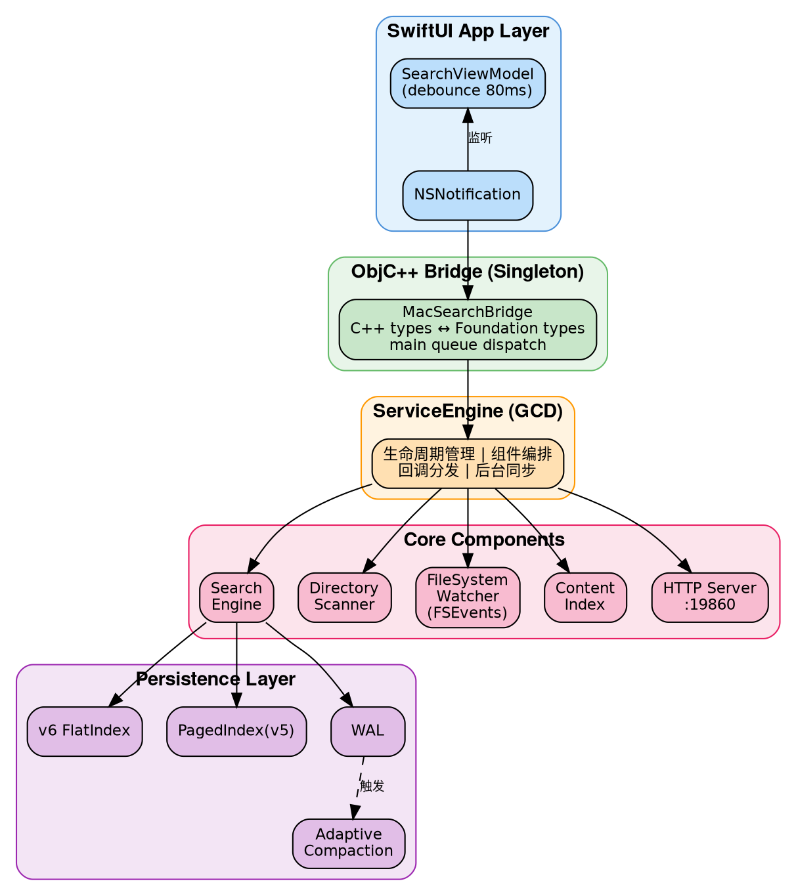

**分层职责：**

- **App 层**：SwiftUI 视图 + ViewModel，负责输入防抖、分页虚拟滚动、高亮渲染
- **Bridge 层**：ObjC++ 单例，将 C++ 的 `std::string/std::vector` 转换为 `NSString/NSArray`，回调通过 `dispatch_async(main_queue)` 投递到主线程
- **ServiceEngine**：核心编排器，管理扫描→索引→监控→持久化的完整生命周期。使用 GCD 串行队列保序 mutation、dispatch_group 追踪后台任务
- **Core 引擎**：纯 C++20，无 Apple 框架依赖（除 CoreServices 的 FSEvents），可独立编译为 CLI daemon

---

## 3. 数据模型：SoA 列式存储

### 为什么不用 AoS？

传统做法（Array of Structures）：
```cpp
struct FileRecord {
    std::string name;      // 32 bytes (SSO)
    std::string path;      // 32 bytes
    uint64_t size;         // 8 bytes
    time_t modTime;        // 8 bytes
    uint64_t inode;        // 8 bytes
    int32_t devId;         // 4 bytes
    uint8_t type;          // 1 byte + 7 padding
};
// sizeof = ~100 bytes，一条 cache line 只能放 ~0.6 条记录
```

搜索时如果只需要过滤 `type` 字段，每条记录都要加载 100 字节到 cache，但只用其中 1 字节——cache 利用率 1%。

### SoA 设计

```
SearchEngine 内部存储（SearchEngine.h:373-399）：

StringPool origNamePool_    // 原始大小写文件名，连续 char buffer
StringPool namePool_        // 小写文件名（搜索用）
StringPool pathPool_        // 去重后的目录路径
StringPool lowerPathPool_   // 小写目录路径

std::vector<uint8_t>  types_       // 1 byte/record
std::vector<uint64_t> sizes_       // 8 bytes/record
std::vector<time_t>   modTimes_    // 8 bytes/record
std::vector<uint64_t> inodes_      // 8 bytes/record
std::vector<int32_t>  devIds_      // 4 bytes/record

std::vector<uint32_t> pathIndices_ // 指向 pathPool_ 的去重索引
```

**关键收益：**

| 操作 | AoS 扫描量 | SoA 扫描量 | 加速比 |
|------|-----------|-----------|--------|
| type 过滤（4.86M 记录） | ~486MB | ~4.86MB | ~100x cache 效率 |
| name 子串搜索 | ~486MB | ~97MB（namePool） | ~5x cache 效率 |

SIMD 函数 `simdTypeLive16` 每条 NEON 指令处理 16 条记录的 type 字段，一条 64B cache line 可覆盖 64 条记录。

### StringPool：连续内存字符串存储

```
StringPool 设计（StringPool.h）：

┌─────────────────────────────────────────────────┐
│ buffer_: ['h','e','l','l','o','.','c','p','p',  │
│           'm','a','i','n','.','s','w','i','f',  │
│           't', ...]                              │
├─────────────────────────────────────────────────┤
│ entries_: [{offset:0, len:9},   // "hello.cpp"  │
│            {offset:9, len:10},  // "main.swift"  │
│            ...]                                  │
└─────────────────────────────────────────────────┘
```

- 所有字符串首尾相连存储在单个 `vector<char>` 中
- 每个字符串通过 `Entry{uint32_t offset, uint16_t length}` 引用（6 字节/条）
- 删除时设置 `length=0`（tombstone），不回收空间——等 compaction 时统一清理
- 好处：零碎片、cache 友好、序列化时可直接 bulk write

### 路径去重

文件系统的特点是大量文件共享相同的目录路径。通过 `pathLookup_`（hash map）将路径 intern 为 `uint32_t` 索引：

```
/Users/wujian/Documents/  →  pathIdx = 42
/Users/wujian/Documents/foo.txt  →  pathIndices_[i] = 42
/Users/wujian/Documents/bar.txt  →  pathIndices_[j] = 42
```

对于 4.86M 文件，大约只有 ~50K 个唯一目录路径。内存节省约 550MB（从每条记录存完整路径 ~100 字节降低到 4 字节索引）。

---

## 4. 扫盘引擎：DirectoryScanner

### API 选型：getattrlistbulk

macOS 提供三种目录遍历 API：

| API | 系统调用次数/目录 | 元数据获取 | 适用场景 |
|-----|-----------------|-----------|---------|
| `readdir` + `stat` | N+1（N = 文件数） | 逐文件 stat | 通用、简单 |
| `std::filesystem` | 同上（封装 readdir） | 同上 | C++17 标准 |
| **`getattrlistbulk`** | **1** | **批量返回** | **高吞吐扫描** |

`getattrlistbulk` 在单次系统调用中返回整个目录的所有条目及其属性（name, type, size, inode, modTime），使用 1MB 内核缓冲区。对于包含 1000 个文件的目录，系统调用次数从 1001 次降低到 1 次。

### 并行扫描架构

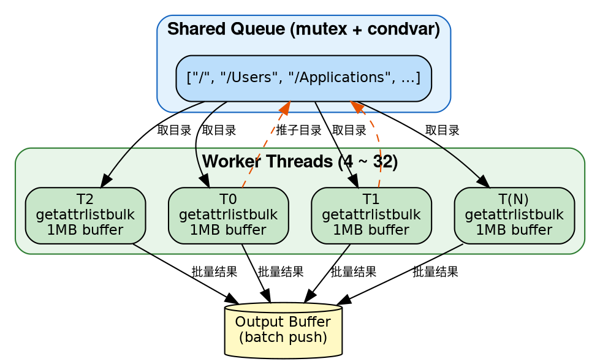

- 线程数：`min(hardware_concurrency, 32)`，下限 4
- Work-stealing 模式：线程从共享队列取目录，扫描后将子目录批量推入队列
- **Inode 去重**：使用 `InodeKey = {dev_t, ino_t}` 集合处理 APFS Firmlinks 和硬链接
- **跨挂载过滤**：比较每个条目的 `dev_t` 与根 `rootDevId_`，避免跨文件系统
- **.app 包处理**：以 `.app` 结尾的目录标记为 type=5，不递归进入内部

### 性能特征

- 4.86M 文件全盘扫描：~8 秒（M3 Pro）
- 瓶颈在 I/O 而非 CPU——SSD 随机读取延迟主导

---

## 5. 搜索引擎：多路加速策略

搜索不是单一算法，而是一个**竞争选择**的多路管线。核心思想：对每个查询，自动选择代价最小的搜索路径。

### 查询执行管线

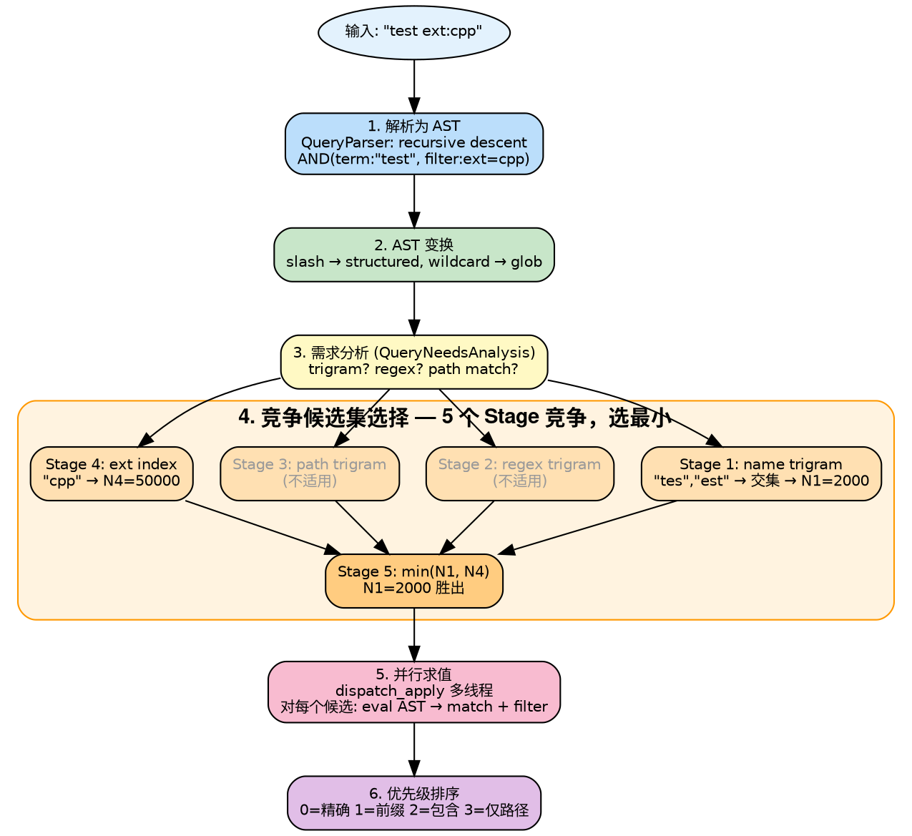

### 搜索路径对比

```
路径                   平均延迟(ms)   典型查询
────────────────────────────────────────────────
glob-trigram           0.1           *.py（直接查 ext index）
trigram                4.1           hello（trigram 交集 + SIMD 验证）
advanced-trigram       6.9           hello ext:cpp（trigram + filter）
structured             31.8          /usr/local/bin（路径分段查询）
linear                 57.8          ab（<3 字符，无法用 trigram）
pure-filter-soa-gcd    104.5         type:folder（全量 SoA 扫描）
```

### 搜索路径决策树

查询进入时，引擎根据查询特征自动选择最优搜索路径：

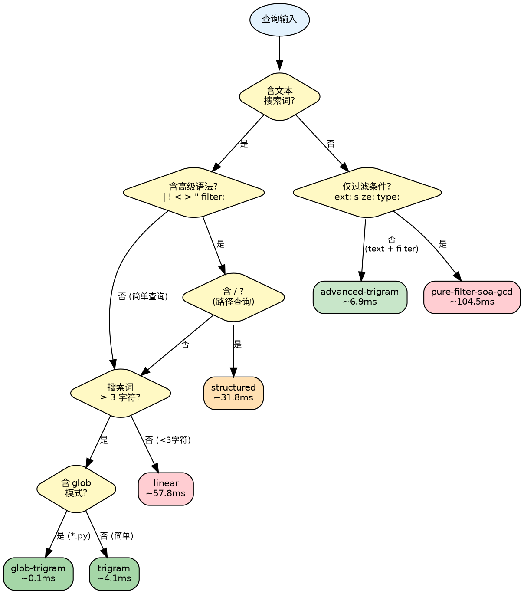

### 纯过滤快速路径

当查询只包含过滤条件（如 `ext:cpp size:>1mb`），没有文本搜索词时：
- 跳过所有 trigram 查找
- 使用 `simdTypeLive16` 批量扫描 `types_` 数组，NEON 每指令处理 16 条记录
- SoA 布局使得这种全量扫描高效——只加载需要检查的列

---

## 6. Trigram 倒排索引

### 原理

Trigram 是连续 3 个字符的组合。例如 "hello" 产生 trigrams: `{hel, ell, llo}`。

```
倒排索引结构（SearchEngine.h:392-396）：

nameTrigramIndex_: unordered_map<uint32_t, vector<uint32_t>>
  "hel" → [12, 4589, 12003, ...]   // sorted record indices
  "ell" → [12, 891, 4589, ...]
  "llo" → [12, 4589, 78901, ...]

查询 "hello":
  trigrams = {hel, ell, llo}
  candidates = intersect(posting[hel], posting[ell], posting[llo])
  → [12, 4589]   // 从 4.86M 缩减到 2 个候选
  → 对每个候选做 SIMD 子串验证
```

**Trigram 打包**（ContentIndex.h:115-119）：3 个 ASCII 字节打包到 `uint32_t` 的低 24 位：
```cpp
Trigram = (a << 16) | (b << 8) | c;
```

### 三级 Trigram 索引

| 索引 | 用途 | 查询示例 |
|------|------|---------|
| `nameTrigramIndex_` | 文件名子串搜索 | `hello`、`test` |
| `pathTrigramIndex_` + `pathIdxToRecords_` | 路径搜索 | `/usr/local` |
| `extensionIndex_` | 扩展名过滤 | `*.cpp`、`ext:py` |

路径 trigram 是两级结构：trigram → pathIdx 集合 → 展开为 recordIdx 集合。因为大量文件共享路径前缀，这避免了 posting list 的冗余膨胀。

### Posting List 操作

- **交集**（`intersectPostingLists`）：sorted set_intersection，用于多 trigram 查询
- **多段交集**（`intersectPostingListsMulti`）：glob 模式 `*test*.cpp` 的字面段 `["test", "cpp"]` 分别提取 trigram 后做交集
- **并集**（`unionPostingListsMulti`）：正则模式 `(foo|bar)` 的每个分支内部做交集，分支间做并集
- **竞争选择**：5 个 Stage 各自产生候选集，选最小的那个

### Trigram 查询求值流程

以查询 `*test*.cpp` 为例，展示 trigram 多段交集的完整求值过程：

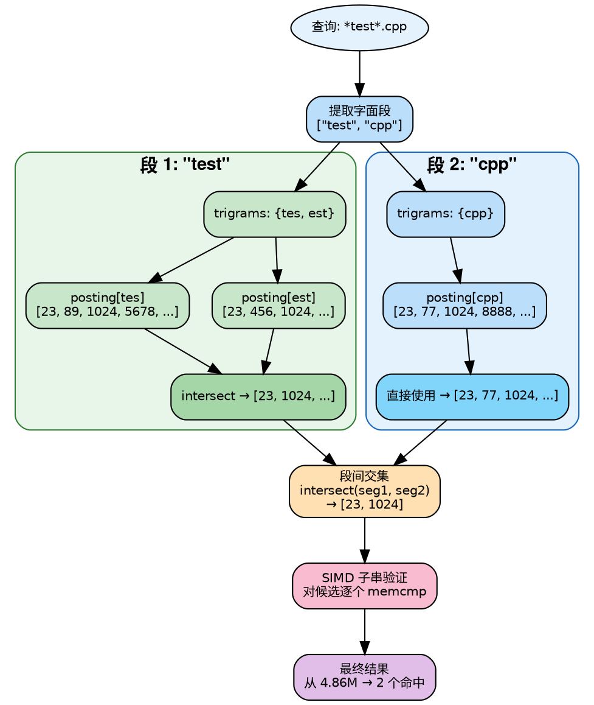

### 关键限制

**Trigram 要求最少 3 个字符。** 1-2 字符的查询（如 `ab`、`桌面`）无法产生 trigram，只能回退到线性扫描。这是 trigram 方案的固有限制，所有使用 trigram 的系统（plocate、ripgrep）都有这个问题。

CJK 字符的额外问题：macOS 文件路径以 ASCII 为主，CJK trigram 几乎没有索引覆盖，导致搜索结果可能不完整。

---

## 7. SIMD 向量化字符串搜索

### 算法：First-Last Byte + 2x Unroll

```
SIMDSearch.h 核心算法（simdFind，lines 39-112）：

传统子串搜索：逐字节比较 → O(n*m)
SIMD 子串搜索：

  needle = "hello" (5 bytes)
  first_byte = 'h', last_byte = 'o'

  ┌────────────────────────────────────┐
  │ data[i..i+15]:   "...h...x...h..x"│  ← 16 bytes
  │ data[i+16..i+31]:"..h....x........"│  ← 16 bytes（2x unroll）
  │                                    │
  │ Step 1: vdupq_n_u8('h') → 广播到 16 lanes
  │ Step 2: vdupq_n_u8('o') → 广播到 16 lanes
  │ Step 3: vceqq_u8(data[i], first_vec) → first_match
  │ Step 4: vceqq_u8(data[i+4], last_vec) → last_match
  │         （偏移 = needle_len - 1）
  │ Step 5: vandq_u8(first_match, last_match) → candidates
  │ Step 6: vmaxvq_u8(candidates) == 0 ? → 快速跳过
  │ Step 7: neon_movemask → 16-bit bitmask
  │ Step 8: __builtin_ctz → 逐个验证 memcmp
  └────────────────────────────────────┘

  2x unroll: 每次迭代处理 32 字节
  两个 block 的 candidates 做 OR 后统一判 zero → 快速跳过
```

### 为什么用 First-Last 而不用 First-Only？

First-Only（只比较首字节）的问题：常见字符如 `e`、`t`、`a` 在文件名中出现频率高（~10%），16 字节中平均有 1.6 个 false positive，每个都要做完整 memcmp。

First-Last 同时比较首尾字节，false positive 概率从 ~10% 降到 ~0.4%（假设均匀分布），memcmp 调用次数降低约 25 倍。

### NEON Movemask 模拟

ARM 没有 x86 的 `_mm_movemask_epi8`，需要手工模拟（SIMDSearch.h:21-31）：

```cpp
inline uint16_t neon_movemask(uint8x16_t v) {
    static const uint8x16_t bit_mask = {1,2,4,8,16,32,64,128,
                                        1,2,4,8,16,32,64,128};
    uint8x16_t masked = vandq_u8(v, bit_mask);
    // 分别对高低 8 字节求和，得到 2 个 8-bit 值
    uint8_t lo = vaddv_u8(vget_low_u8(masked));
    uint8_t hi = vaddv_u8(vget_high_u8(masked));
    return (uint16_t(hi) << 8) | lo;
}
```

### 其他 SIMD 函数

| 函数 | 用途 | 吞吐量 |
|------|------|--------|
| `simdContains` | 子串判定 | 11.56 GB/s（M3 Pro 单线程） |
| `simdToLowerAscii` | 批量 ASCII 小写化 | 16 bytes/指令 |
| `simdTypeLive16` | 批量 tombstone 检查 | 16 records/指令 |
| `simdFindAll` | 收集所有匹配位置 | 用于高亮 |

### 性能实测（5GB 基准测试）

| 算法 | 单线程 GB/s | 12 线程 GB/s |
|------|-----------|-------------|
| **NEON first-last 2x** | **11.56** | **74.30** |
| NEON first-last 1x | 4.93 | 50.42 |
| std::string::find | 1.22 | 12.59 |
| Boyer-Moore-Horspool | 1.17 | — |
| memmem | 1.05 | 9.60 |
| KMP | 0.66 | — |
| Rabin-Karp | 0.14 | — |

NEON 2x 单线程已经超过传统算法 12 线程的吞吐量。2x unroll 利用了 M3 Pro 每周期 4 次 load 的能力。

---

## 8. 查询语言与解析器

### 语法设计

兼容 voidtools Everything 的搜索语法，使用递归下降解析器实现：

```
Grammar（QueryParser.h / QueryTokenizer.h / QueryAST.h）：

query     = or_expr
or_expr   = and_expr ( '|' and_expr )*
and_expr  = not_expr ( not_expr )*        // 空格 = 隐式 AND
not_expr  = '!' atom | atom
atom      = '<' or_expr '>'               // 分组（用 < > 而非括号）
          | '"' ... '"'                   // 引号短语
          | FILTER                        // ext:, size:, etc.
          | WORD                          // 普通搜索词
```

### 支持的过滤器

```
文本过滤:    ext:cpp  file:  folder:  path:  nopath:  parent:
大小过滤:    size:>1mb  size:<100kb  size:10kb..1mb
日期过滤:    dm:today  dm:thisweek  dc:2024  da:last3months
属性过滤:    depth:<3  len:>10  type:file/folder/app
匹配模式:    case:  nocase:  regex:  ww:  wfn:
内容搜索:    content:keyword
类型宏:      audio:  video:  pic:  doc:  exe:  zip:
```

### AST 变换管线

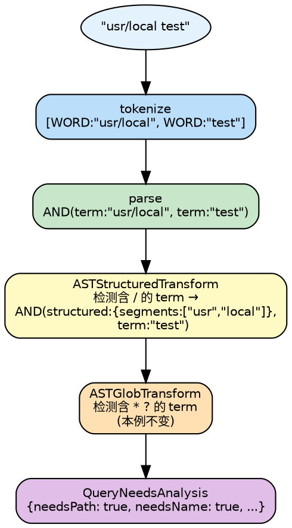

### 零开销向后兼容

简单查询（无 `|`、`!`、`<>`、`"`、filter）直接走旧的 `query()` 路径。`hasAdvancedSyntax()` 做快速字符扫描（~ns 级），避免解析器开销。

---

## 9. 持久化与崩溃恢复

### 两阶段启动（Sub-Second Cold Start）

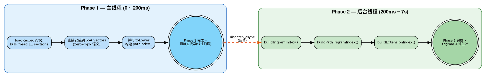

Phase 1 完成后用户立即可以搜索，虽然走线性扫描（~50ms），但比等 7 秒好得多。Phase 2 完成后自动切换到 trigram 加速路径（~5ms）。

### v6 Flat 格式

```
v6 文件布局（FlatIndexWriter.h）：

┌──────────────────────────────────────┐
│ 64-byte Header                       │
│  magic: "MEV6"                       │
│  version: 6                          │
│  sectionCount: 11                    │
│  totalRecords: N                     │
│  SectionEntry[11]: {type, offset,    │
│                     size, crc32}     │
├──────────────────────────────────────┤
│ Section 0: NamesOrig (raw bytes)     │ ← StringPool::buffer_ 直写
│ Section 1: NamesLower                │
│ Section 2: PathPool                  │
│ Section 3: LowerPathPool            │
│ Section 4: PathIndices (uint32[N])   │
│ Section 5: Types (uint8[N])          │
│ Section 6: Sizes (uint64[N])         │
│ Section 7: ModTimes (time_t[N])      │
│ Section 8: Inodes (uint64[N])        │
│ Section 9: DevIds (int32[N])         │
│ Section 10: MetadataKV              │
└──────────────────────────────────────┘

每个 Section 独立 CRC32 校验。
加载时 bulk fread 整个 section → 直接 move 到目标 vector。
```

### WAL（Write-Ahead Log）

增量变更通过 WAL 持久化，避免每次变更都重写整个索引：

```
WAL 格式（IndexWAL.h）：

Header: magic="WAL1", version=1
Entry: [op(1B) | dataLen(4B) | data(变长) | crc32(4B)]
  op: Add=1, Remove=2, Update=3

关键参数:
  fsync 间隔: 每 64 条 entry
  最大 WAL 大小: 50MB → 触发 compaction
```

崩溃恢复时 `readAll()` 从头读取 WAL，遇到第一条 CRC 校验失败的 entry 即停止——保证前缀都是完整的。

### 持久化生命周期

从运行时变更到最终落盘的完整数据流：

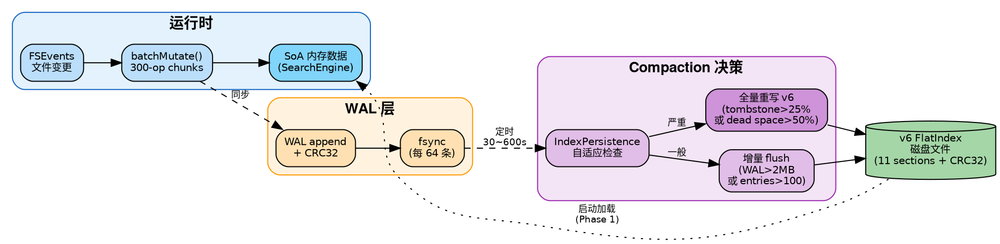

### 自适应 Compaction

```
IndexPersistence 自适应策略（IndexPersistence.h）：

              dirty ratio 高
                  ↓
flush interval: [30s ←────────→ 600s]
                  ↑
              dirty ratio 低

触发条件:
  WAL entry 数 > 100          → 考虑 compaction
  WAL 文件大小 > 2MB          → 立即 flush
  tombstone 比例 > 25%        → 全量重写
  paged file 死空间 > 50%     → 全量重写
```

---

## 10. 实时文件监控：FSEvents

### FSEvents 集成

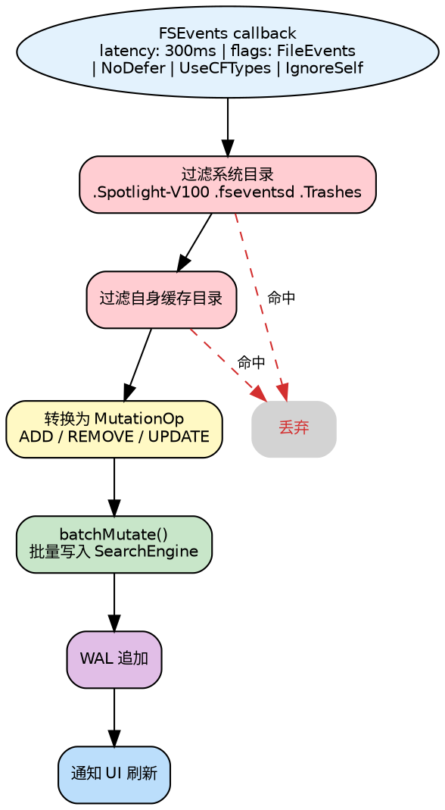

### Rescan 防抖

FSEvents 的 `MustScanSubDirs` 标志表示 journal 被截断，必须重新扫描子树。为避免频繁重扫：

```
防抖机制（ServiceEngine.h:146-153）：

pendingRescanPaths_: set<string>   // 待重扫路径集合
rescanDebounceTimer_: GCD timer    // 5s 防抖

规则:
  1. 收到 MustScanSubDirs → 路径加入 pendingRescanPaths_
  2. 重置 5s 定时器
  3. 5s 内无新事件 → 批量重扫所有 pending 路径
  4. 同一路径 300s 内不重复重扫（throttle）
```

### lastEventId 持久化

`lastEventId` 保存在索引元数据中。增量启动时，只需要回放从 `lastEventId` 到当前的 FSEvents 增量事件，而不是全盘重扫。配合 v6 索引加载，实现 ~200ms 冷启动。

---

## 11. 并发模型与锁设计

### Reader-Writer 锁分层

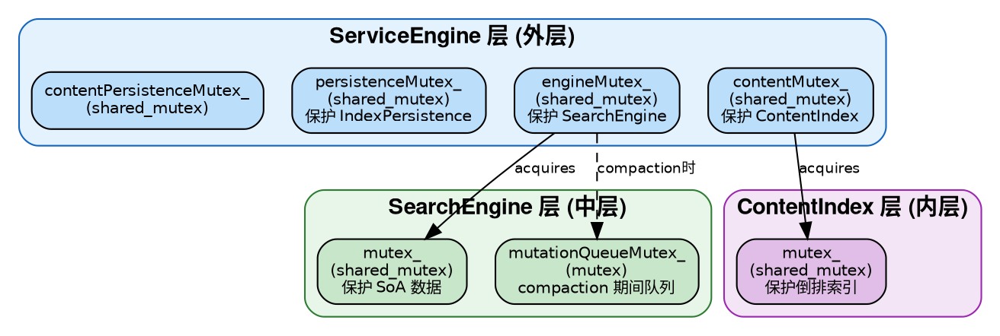

### 查询并发

```
查询不阻塞写入，写入不阻塞查询（大部分时间）：

  Query Thread 1 ──shared_lock──→ 读 SoA 数据
  Query Thread 2 ──shared_lock──→ 读 SoA 数据
  Query Thread 3 ──shared_lock──→ 读 SoA 数据    // 并行
  │
  Mutation ────────unique_lock──→ 写 SoA 数据     // 等所有 reader 完成
  │
  Query Thread 4 ──shared_lock──→ 读（mutation 完成后）
```

### COW Compaction（关键设计）

Compaction 需要重组整个 SoA 存储，如果持有写锁会阻塞所有查询数秒。解法：

```graphviz
// compactRecords() 三阶段 COW（SearchEngine.cpp）
digraph cow_compaction {
    rankdir=LR
    node [shape=box, style="filled,rounded", fontname="Helvetica", fontsize=10]
    edge [fontname="Helvetica", fontsize=9]

    subgraph cluster_p1 {
        label="Phase 1\nshared_lock (~ms)"
        style="filled,rounded"; color="#1565C0"; fillcolor="#E3F2FD"
        fontname="Helvetica Bold"
        Snap [label="deep_copy\nSoA vectors\nStringPools", fillcolor="#BBDEFB"]
        Unlock1 [label="unlock", shape=oval, fillcolor="#90CAF9"]
        Snap -> Unlock1
    }

    subgraph cluster_p2 {
        label="Phase 2\nno lock (~seconds)"
        style="filled,rounded"; color="#2E7D32"; fillcolor="#E8F5E9"
        fontname="Helvetica Bold"
        CompNames [label="compact(namePool, liveMask)", fillcolor="#C8E6C9"]
        CompTypes [label="compact(types, liveMask)", fillcolor="#C8E6C9"]
        Rebuild [label="rebuild(trigram)", fillcolor="#C8E6C9"]
        Note [label="查询正常执行 ✓\nmutation → mutationQueue_"
              shape=note, fillcolor="#FFF9C4", fontcolor="#E65100"]
        CompNames -> CompTypes -> Rebuild
    }

    subgraph cluster_p3 {
        label="Phase 3\nunique_lock (~ms)"
        style="filled,rounded"; color="#C62828"; fillcolor="#FFEBEE"
        fontname="Helvetica Bold"
        Swap [label="swap(SoA, compactedSoA)", fillcolor="#FFCDD2"]
        Replay [label="replay(mutationQueue_)\n回放增量变更", fillcolor="#FFCDD2"]
        Unlock3 [label="unlock", shape=oval, fillcolor="#EF9A9A"]
        Swap -> Replay -> Unlock3
    }

    Unlock1 -> CompNames [style=bold]
    Rebuild -> Swap [style=bold]
}
```

**效果：** 写锁持有时间从 30-60 秒降低到 <100ms。查询在 Phase 2 期间完全不受影响。

### Lock-Free 查询取消

```
查询取消机制（SearchEngine.h:403-408）：

sessionGenerations_: unordered_map<uint64_t, atomic<uint64_t>>

cancel(sessionId):
  sessionGenerations_[sessionId]++   // 原子递增

queryAdvanced() 内部:
  myGen = sessionGenerations_[sessionId].load()
  for each page of candidates:
    if sessionGenerations_[sessionId] != myGen:
      return early   // 新查询已发起，当前查询作废
```

每个 session（GUI=1, HTTP=按连接分配）有独立的 generation counter。用户每次输入新字符，generation 递增，旧查询在下一个 page boundary 检查到 generation 变化后立即退出。无需加锁，无需信号量。

### batchMutate 锁分片

大批量 mutation（如 FSEvents 回放数千条变更）持有写锁过长会饿死查询。解法：

```
batchMutate() 锁分片（SearchEngine.cpp）：

将 mutations 分成 300 条一组的 chunk:
  for chunk in chunks(mutations, 300):
    unique_lock(mutex_)
    apply(chunk)
    unlock()
    // 给 pending query 一个获取 shared_lock 的窗口
```

---

## 12. 内容搜索子系统

### 架构

```
ContentIndex 设计（ContentIndex.h/.cpp）：

文件索引流程:
  1. 检查扩展名白名单（txt, md, py, cpp, h, js, ts, ...）
  2. 检查文件大小 ≤ 1MB
  3. 读取文件前 8KB，检测是否为二进制（含 NUL 字节 → 跳过）
  4. 计算 FNV-1a hash → 如果 hash 未变 → 跳过（增量优化）
  5. 提取 trigram → 更新倒排索引

查询流程:
  1. keyword → 提取 trigrams
  2. 每个 trigram 的 posting list 按大小排序
  3. 从最短 posting list 开始，逐个 set_intersection
  4. 返回候选文件列表
  5. 对候选文件读取内容生成 snippet
```

### Trigram 去重优化（C-1）

提取 trigram 时使用 `thread_local` 位图（16M bits = 2MB）做 O(1) 去重：

```cpp
thread_local uint8_t trigramBitmap[1 << 24 / 8];  // 2MB per thread
// 不清零整个位图——只记录并清除本次设置的位
// O(unique_trigrams) 而非 O(2^24)
```

### Snippet 生成

64KB 分块读取文件（而非一次读 1MB），块间有重叠以处理跨块关键词。返回匹配点前后 ~80 字符的上下文。

---

## 13. 性能演进数据

### 查询延迟演进（29 轮基准测试）

```
延迟 (ms)
200 ┤
    │ ■ R1: 178.4ms
180 ┤
    │
160 ┤
    │
140 ┤
    │
120 ┤
    │
100 ┤
    │
 80 ┤   ■ R5: 79.7ms
    │
 60 ┤         ■ R10: 69.1ms
    │
 40 ┤                     ■ R15: 34.7ms    ■ R24: 39.8ms
    │
 20 ┤
    │                                              ■ R29: 10.5ms
  0 ┼──────────────────────────────────────────────────────────────
    R1    R5    R10   R15   R20   R24   R29
```

**17x 延迟降低，四次范式跃迁：**

| 阶段 | 关键变更 | 效果 |
|------|---------|------|
| Trigram 倒排索引 | 路径查询 120x 提升 | Agent 自驱动实现 |
| SoA 列式 + SIMD | 35ms → 10.5ms | 人类架构决策 |
| Node-Centric Query | 路径查询 1522x 提升 | 人类架构决策 |
| v6 Flat 持久化 | 启动 250x 提升（50s→200ms） | 人类架构决策 |

### 启动时间演进

```
                        前                    后
全盘扫描启动      ~50s + 7s trigram build → ~200ms Phase 1 + 7s Phase 2（后台）
增量启动          ~5s WAL replay           → ~200ms + FSEvents delta
```

### 内存演进

```
                        前                    后
路径存储          ~100 bytes/record         → 4 bytes/record（去重索引）
Trigram 副本      per-record trigram vector  → 共享倒排索引
总内存（4.86M）   ~1GB+                     → ~300MB
```

---

## 14. 竞品对比与差异化

### 核心竞品对比

| 维度 | Everything (Win) | plocate (Linux) | Cardinal (Mac/Rust) | MacEverything |
|------|-----------------|-----------------|--------------------|--------------:|
| 索引方式 | 直读 NTFS MFT | Trigram + TurboPFor | mmap slab | Trigram + SoA |
| 搜索算法 | 线性扫描（<100MB 索引） | Trigram 交集 | Rabin-Karp | Trigram + SIMD |
| 实时更新 | USN Journal | updatedb cron | FSEvents | FSEvents + WAL |
| 启动速度 | 即时（常驻） | N/A（CLI） | 未知 | 200ms (Phase 1) |
| 搜索延迟 | <1ms（内存带宽） | ~8ms（27M 文件） | 未知 | ~10.5ms（4.86M 文件） |
| UI | 原生 Win32 | CLI | Tauri (Web) | 原生 SwiftUI |
| 持久化 | MFT 即索引 | 自定义二进制 | mmap slab | v6 Flat + WAL |

### macOS 市场差异化

**现有 Mac 搜索工具的问题：**
- Spotlight/Alfred/Raycast：都基于 Spotlight，无法做到 sub-100ms 全文件名搜索
- Find Any File：使用 `searchfs()` 实时查询，无持久化索引，3-15 秒
- EasyFind：无索引，5-30 秒
- Cardinal：最接近的竞品，但使用 Tauri/Web UI 非原生体验

**MacEverything 的差异化：**
1. 原生 SwiftUI UI（非 Electron/Tauri）
2. sub-100ms 全盘文件名搜索
3. 轻量级持久化索引 + 实时 FSEvents 更新
4. CLI daemon 模式 + HTTP API（可集成到其他工具）
5. 完整的 Everything 兼容查询语法

---

## 15. 设计得失与已知问题

### 做对了的设计决策

**1. SoA 列式存储**
- 搜索只需要 name/type 时，不加载 size/modTime/inode
- 使 SIMD 批量操作成为可能
- 代价：record 管理更复杂（增删改需要同步维护多个 vector）

**2. COW Compaction**
- 彻底解决了 compaction 阻塞查询的问题
- 代价：Phase 1 快照需要额外内存（约 2x 峰值）

**3. 两阶段启动**
- 用户体感从 50 秒等待变成 200ms 即可用
- 代价：Phase 1 ~ Phase 2 期间搜索走线性扫描（~50ms），可接受

**4. 竞争候选集选择**
- 自动适应不同查询模式，无需手写策略规则
- 代价：候选集计算有额外开销，但 < 1ms

**5. WAL + 自适应 Compaction**
- 崩溃恢复、增量更新、死空间回收三者统一
- 代价：实现复杂度高

### 设计上的不足

**1. Trigram 3 字符最低限制**
- 1-2 字符查询回退线性扫描，CJK 短词查询（如"桌面"）延迟 ~181ms
- 竞品方案：2-gram（内存翻倍）、SIMD 暴力搜索（Everything 方案）
- 改进方向：对 <3 字符查询使用 SIMD 快速路径

**2. 路径存储冗余**
- 同时维护 pathPool_ 和 lowerPathPool_ 两份路径数据
- 改进方向：运行时 toLower，用 CPU 换内存

**3. Tombstone 空间不回收**
- StringPool 删除只标记 length=0，需要等 compaction 回收
- 高频增删场景下可能浪费内存
- 改进方向：分代策略，小对象就地回收

**4. 无模糊搜索/拼音搜索**
- 不支持 fzf 风格的 fuzzy matching
- 不支持中文拼音搜索
- 竞品 Cardinal 和 JARVIS Search 已支持

### 已知性能问题（高优先级）

| ID | 问题 | 影响 | 根因 | 修复方向 |
|----|------|------|------|---------|
| P24 | case-sensitive 查询跳过 trigram | 631ms | 大小写 trigram 独立，`case:README` 无法用小写 trigram | 一行修复：case query 也用小写 trigram 预过滤 |
| P23 | flush 期间查询延迟飙升 | 547ms | flush 持有写锁时阻塞查询 | flush 分步化或 COW flush |
| P22 | CJK 2 字符查询线性扫描 | 181ms | trigram 最少需要 3 字节 | SIMD 快速路径 or 2-gram |

---

## 16. 演化方向

### 短期优化（预期收益高）

1. **Case-sensitive trigram 预过滤（P24）**
   - 对 `case:README` 查询，先用小写 trigram 缩小候选集，再做大小写敏感匹配
   - 预计：631ms → <10ms，一行代码修复

2. **短查询 SIMD 加速**
   - 对 <3 字符查询，直接 SIMD 扫描 namePool_
   - 预计：4-8x 提升（借助 SoA 布局 + NEON 已有基础设施）

3. **Flush 查询保护**
   - flush 操作分步化，每步只持有短暂写锁
   - 类似 batchMutate 的 300-op chunk 分片策略

### 中期演进

4. **模糊搜索（Fuzzy Matching）**
   - Smith-Waterman 变体（fzf 方案），支持首字母匹配、连续匹配加分
   - 需要新的评分排序体系

5. **零拷贝索引加载**
   - v6 格式已经接近 mmap-ready，进一步优化为 mmap + 直接指针
   - 预计启动时间从 200ms 降到 <50ms

6. **Delta 压缩 Posting List**
   - plocate 方案：posting list 用 delta encoding + varint 压缩
   - 内存降低 50-70%，缓存命中率提升

### 长期方向

7. **中文拼音搜索**
   - 拼音 trigram 索引或拼音→汉字映射表
   - 参考 JARVIS Search 实现

8. **语义搜索集成**
   - 基于文件名/路径的 embedding，支持自然语言查询
   - 与现有精确搜索互补，非替代

9. **分布式索引**
   - 支持网络文件系统（NFS/SMB）的增量索引
   - 需要新的一致性协议

---

## 附录 A：关键常量速查

| 常量 | 值 | 位置 | 说明 |
|------|-----|------|------|
| `kRecordsPerPage` | 1024 | SearchEngine.h | 每页记录数 |
| `kRecentCacheSize` | 200 | SearchEngine.h | 最近文件缓存 |
| `ATTR_BUF_SIZE` | 1MB | DirectoryScanner.cpp | getattrlistbulk 缓冲区 |
| FSEvents latency | 300ms | FileSystemWatcher.cpp | 事件合并窗口 |
| Search debounce | 80ms | SearchViewModel.swift | GUI 输入防抖 |
| Content debounce | 300ms | SearchViewModel.swift | 内容搜索防抖 |
| Page size (GUI) | 100 | SearchViewModel.swift | 虚拟滚动批次 |
| Max results | 10,000 | SearchViewModel.swift | 单次查询上限 |
| `kCompactThreshold` | 100 | IndexPersistence.h | WAL entry compaction 阈值 |
| `kBaseIntervalSec` | 300 | IndexPersistence.h | 基础 flush 间隔 |
| `kMinIntervalSec` | 30 | IndexPersistence.h | 最小自适应间隔 |
| `kMaxIntervalSec` | 600 | IndexPersistence.h | 最大自适应间隔 |
| `kWALSizeFlushThreshold` | 2MB | IndexPersistence.h | WAL 大小触发 flush |
| `kMaxWALSize` | 50MB | IndexWAL.h | WAL 最大大小 |
| `kTombstoneCompactRatio` | 0.25 | IndexPersistence.h | tombstone 比例触发重写 |
| `kRescanDebounceDelaySec` | 5.0 | ServiceEngine.h | 重扫防抖延迟 |
| `kRescanThrottleIntervalSec` | 300.0 | ServiceEngine.h | 重扫节流间隔 |
| HTTP port | 19860 | MacSearchBridge.mm | 默认 HTTP 端口 |
| batchMutate chunk | 300 | SearchEngine.cpp | 锁分片大小 |
| WAL fsync 间隔 | 64 entries | IndexWAL.h | 持久化写入间隔 |

## 附录 B：文件组织

```
MacEverything/
├── Core/                              # C++20 核心引擎
│   ├── SearchEngine.h                 # SoA 存储 + Trigram 索引 + 查询路由
│   ├── SearchEngine.cpp               # 记录管理、WAL、compaction
│   ├── SearchEngineQuery.cpp          # 查询预处理 + 路由
│   ├── SearchEngineAdvancedQuery.cpp   # 高级查询求值（竞争候选集）
│   ├── SearchEngineIndex.cpp          # Trigram/Extension 索引构建
│   ├── SearchEngineV6.cpp             # v6 格式加载 + 两阶段启动
│   ├── DirectoryScanner.h/.cpp        # getattrlistbulk 并行扫描
│   ├── FileSystemWatcher.h/.cpp       # FSEvents 实时监控
│   ├── ContentIndex.h/.cpp            # 内容搜索 Trigram 索引
│   ├── SIMDSearch.h                   # ARM NEON SIMD 字符串搜索
│   ├── StringPool.h                   # 连续内存字符串池
│   ├── FlatIndexWriter.h              # v6 Flat 持久化格式
│   ├── PagedIndexWriter.h             # v5 Paged 持久化格式
│   ├── IndexWAL.h/.cpp                # Write-Ahead Log
│   ├── IndexPersistence.h             # 自适应 Compaction 编排
│   ├── ContentIndexPersistence.h      # 内容索引持久化
│   ├── QueryParser.h                  # 递归下降解析器
│   ├── QueryTokenizer.h               # 词法分析器
│   ├── QueryAST.h                     # AST 节点定义
│   ├── QueryFilterParser.h            # 过滤器解析
│   ├── QueryDateParser.h              # 日期过滤器解析
│   ├── CompiledGlob.h                 # Glob 模式预编译
│   ├── ServiceEngine.h/.cpp           # 生命周期编排
│   ├── ServiceEngine+FSEvents.cpp     # FSEvents 集成
│   ├── ServiceEngine+Content.cpp      # 内容索引编排
│   └── HttpServer.h/.cpp              # HTTP REST API
├── Bridge/                            # ObjC++ 桥接
│   ├── MacSearchBridge.h/.mm          # C++ ↔ Foundation 类型转换
│   └── MacSearchBridge+Content.h/.mm  # 内容搜索桥接
├── App/                               # SwiftUI 界面
│   └── SearchViewModel.swift          # 搜索视图模型
├── CLI/                               # CLI Daemon
│   └── daemon_main.cpp                # 无头守护进程
└── tests/                             # 87 个测试文件，11,000+ 测试用例
```

## 附录 C：HTTP API

```bash
# 文件名搜索
curl "http://localhost:19860/api/search?q=hello&max=20"

# 内容搜索
curl "http://localhost:19860/api/search/content?q=keyword&max=20"

# 最近修改
curl "http://localhost:19860/api/recent?count=20"

# 索引状态
curl "http://localhost:19860/api/status"

# 健康检查
curl "http://localhost:19860/api/health"

# 重建索引
curl -X POST "http://localhost:19860/api/index/rebuild"

# 响应格式（search 示例）
{
  "results": [
    {"name": "hello.cpp", "path": "/Users/.../", "type": 1, "size": 1234, "modTime": 1714000000}
  ],
  "totalCount": 42,
  "timing": {"totalMs": 5.2, "searchMs": 4.1, "formatMs": 1.1},
  "searchPath": "trigram",
  "trigramCandidates": 156
}
```
