# MacEverything 架构深度剖析

> 面向工程/系统/算法同学的技术分享 | 初版 2026-04-25 · 更新 2026-05-31（R108 数据、短查询缓存、内置 LLM 自然语言搜索）

---

## 目录

1. [项目定位与核心指标](#1-项目定位与核心指标)
2. [整体架构](#2-整体架构)
3. [数据模型：SoA 列式存储](#3-数据模型soa-列式存储)
4. [扫盘引擎：DirectoryScanner](#4-扫盘引擎directoryscanner)
5. [搜索引擎：多路加速策略](#5-搜索引擎多路加速策略)
6. [Trigram 倒排索引](#6-trigram-倒排索引)
7. [SIMD 向量化字符串搜索](#7-simd-向量化字符串搜索)
8. [查询语言与解析器](#8-查询语言与解析器)
9. [短查询缓存：ShortQueryCache](#9-短查询缓存shortquerycache)
10. [持久化与崩溃恢复](#10-持久化与崩溃恢复)
11. [实时文件监控：FSEvents](#11-实时文件监控fsevents)
12. [并发模型与锁设计](#12-并发模型与锁设计)
13. [内容搜索子系统](#13-内容搜索子系统)
14. [内置 LLM 自然语言搜索](#14-内置-llm-自然语言搜索)
15. [性能演进数据](#15-性能演进数据)
16. [竞品对比与差异化](#16-竞品对比与差异化)
17. [设计得失与已知问题](#17-设计得失与已知问题)
18. [演化方向](#18-演化方向)

---

## 1. 项目定位与核心指标

MacEverything 是 macOS 上的全盘文件名搜索工具，对标 Windows 平台的 voidtools Everything。核心价值主张：

| 指标 | 目标 | 实际 |
|------|------|------|
| 全盘扫描 | < 10s | ~8s（首次全盘） |
| 搜索延迟 | < 50ms | 1-2 字符 0.4ms（缓存）/ 常规词 ~10-20ms（trigram） |
| 冷启动 | < 1s | ~200ms（Phase 1 主线程） |
| 内存占用 | 合理 | ~300-400MB（6.18M 记录） |
| 实时性 | 秒级 | FSEvents 300ms 合并窗口 |

> **数据集说明**：本文性能数据来自 M3 Pro 长跑实测。截至 2026-05-30 运行时索引规模为 **total 6,183,351 / live 5,412,386**（约 12.5% 为待 compaction 的 tombstone）。早期文档引用的 4.86M 为更早期的快照，性能演进图表（§15）保留历史 R1→R29 数据以体现优化轨迹，运行时延迟则以最新 R108 电池为准。

技术栈：C++20 核心引擎 + Objective-C++ 桥接 + SwiftUI 界面 + 内置 llama.cpp（自然语言搜索）。Core 引擎同时编译为 CLI daemon、HTTP API（:19860）与 MCP server，可独立于 GUI 运行。

---

## 2. 整体架构

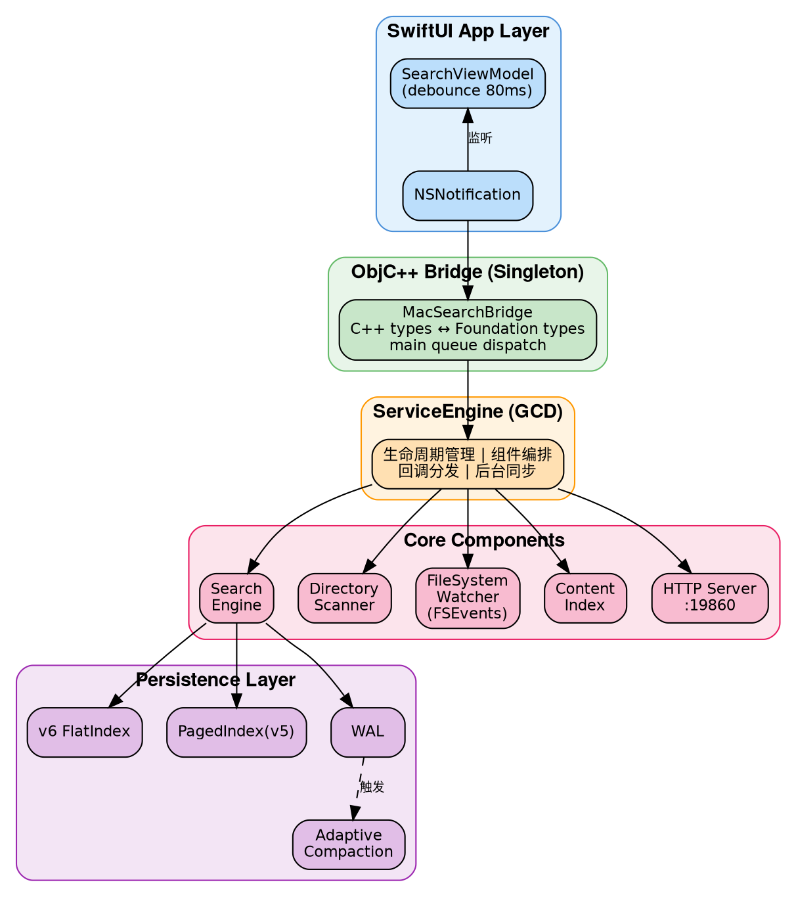

**分层职责：**

- **App 层**：SwiftUI 视图 + ViewModel，负责输入防抖、分页虚拟滚动、高亮渲染
- **Bridge 层**：ObjC++ 单例，将 C++ 的 `std::string/std::vector` 转换为 `NSString/NSArray`，回调通过 `dispatch_async(main_queue)` 投递到主线程
- **ServiceEngine**：核心编排器，管理扫描→索引→监控→持久化的完整生命周期。使用 GCD 串行队列保序 mutation、dispatch_group 追踪后台任务
- **Core 引擎**：纯 C++20，无 Apple 框架依赖（除 CoreServices 的 FSEvents），可独立编译为 CLI daemon

---

## 3. 数据模型：SoA 列式存储

### 为什么不用 AoS？

传统做法（Array of Structures）：
```cpp
struct FileRecord {
    std::string name;      // 32 bytes (SSO)
    std::string path;      // 32 bytes
    uint64_t size;         // 8 bytes
    time_t modTime;        // 8 bytes
    uint64_t inode;        // 8 bytes
    int32_t devId;         // 4 bytes
    uint8_t type;          // 1 byte + 7 padding
};
// sizeof = ~100 bytes，一条 cache line 只能放 ~0.6 条记录
```

搜索时如果只需要过滤 `type` 字段，每条记录都要加载 100 字节到 cache，但只用其中 1 字节——cache 利用率 1%。

### SoA 设计

```
SearchEngine 内部存储（SearchEngine.h:373-399）：

StringPool origNamePool_    // 原始大小写文件名，连续 char buffer
StringPool namePool_        // 小写文件名（搜索用）
StringPool pathPool_        // 去重后的目录路径
StringPool lowerPathPool_   // 小写目录路径

std::vector<uint8_t>  types_       // 1 byte/record
std::vector<uint64_t> sizes_       // 8 bytes/record
std::vector<time_t>   modTimes_    // 8 bytes/record
std::vector<uint64_t> inodes_      // 8 bytes/record
std::vector<int32_t>  devIds_      // 4 bytes/record

std::vector<uint32_t> pathIndices_ // 指向 pathPool_ 的去重索引
```

**关键收益：**

| 操作 | AoS 扫描量 | SoA 扫描量 | 加速比 |
|------|-----------|-----------|--------|
| type 过滤（4.86M 记录） | ~486MB | ~4.86MB | ~100x cache 效率 |
| name 子串搜索 | ~486MB | ~97MB（namePool） | ~5x cache 效率 |

SIMD 函数 `simdTypeLive16` 每条 NEON 指令处理 16 条记录的 type 字段，一条 64B cache line 可覆盖 64 条记录。

### StringPool：连续内存字符串存储

```
StringPool 设计（StringPool.h）：

┌─────────────────────────────────────────────────┐
│ buffer_: ['h','e','l','l','o','.','c','p','p',  │
│           'm','a','i','n','.','s','w','i','f',  │
│           't', ...]                              │
├─────────────────────────────────────────────────┤
│ entries_: [{offset:0, len:9},   // "hello.cpp"  │
│            {offset:9, len:10},  // "main.swift"  │
│            ...]                                  │
└─────────────────────────────────────────────────┘
```

- 所有字符串首尾相连存储在单个 `vector<char>` 中
- 每个字符串通过 `Entry{uint32_t offset, uint16_t length}` 引用（6 字节/条）
- 删除时设置 `length=0`（tombstone），不回收空间——等 compaction 时统一清理
- 好处：零碎片、cache 友好、序列化时可直接 bulk write

### 路径去重

文件系统的特点是大量文件共享相同的目录路径。通过 `pathLookup_`（hash map）将路径 intern 为 `uint32_t` 索引：

```
/Users/wujian/Documents/  →  pathIdx = 42
/Users/wujian/Documents/foo.txt  →  pathIndices_[i] = 42
/Users/wujian/Documents/bar.txt  →  pathIndices_[j] = 42
```

对于 4.86M 文件，大约只有 ~50K 个唯一目录路径。内存节省约 550MB（从每条记录存完整路径 ~100 字节降低到 4 字节索引）。

---

## 4. 扫盘引擎：DirectoryScanner

### API 选型：getattrlistbulk

macOS 提供三种目录遍历 API：

| API | 系统调用次数/目录 | 元数据获取 | 适用场景 |
|-----|-----------------|-----------|---------|
| `readdir` + `stat` | N+1（N = 文件数） | 逐文件 stat | 通用、简单 |
| `std::filesystem` | 同上（封装 readdir） | 同上 | C++17 标准 |
| **`getattrlistbulk`** | **1** | **批量返回** | **高吞吐扫描** |

`getattrlistbulk` 在单次系统调用中返回整个目录的所有条目及其属性（name, type, size, inode, modTime），使用 1MB 内核缓冲区。对于包含 1000 个文件的目录，系统调用次数从 1001 次降低到 1 次。

### 并行扫描架构

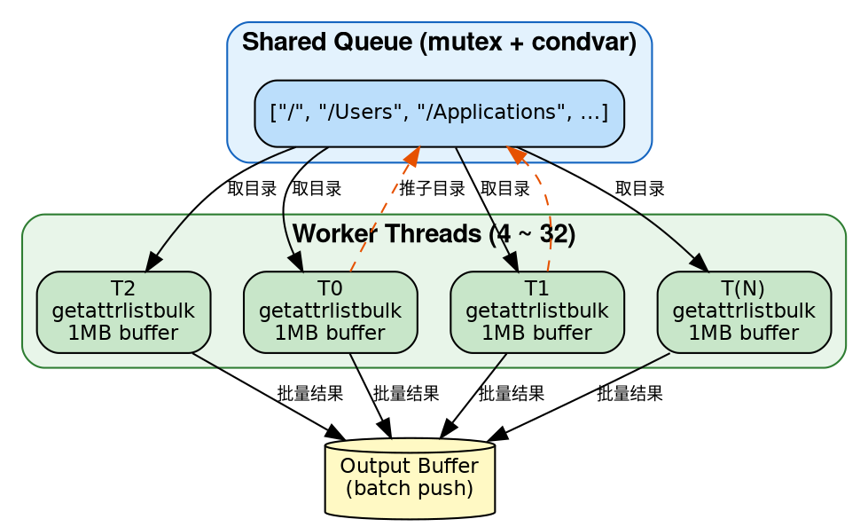

- 线程数：`min(hardware_concurrency, 32)`，下限 4
- Work-stealing 模式：线程从共享队列取目录，扫描后将子目录批量推入队列
- **Inode 去重**：使用 `InodeKey = {dev_t, ino_t}` 集合处理 APFS Firmlinks 和硬链接
- **跨挂载过滤**：比较每个条目的 `dev_t` 与根 `rootDevId_`，避免跨文件系统
- **.app 包处理**：以 `.app` 结尾的目录标记为 type=5，不递归进入内部

### 性能特征

- 4.86M 文件全盘扫描：~8 秒（M3 Pro）
- 瓶颈在 I/O 而非 CPU——SSD 随机读取延迟主导

---

## 5. 搜索引擎：多路加速策略

搜索不是单一算法，而是一个**竞争选择**的多路管线。核心思想：对每个查询，自动选择代价最小的搜索路径。

### 查询执行管线

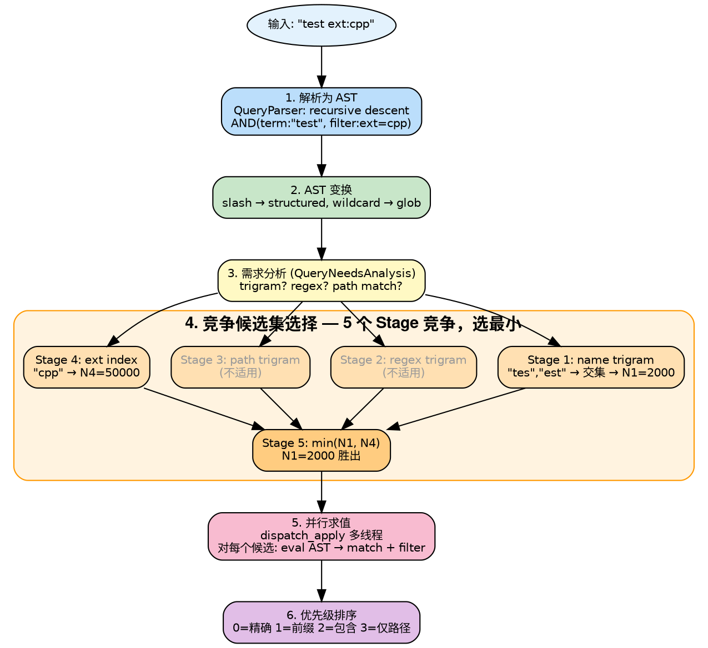

### 搜索路径对比

实测延迟（M3 Pro，6.18M 记录，R108 暖态电池）：

```
路径                   实测延迟(ms)   典型查询           说明
──────────────────────────────────────────────────────────────────────
short-query-cache      0.37          x、ab              1-2 字符 ASCII，O(1) 命中预算缓存（§9）
advanced-ext-index     5.62          ext:cpp            扩展名索引直查
main.cpp (词+ext)      9.59          main.cpp           trigram 交集（74 候选）
MacEverything          17.96         MacEverything      trigram（6.7K 候选）
hello world            18.04         多词              逐词 trigram 交集
advanced-trigram       22-30         README、*.swift    trigram 交集 + SIMD 验证
test（高频词）         47.69         test               137K 候选仅 48ms（SIMD 验证摊薄）
size:>100m             51.36         数值过滤           pure-filter-soa-gcd 全量 SoA 扫描
dm:today               51.75         日期过滤           pure-filter-soa-gcd
中文测试 / path:/Users 135-144       CJK / 路径子串     advanced-linear-gcd（无 trigram 覆盖）
content:import         208           内容关键词         pure-filter（内容倒排，见 §13）
```

> 注：早期文档的 `glob-trigram`/`trigram`/`linear` 路径名在统一进 Advanced 求值管线后，对外 `searchPath` 标签已演化为 `advanced-trigram`/`advanced-ext-index`/`advanced-linear-gcd`/`pure-filter-soa-gcd`。1-2 字符查询不再走线性扫描，而是命中 §9 的 `short-query-cache` 快路径（57.8ms → 0.37ms，**~150x**）。CJK 短词与 `path:` 子串目前仍走 `advanced-linear-gcd`（trigram 对 CJK/路径覆盖不足，见 §17）。

### 搜索路径决策树

查询进入时，引擎根据查询特征自动选择最优搜索路径：

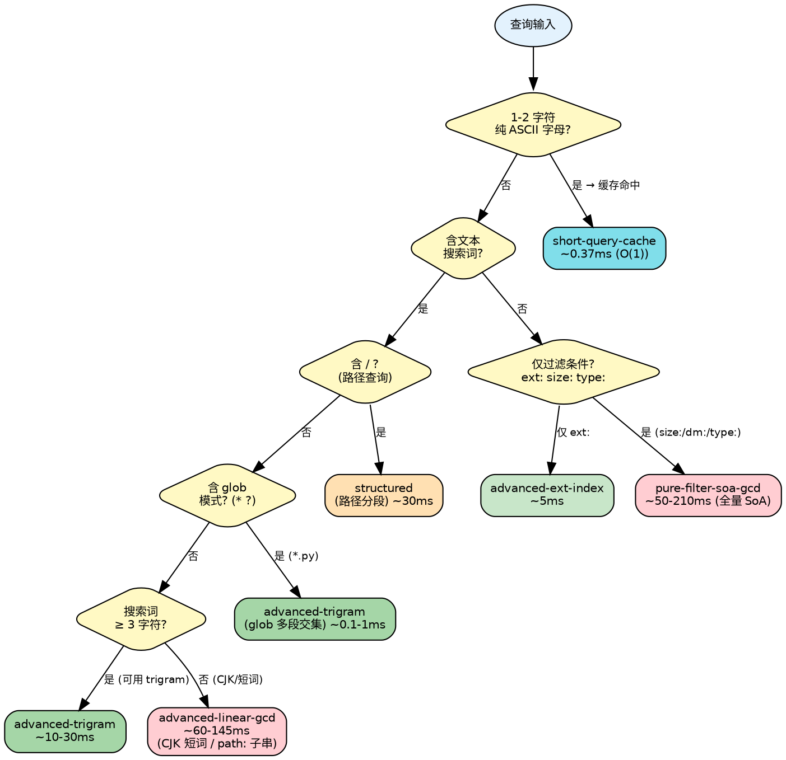

> **快路径优先级**：`query()` 在进入统一 Advanced 求值管线前，先尝试两个快路径——目录列举（`dir-list`，纯路径前缀）和短查询缓存（`short-query-cache`，1-2 字符 ASCII）。只有两者都未命中才落入 `queryAdvanced()` 的竞争候选集选择。

### 纯过滤快速路径

当查询只包含过滤条件（如 `ext:cpp size:>1mb`），没有文本搜索词时：
- 跳过所有 trigram 查找
- 使用 `simdTypeLive16` 批量扫描 `types_` 数组，NEON 每指令处理 16 条记录
- SoA 布局使得这种全量扫描高效——只加载需要检查的列

---

## 6. Trigram 倒排索引

### 原理

Trigram 是连续 3 个字符的组合。例如 "hello" 产生 trigrams: `{hel, ell, llo}`。

```
倒排索引结构（SearchEngine.h:392-396）：

nameTrigramIndex_: unordered_map<uint32_t, vector<uint32_t>>
  "hel" → [12, 4589, 12003, ...]   // sorted record indices
  "ell" → [12, 891, 4589, ...]
  "llo" → [12, 4589, 78901, ...]

查询 "hello":
  trigrams = {hel, ell, llo}
  candidates = intersect(posting[hel], posting[ell], posting[llo])
  → [12, 4589]   // 从 4.86M 缩减到 2 个候选
  → 对每个候选做 SIMD 子串验证
```

**Trigram 打包**（ContentIndex.h:115-119）：3 个 ASCII 字节打包到 `uint32_t` 的低 24 位：
```cpp
Trigram = (a << 16) | (b << 8) | c;
```

### 三级 Trigram 索引

| 索引 | 用途 | 查询示例 |
|------|------|---------|
| `nameTrigramIndex_` | 文件名子串搜索 | `hello`、`test` |
| `pathTrigramIndex_` + `pathIdxToRecords_` | 路径搜索 | `/usr/local` |
| `extensionIndex_` | 扩展名过滤 | `*.cpp`、`ext:py` |

路径 trigram 是两级结构：trigram → pathIdx 集合 → 展开为 recordIdx 集合。因为大量文件共享路径前缀，这避免了 posting list 的冗余膨胀。

### Posting List 操作

- **交集**（`intersectPostingLists`）：sorted set_intersection，用于多 trigram 查询
- **多段交集**（`intersectPostingListsMulti`）：glob 模式 `*test*.cpp` 的字面段 `["test", "cpp"]` 分别提取 trigram 后做交集
- **并集**（`unionPostingListsMulti`）：正则模式 `(foo|bar)` 的每个分支内部做交集，分支间做并集
- **竞争选择**：5 个 Stage 各自产生候选集，选最小的那个

### Trigram 查询求值流程

以查询 `*test*.cpp` 为例，展示 trigram 多段交集的完整求值过程：

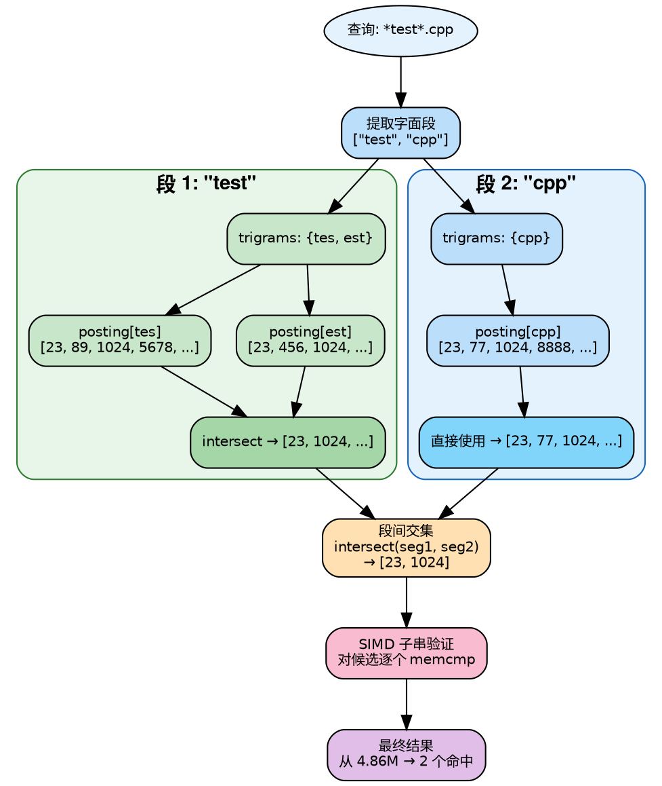

### 关键限制

**Trigram 要求最少 3 个字符。** 1-2 字符的查询（如 `ab`、`桌面`）无法产生 trigram。这是 trigram 方案的固有限制，所有使用 trigram 的系统（plocate、ripgrep）都有这个问题。

MacEverything 对此分两种情况处理：

- **1-2 字符纯 ASCII 字母**（`a`…`zz`，共 702 个键）：由 **ShortQueryCache 预算缓存**（§9）以 O(1) 命中，0.37ms 返回，彻底绕开线性扫描。
- **CJK 短词**（如 `桌面`、`中文`）：macOS 文件路径以 ASCII 为主，CJK trigram 几乎没有索引覆盖；且 CJK 双字不在 702 个 ASCII 缓存键内，仍回退到 `advanced-linear-gcd` 线性扫描（~135ms，见 §15/§17）。这是当前已知短板，规划用 CJK trigram 或 2-gram 索引解决。

---

## 7. SIMD 向量化字符串搜索

### 算法：First-Last Byte + 2x Unroll

```
SIMDSearch.h 核心算法（simdFind，lines 39-112）：

传统子串搜索：逐字节比较 → O(n*m)
SIMD 子串搜索：

  needle = "hello" (5 bytes)
  first_byte = 'h', last_byte = 'o'

  ┌────────────────────────────────────┐
  │ data[i..i+15]:   "...h...x...h..x"│  ← 16 bytes
  │ data[i+16..i+31]:"..h....x........"│  ← 16 bytes（2x unroll）
  │                                    │
  │ Step 1: vdupq_n_u8('h') → 广播到 16 lanes
  │ Step 2: vdupq_n_u8('o') → 广播到 16 lanes
  │ Step 3: vceqq_u8(data[i], first_vec) → first_match
  │ Step 4: vceqq_u8(data[i+4], last_vec) → last_match
  │         （偏移 = needle_len - 1）
  │ Step 5: vandq_u8(first_match, last_match) → candidates
  │ Step 6: vmaxvq_u8(candidates) == 0 ? → 快速跳过
  │ Step 7: neon_movemask → 16-bit bitmask
  │ Step 8: __builtin_ctz → 逐个验证 memcmp
  └────────────────────────────────────┘

  2x unroll: 每次迭代处理 32 字节
  两个 block 的 candidates 做 OR 后统一判 zero → 快速跳过
```

### 为什么用 First-Last 而不用 First-Only？

First-Only（只比较首字节）的问题：常见字符如 `e`、`t`、`a` 在文件名中出现频率高（~10%），16 字节中平均有 1.6 个 false positive，每个都要做完整 memcmp。

First-Last 同时比较首尾字节，false positive 概率从 ~10% 降到 ~0.4%（假设均匀分布），memcmp 调用次数降低约 25 倍。

### NEON Movemask 模拟

ARM 没有 x86 的 `_mm_movemask_epi8`，需要手工模拟（SIMDSearch.h:21-31）：

```cpp
inline uint16_t neon_movemask(uint8x16_t v) {
    static const uint8x16_t bit_mask = {1,2,4,8,16,32,64,128,
                                        1,2,4,8,16,32,64,128};
    uint8x16_t masked = vandq_u8(v, bit_mask);
    // 分别对高低 8 字节求和，得到 2 个 8-bit 值
    uint8_t lo = vaddv_u8(vget_low_u8(masked));
    uint8_t hi = vaddv_u8(vget_high_u8(masked));
    return (uint16_t(hi) << 8) | lo;
}
```

### 其他 SIMD 函数

| 函数 | 用途 | 吞吐量 |
|------|------|--------|
| `simdContains` | 子串判定 | 11.56 GB/s（M3 Pro 单线程） |
| `simdToLowerAscii` | 批量 ASCII 小写化 | 16 bytes/指令 |
| `simdTypeLive16` | 批量 tombstone 检查 | 16 records/指令 |
| `simdFindAll` | 收集所有匹配位置 | 用于高亮 |

### 性能实测（5GB 基准测试）

| 算法 | 单线程 GB/s | 12 线程 GB/s |
|------|-----------|-------------|
| **NEON first-last 2x** | **11.56** | **74.30** |
| NEON first-last 1x | 4.93 | 50.42 |
| std::string::find | 1.22 | 12.59 |
| Boyer-Moore-Horspool | 1.17 | — |
| memmem | 1.05 | 9.60 |
| KMP | 0.66 | — |
| Rabin-Karp | 0.14 | — |

NEON 2x 单线程已经超过传统算法 12 线程的吞吐量。2x unroll 利用了 M3 Pro 每周期 4 次 load 的能力。

---

## 8. 查询语言与解析器

### 语法设计

兼容 voidtools Everything 的搜索语法，使用递归下降解析器实现：

```
Grammar（QueryParser.h / QueryTokenizer.h / QueryAST.h）：

query     = or_expr
or_expr   = and_expr ( '|' and_expr )*
and_expr  = not_expr ( not_expr )*        // 空格 = 隐式 AND
not_expr  = '!' atom | atom
atom      = '<' or_expr '>'               // 分组（用 < > 而非括号）
          | '"' ... '"'                   // 引号短语
          | FILTER                        // ext:, size:, etc.
          | WORD                          // 普通搜索词
```

### 支持的过滤器

```
文本过滤:    ext:cpp  file:  folder:  path:  nopath:  parent:
大小过滤:    size:>1mb  size:<100kb  size:10kb..1mb
日期过滤:    dm:today  dm:thisweek  dc:2024  da:last3months
属性过滤:    depth:<3  len:>10  type:file/folder/app
匹配模式:    case:  nocase:  regex:  ww:  wfn:
内容搜索:    content:keyword
类型宏:      audio:  video:  pic:  doc:  exe:  zip:
```

### AST 变换管线

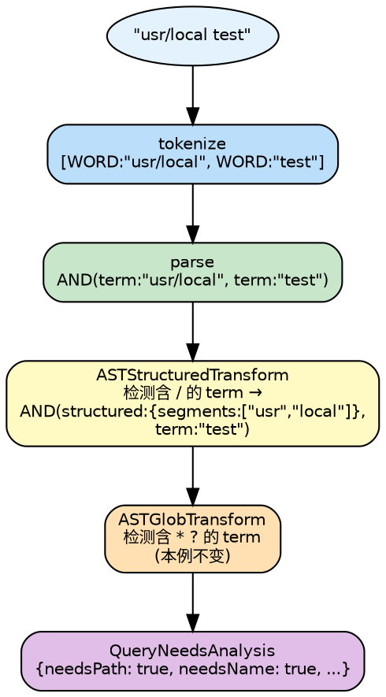

### 零开销向后兼容

简单查询（无 `|`、`!`、`<>`、`"`、filter）直接走旧的 `query()` 路径。`hasAdvancedSyntax()` 做快速字符扫描（~ns 级），避免解析器开销。

---

## 9. 短查询缓存：ShortQueryCache

### 问题：1-2 字符查询的线性扫描惩罚

trigram 索引要求查询词 ≥ 3 字符（§6）。1-2 字符的 ASCII 查询（`a`、`ab`）无法产生 trigram，早期版本只能全量线性扫描 6.18M 条记录，**持锁 ~58ms**（旧 `linear` 路径）。而这类查询恰恰是用户输入时**每键必经**的中间状态（输入 "abc" 会先后触发 "a"→"ab"→"abc"），违背「小巧精确快速」定位。

**解法**：把所有可能的 1-2 字符 ASCII 字母查询的 Top-100 结果预先算好缓存起来。26 个 unigram（`a`…`z`）+ 676 个 bigram（`aa`…`zz`）= **702 个键**，O(1) 命中。

### 数据结构（ShortQueryCache.h）

```cpp
struct ScoredResult { uint32_t score; uint32_t idx; };   // 8 bytes
struct CacheEntry {
    BoundedSortedVec<ScoredResult> results{kMaxResults}; // 有界 Top-100，按 score 排序
    uint32_t totalMatches = 0;                           // 命中总数（UI "X of Y"）
};
std::array<CacheEntry, 702> entries_;                    // 扁平数组，O(1) 索引

static constexpr size_t kTotalKeys  = 702;   // 26 + 676
static constexpr size_t kMaxResults = 100;
```

**键编码**（`keyIndex()`）：单字符 `'a'..'z'` → `0..25`；双字符 `ab` → `26 + (a-'a')*26 + (b-'a')`。非 1-2 字符 ASCII 小写字母返回 -1（不命中缓存，落回 Advanced 路径）。

`BoundedSortedVec` 是有界排序向量：插入时若未满直接有序插入，已满则仅当新分数优于当前最差项才替换——保证每个键恒定 ≤100 条、内存上界确定（~702 × 100 × 8B ≈ **560KB**）。

### 评分：复用 4 级相关性

缓存内排序与主查询路径一致，`computeScore()` 打包为 `uint32_t`：

```cpp
// quality: 0=精确  1=前缀  2=词边界  3=普通子串（simdFind 定位 + 前字符非字母数字判定）
uint32_t score = (0 << 16) | (quality << 8) | min(fullPathLen, 255);
//                            ↑ 相关性主序     ↑ 路径越短越优（次序）
```

即「先按相关性档位、同档再按完整路径长度」——与 `queryAdvanced()` 的排序键同构，保证缓存结果与实时查询结果顺序一致。

### 构建：单遍扫描全量记录

`rebuild()` 对 6.18M 记录扫一遍，每条记录提取其文件名中**出现过的**所有 unigram/bigram（`collectHitKeys()` 用 702-bit 局部 `seen[]` 去重，避免同名重复计数），再把该记录按分数 `tryInsert` 进对应键的有界向量：

```
for each live record:
    name = lowercase 文件名
    hitKeys = {name 中出现的所有 a..z 单字符} ∪ {所有 aa..zz 双字符}   // 局部 bitset 去重
    for ki in hitKeys:
        entries_[ki].totalMatches++
        entries_[ki].results.insert({computeScore(...), recordIdx})    // 有界 Top-100
```

构建在 **Phase 2 完成时触发**（`SearchEngineV6.cpp::completePhase2()` 末尾调用 `buildShortQueryCache()`，与 trigram 索引同批），日志记录 `sqcache=Nms`。

### 增量维护（关键：非 50% 重建，而是就地增删）

> 注：早期设计（plan）曾用「deletedCount 计数 + 50% 阈值重建」。实现演进后改为**就地增量维护**（changelog 165/170），更精确且无周期性重建抖动。

- **新增记录**（`addRecord` 后）：`tryInsert(idx, name, nameLen, fullPathLen)` 把新记录尝试插入其所有 hitKeys 的有界向量（仅当分数进得了 Top-100）。
- **删除/tombstone**（mutation 路径）：`eraseRecord(idx, name, nameLen)` 从该记录所有 hitKeys 的向量中 `remove_if(idx)` 真正移除条目。
- **查询时兜底**：`lookup()` 返回的 `results` 仍可能含已被 tombstone 但尚未 erase 的 idx，故快路径在拷贝结果时再做一次 `types_[idx]==0 continue` 的存活过滤（双保险）。

### 查询快路径（SearchEngineQuery.cpp:248-268）

```cpp
// query() 内，落入 queryAdvanced() 之前
if (shortQueryCache_.isBuilt()) {
    if (auto* entry = shortQueryCache_.lookup(pq.lower)) {   // pq.lower 已小写
        std::vector<uint32_t> result;
        for (const auto& sr : entry->results) {
            if (types_[sr.idx] == 0) continue;               // 跳过 tombstone
            result.push_back(sr.idx);
            if (maxResults > 0 && result.size() >= maxResults) break;
        }
        timing.searchPath = "short-query-cache";
        return result;                                       // R108 实测 0.37ms
    }
}
```

### 持久化：独立 .sqcache 文件

缓存不进 v6 主索引（保持 v6 格式稳定），单独落盘到 `<v6Path>.sqcache`：

```
Header: magic 0x56435153 ("SQCS") | version 2 | entryCount 702
Per-entry(×702): resultCount(4) | totalMatches(4) | ScoredResult[resultCount](8B each)
```

- **加载**（`IndexPersistence.cpp:43`）：v6 加载后 `getShortQueryCache().loadFrom(cachePath)`；magic/version/entryCount 任一不符即放弃，待 Phase 2 重建。
- **保存**（`IndexPersistence.cpp:195`）：v6 重写后 `saveTo(cachePath)`，与主索引同生命周期落盘。

### 收益

| 查询 | 旧路径（linear） | ShortQueryCache | 加速比 |
|------|----------------|-----------------|--------|
| `x`（1 字符） | ~58ms 持锁全扫 | **0.37ms** O(1) | **~150x** |
| `ab`（2 字符） | ~58ms | **<1ms** | **~60x+** |

输入框每一次中间击键（"a"→"ab"→"abc"）不再卡顿，且 0.37ms 期间几乎不持锁，消除了短查询对并发写入的阻塞。

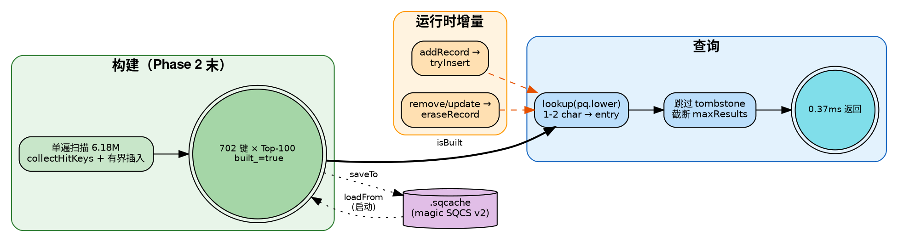

---

## 10. 持久化与崩溃恢复

### 两阶段启动（Sub-Second Cold Start）

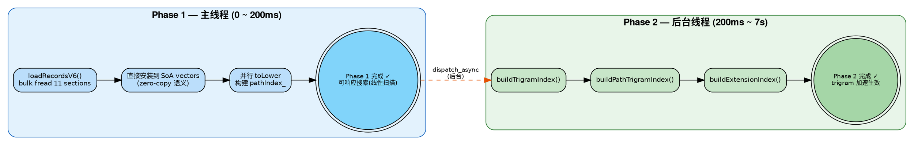

Phase 1 完成后用户立即可以搜索，虽然走线性扫描（~50ms），但比等 7 秒好得多。Phase 2 完成后自动切换到 trigram 加速路径（~5ms）。

### v6 Flat 格式

```
v6 文件布局（FlatIndexWriter.h）：

┌──────────────────────────────────────┐
│ 64-byte Header                       │
│  magic: "MEV6"                       │
│  version: 6                          │
│  sectionCount: 11                    │
│  totalRecords: N                     │
│  SectionEntry[11]: {type, offset,    │
│                     size, crc32}     │
├──────────────────────────────────────┤
│ Section 0: NamesOrig (raw bytes)     │ ← StringPool::buffer_ 直写
│ Section 1: NamesLower                │
│ Section 2: PathPool                  │
│ Section 3: LowerPathPool            │
│ Section 4: PathIndices (uint32[N])   │
│ Section 5: Types (uint8[N])          │
│ Section 6: Sizes (uint64[N])         │
│ Section 7: ModTimes (time_t[N])      │
│ Section 8: Inodes (uint64[N])        │
│ Section 9: DevIds (int32[N])         │
│ Section 10: MetadataKV              │
└──────────────────────────────────────┘

每个 Section 独立 CRC32 校验。
加载时 bulk fread 整个 section → 直接 move 到目标 vector。
```

### WAL（Write-Ahead Log）

增量变更通过 WAL 持久化，避免每次变更都重写整个索引：

```
WAL 格式（IndexWAL.h）：

Header: magic="WAL1", version=1
Entry: [op(1B) | dataLen(4B) | data(变长) | crc32(4B)]
  op: Add=1, Remove=2, Update=3

关键参数:
  fsync 间隔: 每 64 条 entry
  最大 WAL 大小: 50MB → 触发 compaction
```

崩溃恢复时 `readAll()` 从头读取 WAL，遇到第一条 CRC 校验失败的 entry 即停止——保证前缀都是完整的。

### 持久化生命周期

从运行时变更到最终落盘的完整数据流：

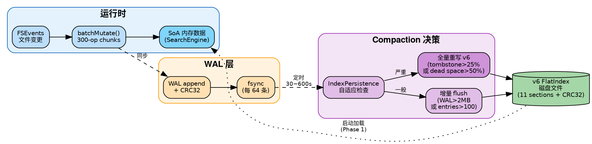

### 自适应 Compaction

```
IndexPersistence 自适应策略（IndexPersistence.h）：

              dirty ratio 高
                  ↓
flush interval: [30s ←────────→ 600s]
                  ↑
              dirty ratio 低

触发条件:
  WAL entry 数 > 100          → 考虑 compaction
  WAL 文件大小 > 2MB          → 立即 flush
  tombstone 比例 > 25%        → 全量重写
  paged file 死空间 > 50%     → 全量重写
```

---

## 11. 实时文件监控：FSEvents

### FSEvents 集成

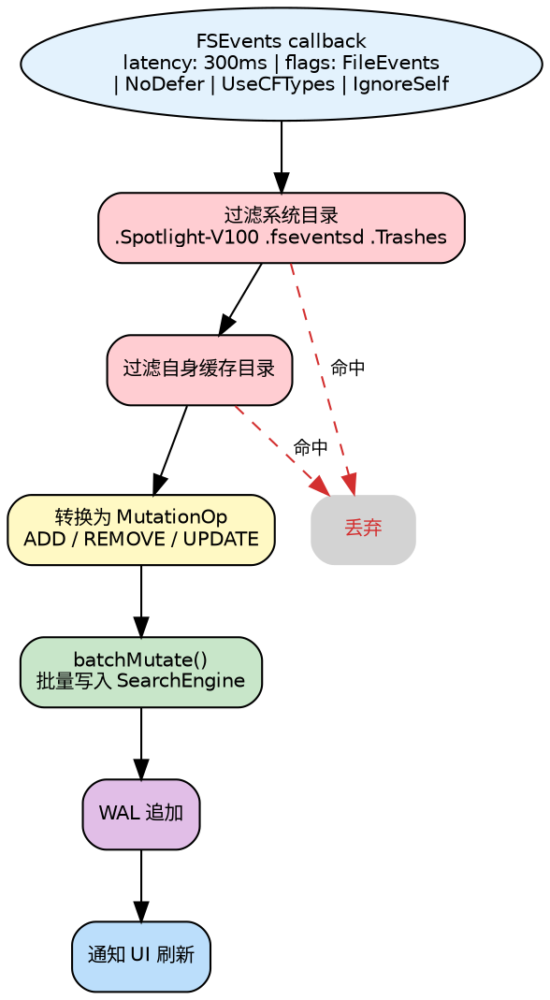

### Rescan 防抖

FSEvents 的 `MustScanSubDirs` 标志表示 journal 被截断，必须重新扫描子树。为避免频繁重扫：

```
防抖机制（ServiceEngine.h:146-153）：

pendingRescanPaths_: set<string>   // 待重扫路径集合
rescanDebounceTimer_: GCD timer    // 5s 防抖

规则:
  1. 收到 MustScanSubDirs → 路径加入 pendingRescanPaths_
  2. 重置 5s 定时器
  3. 5s 内无新事件 → 批量重扫所有 pending 路径
  4. 同一路径 300s 内不重复重扫（throttle）
```

### lastEventId 持久化

`lastEventId` 保存在索引元数据中。增量启动时，只需要回放从 `lastEventId` 到当前的 FSEvents 增量事件，而不是全盘重扫。配合 v6 索引加载，实现 ~200ms 冷启动。

---

## 12. 并发模型与锁设计

### Reader-Writer 锁分层

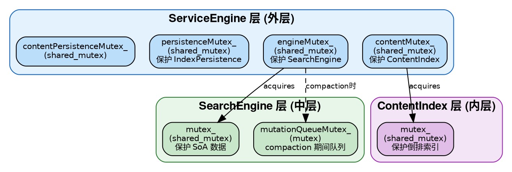

### 查询并发

```
查询不阻塞写入，写入不阻塞查询（大部分时间）：

  Query Thread 1 ──shared_lock──→ 读 SoA 数据
  Query Thread 2 ──shared_lock──→ 读 SoA 数据
  Query Thread 3 ──shared_lock──→ 读 SoA 数据    // 并行
  │
  Mutation ────────unique_lock──→ 写 SoA 数据     // 等所有 reader 完成
  │
  Query Thread 4 ──shared_lock──→ 读（mutation 完成后）
```

### COW Compaction（关键设计）

Compaction 需要重组整个 SoA 存储，如果持有写锁会阻塞所有查询数秒。解法：

```graphviz
// compactRecords() 三阶段 COW（SearchEngine.cpp）
digraph cow_compaction {
    rankdir=LR
    node [shape=box, style="filled,rounded", fontname="Helvetica", fontsize=10]
    edge [fontname="Helvetica", fontsize=9]

    subgraph cluster_p1 {
        label="Phase 1\nshared_lock (~ms)"
        style="filled,rounded"; color="#1565C0"; fillcolor="#E3F2FD"
        fontname="Helvetica Bold"
        Snap [label="deep_copy\nSoA vectors\nStringPools", fillcolor="#BBDEFB"]
        Unlock1 [label="unlock", shape=oval, fillcolor="#90CAF9"]
        Snap -> Unlock1
    }

    subgraph cluster_p2 {
        label="Phase 2\nno lock (~seconds)"
        style="filled,rounded"; color="#2E7D32"; fillcolor="#E8F5E9"
        fontname="Helvetica Bold"
        CompNames [label="compact(namePool, liveMask)", fillcolor="#C8E6C9"]
        CompTypes [label="compact(types, liveMask)", fillcolor="#C8E6C9"]
        Rebuild [label="rebuild(trigram)", fillcolor="#C8E6C9"]
        Note [label="查询正常执行 ✓\nmutation → mutationQueue_"
              shape=note, fillcolor="#FFF9C4", fontcolor="#E65100"]
        CompNames -> CompTypes -> Rebuild
    }

    subgraph cluster_p3 {
        label="Phase 3\nunique_lock (~ms)"
        style="filled,rounded"; color="#C62828"; fillcolor="#FFEBEE"
        fontname="Helvetica Bold"
        Swap [label="swap(SoA, compactedSoA)", fillcolor="#FFCDD2"]
        Replay [label="replay(mutationQueue_)\n回放增量变更", fillcolor="#FFCDD2"]
        Unlock3 [label="unlock", shape=oval, fillcolor="#EF9A9A"]
        Swap -> Replay -> Unlock3
    }

    Unlock1 -> CompNames [style=bold]
    Rebuild -> Swap [style=bold]
}
```

**效果：** 写锁持有时间从 30-60 秒降低到 <100ms。查询在 Phase 2 期间完全不受影响。

### Lock-Free 查询取消

```
查询取消机制（SearchEngine.h:403-408）：

sessionGenerations_: unordered_map<uint64_t, atomic<uint64_t>>

cancel(sessionId):
  sessionGenerations_[sessionId]++   // 原子递增

queryAdvanced() 内部:
  myGen = sessionGenerations_[sessionId].load()
  for each page of candidates:
    if sessionGenerations_[sessionId] != myGen:
      return early   // 新查询已发起，当前查询作废
```

每个 session（GUI=1, HTTP=按连接分配）有独立的 generation counter。用户每次输入新字符，generation 递增，旧查询在下一个 page boundary 检查到 generation 变化后立即退出。无需加锁，无需信号量。

### batchMutate 锁分片

大批量 mutation（如 FSEvents 回放数千条变更）持有写锁过长会饿死查询。解法：

```
batchMutate() 锁分片（SearchEngine.cpp）：

将 mutations 分成 300 条一组的 chunk:
  for chunk in chunks(mutations, 300):
    unique_lock(mutex_)
    apply(chunk)
    unlock()
    // 给 pending query 一个获取 shared_lock 的窗口
```

---

## 13. 内容搜索子系统

### 架构

```
ContentIndex 设计（ContentIndex.h/.cpp）：

文件索引流程:
  1. 检查扩展名白名单（txt, md, py, cpp, h, js, ts, ...）
  2. 检查文件大小 ≤ 1MB
  3. 读取文件前 8KB，检测是否为二进制（含 NUL 字节 → 跳过）
  4. 计算 FNV-1a hash → 如果 hash 未变 → 跳过（增量优化）
  5. 提取 trigram → 更新倒排索引

查询流程:
  1. keyword → 提取 trigrams
  2. 每个 trigram 的 posting list 按大小排序
  3. 从最短 posting list 开始，逐个 set_intersection
  4. 返回候选文件列表
  5. 对候选文件读取内容生成 snippet
```

### Trigram 去重优化（C-1）

提取 trigram 时使用 `thread_local` 位图（16M bits = 2MB）做 O(1) 去重：

```cpp
thread_local uint8_t trigramBitmap[1 << 24 / 8];  // 2MB per thread
// 不清零整个位图——只记录并清除本次设置的位
// O(unique_trigrams) 而非 O(2^24)
```

### Snippet 生成

64KB 分块读取文件（而非一次读 1MB），块间有重叠以处理跨块关键词。返回匹配点前后 ~80 字符的上下文。

---

## 14. 内置 LLM 自然语言搜索

### 定位：自然语言 → Everything 查询语法

MacEverything 的查询语法（§8）功能强大但有学习成本。AI 层让用户用自然语言描述意图（"最近改的大 PDF"、"昨天下载的图片"），由一个**本地小模型**翻译成精确的 Everything 查询语法（`ext:pdf size:>10mb dm:last7days`），再交给确定性搜索引擎执行。

**关键设计原则**：AI 只做**翻译**（NL → query syntax），不做检索。检索仍由确定性的 trigram/SIMD 引擎完成。这样既获得自然语言的易用性，又保留毫秒级精确搜索的可解释性与速度——AI 是「输入法」而非「搜索引擎」。

> 演进背景：早期版本依赖外部 Ollama / LiteLLM 进程。为贯彻「自包含、不依赖外部运行时」的瑞士军刀定位（changelog 164），重构为**内置 llama.cpp + 捆绑 GGUF 模型**，开箱即用、无需用户额外安装。远程后端作为可选项保留。

### 架构：IModelBackend 抽象 + 双后端

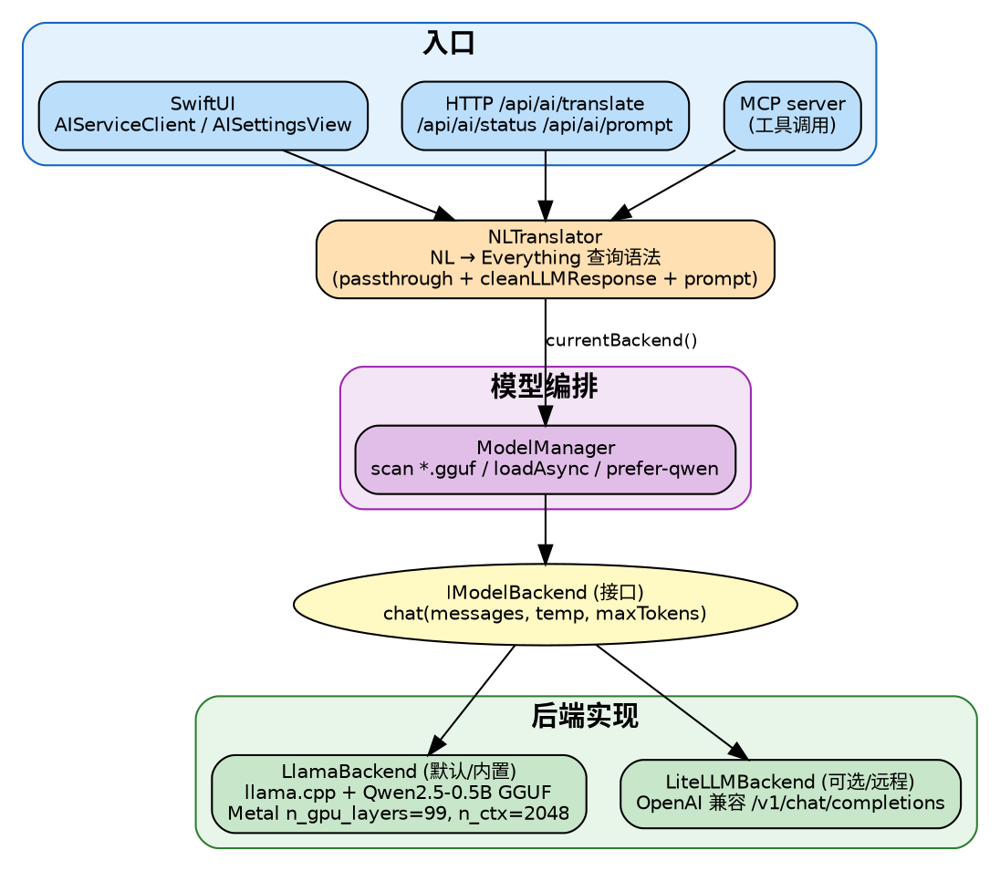

| 组件 | 文件 | 职责 |
|------|------|------|
| `IModelBackend` | `IModelBackend.h` | 后端接口：`chat()` / `embed()` / `isAvailable()` / `modelName()` |
| `LlamaBackend` | `LlamaBackend.{h,cpp}` | **内置默认**：llama.cpp 加载本地 GGUF，Metal GPU 推理 |
| `LiteLLMBackend` | `LiteLLMBackend.{h,cpp}` | **可选远程**：OpenAI 兼容 HTTP API（手写 JSON，无 JSON 库） |
| `ModelManager` | `ModelManager.{h,cpp}` | 扫描模型目录、异步加载、热切换 |
| `NLTranslator` | `NLTranslator.{h,cpp}` | 翻译管线：prompt 组装 + 透传 + 清洗 |

### LlamaBackend：本地 GGUF 推理

```cpp
// loadModel(ggufPath)：
mparams.n_gpu_layers = 99;     // 全部 offload 到 Metal GPU
cparams.n_ctx = 2048;          // 上下文窗口
cparams.n_batch = 2048;
ggml_set_abort_callback(...);  // 可中断
// chat()：llama_chat_apply_template 两遍定长 → tokenize（负值重试）
//         → n_ctx 溢出保护 → llama_memory_clear → decode prompt
//         → sampler chain（temp<=0 走 greedy，否则 temp+dist）
//         → 生成循环（EOG 终止）→ token_to_piece 拼接
```

全程 `mutex_` 保护，模型名形如 `local:qwen2.5-0.5b`。`vendor/llama.cpp` 随源码 vendored，编译进 app。

### LiteLLMBackend：可选远程后端

标准 OpenAI chat completion 协议：`POST /v1/chat/completions`，连接超时 5s、读超时 30s。手写 `jsonEscape` / `parseChatResponse`（扫描 `"content":"..."`），不引入 JSON 库，与项目「零外部依赖」风格一致。`isAvailable()` 探测 `/health`，模型名形如 `remote:host:port`。

### NLTranslator：翻译管线

```dot
// NLTranslator::translate() 管线
digraph nlt {
    rankdir=LR
    node [shape=box, style="filled,rounded", fontname="Helvetica", fontsize=10]
    edge [fontname="Helvetica", fontsize=9]

    In [label="自然语言\n\"最近的大 PDF\"", shape=ellipse, fillcolor="#E3F2FD", style=filled]
    Trim [label="trim + clamp\ntemp∈[0,2]", fillcolor="#BBDEFB"]
    PT [label="looksLikeQuerySyntax?\n已是语法 → 透传", shape=diamond, fillcolor="#FFF9C4"]
    Build [label="buildMessages\nsystem + few-shot + user", fillcolor="#C8E6C9"]
    Chat [label="backend->chat\n(temp=0 默认确定性)", fillcolor="#FFE0B2"]
    Clean [label="cleanLLMResponse\n去 ```fence / 前缀 / 引号\n仅取首行", fillcolor="#F8BBD0"]
    Out [label="ext:pdf size:>10mb\ndm:last7days", shape=ellipse, fillcolor="#A5D6A7", style=filled]

    In -> Trim -> PT
    PT -> Out [label="是（passthrough）"]
    PT -> Build [label="否"]
    Build -> Chat -> Clean -> Out
}
```

要点：

- **语法透传**：若输入已是合法查询语法（`looksLikeQuerySyntax()` 检测 30 个已知 filter 前缀如 `ext:`/`size:`/`path:`/`dm:`/`content:`/`regex:`…），直接返回，不调模型——既省推理又避免「翻译已合法语法」的退化。
- **few-shot prompt**：内置默认 system prompt（查询语法参考 + 9 条规则，含中文意图映射"最近"→`dm:last7days`、"大文件"→`size:>100mb`、类型宏）+ 12 对 few-shot 示例（含 `abc`/`readme`/`config.json`/`hello world` 等直通样例）。
- **外置 prompt 文件**：支持从 `prompt.txt` 加载，用 `<SYSTEM_PROMPT>` / `<FEW_SHOT>`（`user:`/`assistant:` 配对）标签解析；`promptSource()` 报告当前使用内置还是文件。优先加载用户级 prompt，缺失则回退到 app bundle 内置 prompt（`ServiceEngine.cpp:34`）。
- **响应清洗**：`cleanLLMResponse()` 剥离 ```` ```fence ````、`Query:`/`Result:`/`Output:`/`查询:` 等前缀、首尾引号，并只取首行——小模型常带解释性废话，清洗保证输出是纯查询串。
- **确定性默认**：默认 `temperature=0`（greedy），同一自然语言输入稳定产出同一查询；并记录 build/infer/clean/total 各阶段耗时日志。

### 集成与生命周期

- **ServiceEngine** 启动时 `ModelManager(modelsDir).loadAsync(...)`，后台线程扫描 `*.gguf`、**优先选名字含 "qwen" 的模型**、加载成功后构造 `NLTranslator(backend)` 并加载 prompt。加载是异步的，**不阻塞**主搜索功能——模型没就绪时 AI 端点返回 503，文件搜索照常工作。
- **HttpServer** 通过 `setAIGetters()` 注入 `getNLTranslator_` / `getModelManager_` 弱获取器，暴露：
  - `GET  /api/ai/status` — 模型是否就绪、当前模型名
  - `GET  /api/ai/prompt` — 当前 prompt 来源/内容
  - `POST /api/ai/translate` — 自然语言 → 查询语法（核心端点）
- **MCP server**（`mcp_main`）把翻译+搜索暴露为 MCP 工具，供 Claude 等 agent 直接调用 MacEverything。

---

## 15. 性能演进数据

### 查询延迟演进（早期 29 轮基准测试，历史轨迹）

> 下图是项目早期（4.86M 数据集）的优化轨迹，体现四次架构范式跃迁。当前运行时延迟以最新 R108 电池为准（见 §5 路径对比与本节末「运行时稳定性」）。

```
延迟 (ms)
200 ┤
    │ ■ R1: 178.4ms
180 ┤
    │
160 ┤
    │
140 ┤
    │
120 ┤
    │
100 ┤
    │
 80 ┤   ■ R5: 79.7ms
    │
 60 ┤         ■ R10: 69.1ms
    │
 40 ┤                     ■ R15: 34.7ms    ■ R24: 39.8ms
    │
 20 ┤
    │                                              ■ R29: 10.5ms
  0 ┼──────────────────────────────────────────────────────────────
    R1    R5    R10   R15   R20   R24   R29
```

**17x 延迟降低，多次范式跃迁：**

| 阶段 | 关键变更 | 效果 |
|------|---------|------|
| Trigram 倒排索引 | 路径查询 120x 提升 | Agent 自驱动实现 |
| SoA 列式 + SIMD | 35ms → 10.5ms | 人类架构决策 |
| Node-Centric Query | 路径查询 1522x 提升 | 人类架构决策 |
| v6 Flat 持久化 | 启动 250x 提升（50s→200ms） | 人类架构决策 |
| ShortQueryCache（2026-05） | 1-2 字符 57.8ms → 0.37ms（~150x） | §9，预算缓存 |
| 内置 LLM NL 搜索（2026-05） | 自然语言 → 查询语法 | §14，llama.cpp 自包含 |

### 启动时间演进

```
                        前                    后
全盘扫描启动      ~50s + 7s trigram build → ~200ms Phase 1 + 7s Phase 2（后台）
增量启动          ~5s WAL replay           → ~200ms + FSEvents delta
```

### 内存演进

```
                        前                    后
路径存储          ~100 bytes/record         → 4 bytes/record（去重索引）
Trigram 副本      per-record trigram vector  → 共享倒排索引
总内存（4.86M）   ~1GB+                     → ~300MB
```

### 运行时稳定性观测（R100+ 长跑，架构师重点关注）

近期持续性能巡检（`docs/performance_ana/R_*.md`，每 30min 一轮）在**长时间运行**下暴露了与单次查询延迟无关的**运行时退化**问题，是当前架构改进的主战场：

| 观测项 | R108（2026-05-30 22:11，运行 ~80min）数据 | 趋势/含义 |
|--------|-------------------------------------------|-----------|
| 索引规模 | total 6,183,351 / live 5,412,386 | — |
| **Tombstone 比例** | **770,965（12.47%）** | 连续 35 轮单调上升；距 R43 崩溃参考 12.97% 仅 ~0.5pp |
| Tombstone 增量 | +15,189 / 30min（连续 2 轮 taper 至 14-15K） | 即使 taper，**~1h 即触崩溃线** |
| Flush 次数 / compaction | 16 次 flush，**0 次 compaction**，0 reclaim | 见下「R67 阀门」 |
| Flush rewrite 耗时（暖态） | 3-7s（启动期 24-30s） | 每次全量重写，含 771K 死记录 |
| 慢查询（>100ms） | 158 条，中位 214ms，0 条 organic 越线 | 暖态电池极洁净 |

**两个根因性问题（P0）：**

1. **R67 Flush 比例阀永不触发（compaction 死锁）**：自适应 compaction 的 tombstone 比例阀设为 25%（`kTombstoneCompactRatio`），但实际运行中 tombstone 在到达 25% 之前，约 **12.97%** 就已触发崩溃参考。换言之**比例阀阈值高于可达上限，全量 compaction 永远不会自动触发**——tombstone 只增不减，每次 flush 都在重写越来越多的死记录（R108 已达 771K 死记录/次）。这是「flush rewrite-bloat 恶性循环」。**修复方向**：阈值下调至 8-10%，并调换比例检查与 flush 的顺序。

2. **Flush 持锁全量重写**：16 次 flush 全程持写锁 3-30s，期间查询被阻塞（历史 P23：flush 期间查询飙至 547ms）。**修复方向**：COW 无锁快照 flush（复用 §12 compaction 的三阶段 COW 思路），配合 R67 修复消除死记录重写。

> 这两点是架构师规划下一阶段改进的**最高优先级**——它们不是单次查询的算法问题，而是「长时间运行下索引健康度无法自维持」的系统性缺陷。详细逐轮证据见 `docs/performance_ana/`。

---

## 16. 竞品对比与差异化

### 核心竞品对比

| 维度 | Everything (Win) | plocate (Linux) | Cardinal (Mac/Rust) | MacEverything |
|------|-----------------|-----------------|--------------------|--------------:|
| 索引方式 | 直读 NTFS MFT | Trigram + TurboPFor | mmap slab | Trigram + SoA |
| 搜索算法 | 线性扫描（<100MB 索引） | Trigram 交集 | Rabin-Karp | Trigram + SIMD |
| 实时更新 | USN Journal | updatedb cron | FSEvents | FSEvents + WAL |
| 启动速度 | 即时（常驻） | N/A（CLI） | 未知 | 200ms (Phase 1) |
| 搜索延迟 | <1ms（内存带宽） | ~8ms（27M 文件） | 未知 | 0.4ms（短查询）/ ~10-20ms（trigram，6.18M 文件） |
| UI | 原生 Win32 | CLI | Tauri (Web) | 原生 SwiftUI |
| 持久化 | MFT 即索引 | 自定义二进制 | mmap slab | v6 Flat + WAL + .sqcache |
| 自然语言搜索 | 无 | 无 | 无 | **内置 llama.cpp（NL→查询语法）** |
| Agent 集成 | 无 | 无 | 无 | **HTTP API + MCP server** |

### macOS 市场差异化

**现有 Mac 搜索工具的问题：**
- Spotlight/Alfred/Raycast：都基于 Spotlight，无法做到 sub-100ms 全文件名搜索
- Find Any File：使用 `searchfs()` 实时查询，无持久化索引，3-15 秒
- EasyFind：无索引，5-30 秒
- Cardinal：最接近的竞品，但使用 Tauri/Web UI 非原生体验

**MacEverything 的差异化：**
1. 原生 SwiftUI UI（非 Electron/Tauri）
2. sub-100ms 全盘文件名搜索（短查询 0.4ms）
3. 轻量级持久化索引 + 实时 FSEvents 更新
4. CLI daemon 模式 + HTTP API + MCP server（可集成到 agent / 其他工具）
5. 完整的 Everything 兼容查询语法
6. **内置 LLM 自然语言搜索**（捆绑 GGUF，无需外部运行时，离线可用）——「输入法」式翻译，不牺牲精确搜索的速度与可解释性

---

## 17. 设计得失与已知问题

### 做对了的设计决策

**1. SoA 列式存储**
- 搜索只需要 name/type 时，不加载 size/modTime/inode
- 使 SIMD 批量操作成为可能
- 代价：record 管理更复杂（增删改需要同步维护多个 vector）

**2. COW Compaction**
- 彻底解决了 compaction 阻塞查询的问题
- 代价：Phase 1 快照需要额外内存（约 2x 峰值）

**3. 两阶段启动**
- 用户体感从 50 秒等待变成 200ms 即可用
- 代价：Phase 1 ~ Phase 2 期间搜索走线性扫描（~50ms），可接受

**4. 竞争候选集选择**
- 自动适应不同查询模式，无需手写策略规则
- 代价：候选集计算有额外开销，但 < 1ms

**5. WAL + 自适应 Compaction**
- 崩溃恢复、增量更新、死空间回收三者统一
- 代价：实现复杂度高

### 设计上的不足

**1. Trigram 3 字符最低限制（ASCII 已解决，CJK 待解决）**
- ASCII 1-2 字符查询：**已由 ShortQueryCache 解决**（§9，57.8ms → 0.37ms），702 个预算键覆盖全部 `a`…`zz`
- CJK 短词查询（如"桌面"、"中文"）：**仍待解决**——CJK 双字不在 ASCII 缓存键内，trigram 也几乎无 CJK 覆盖，回退线性扫描 ~135ms
- 改进方向：CJK trigram 索引 或 2-gram（内存翻倍）

**2. 路径存储冗余**
- 同时维护 pathPool_ 和 lowerPathPool_ 两份路径数据
- 改进方向：运行时 toLower，用 CPU 换内存

**3. Tombstone 空间不回收**
- StringPool 删除只标记 length=0，需要等 compaction 回收
- 高频增删场景下可能浪费内存
- 改进方向：分代策略，小对象就地回收

**4. 无模糊搜索/拼音搜索**
- 不支持 fzf 风格的 fuzzy matching
- 不支持中文拼音搜索
- 竞品 Cardinal 和 JARVIS Search 已支持

### 已知性能问题（高优先级）

**运行时稳定性（P0，长跑根因性问题，详见 §15「运行时稳定性观测」）：**

| ID | 问题 | 影响 | 根因 | 修复方向 |
|----|------|------|------|---------|
| **R67** | **Compaction 比例阀永不触发** | tombstone 单调增至 12.47%，~1h 触崩溃线 | 比例阀阈值 25% 高于可达上限（~12.97%），全量 compaction 从不自动触发 | 阈值下调至 8-10% + 调换比例检查/flush 顺序 |
| **Flush** | **Flush 持锁全量重写** | flush 期间查询阻塞 3-30s（历史 547ms 飙升） | flush 持写锁重写整个 v6（含 771K 死记录） | COW 无锁快照 flush（复用 §12 三阶段 COW） |

**单次查询（中优先级）：**

| ID | 问题 | 影响 | 根因 | 修复方向 |
|----|------|------|------|---------|
| P24 | case-sensitive 查询跳过 trigram | 631ms | 大小写 trigram 独立，`case:README` 无法用小写 trigram | 一行修复：case query 也用小写 trigram 预过滤 |
| P22 | CJK 2 字符查询线性扫描 | ~135ms | CJK 不在 ASCII short-query-cache 键内，trigram 无 CJK 覆盖 | CJK trigram 索引 or 2-gram |
| P-pure | 纯过滤查询全量 SoA 扫描 | size:/dm:/content: 50-210ms | 无索引，逐记录 SIMD 求值 | 数值/日期辅助索引 |

**代码健康度（架构师改进项）：**

- `SearchEngineAdvancedQuery.cpp` **1091 行**，超出项目「单文件 ≤1000 行」规范（CLAUDE.md §4）。该文件同时承载 `advanced-trigram` 求值、`advanced-linear-gcd` 线性扫描、`pure-filter-soa-gcd` 纯过滤三条热路径。建议按搜索路径拆分为独立编译单元，便于维护与针对性优化。

---

## 18. 演化方向

### 短期优化（预期收益高）

1. **🔥 R67 Compaction 比例阀修复（最高优先级）**
   - tombstone 比例阀阈值从 25% 下调至 8-10%，并调换比例检查与 flush 的执行顺序
   - 解决「tombstone 只增不减、flush rewrite-bloat 恶性循环」——当前 ~1h 触崩溃线
   - 是长跑稳定性的根本修复，详见 §15/§17

2. **🔥 COW 无锁快照 Flush**
   - flush 复用 §12 compaction 的三阶段 COW：shared_lock 快照 → 无锁重写 → unique_lock swap
   - 消除 flush 期间 3-30s 查询阻塞（历史 P23 547ms 飙升）
   - 配合 R67 修复，停止重写死记录

3. **Case-sensitive trigram 预过滤（P24）**
   - 对 `case:README` 查询，先用小写 trigram 缩小候选集，再做大小写敏感匹配
   - 预计：631ms → <10ms，一行代码修复

4. **SearchEngineAdvancedQuery.cpp 拆分**
   - 1091 行超规范，按 trigram / linear / pure-filter 三条热路径拆为独立单元

> 已完成（不再列为待办）：**短查询加速**已由 ShortQueryCache 落地（§9，ASCII 1-2 字符 57.8ms → 0.37ms）。

### 中期演进

5. **CJK trigram / 2-gram 索引（P22）**
   - 当前 CJK 短词（"桌面"）走线性扫描 ~135ms，ShortQueryCache 仅覆盖 ASCII
   - 为 CJK 建立 trigram 或 2-gram 倒排，补齐中文搜索短板

6. **模糊搜索（Fuzzy Matching）**
   - Smith-Waterman 变体（fzf 方案），支持首字母匹配、连续匹配加分
   - 需要新的评分排序体系

7. **零拷贝索引加载**
   - v6 格式已经接近 mmap-ready，进一步优化为 mmap + 直接指针
   - 预计启动时间从 200ms 降到 <50ms

8. **Delta 压缩 Posting List**
   - plocate 方案：posting list 用 delta encoding + varint 压缩
   - 内存降低 50-70%，缓存命中率提升

### 长期方向

9. **中文拼音搜索**
   - 拼音 trigram 索引或拼音→汉字映射表
   - 参考 JARVIS Search 实现

10. **语义搜索集成（embedding）**
   - 现已有内置 LLM 的「自然语言 → 查询语法」翻译（§14）；下一步是基于文件名/路径 embedding 的真正语义检索
   - `IModelBackend::embed()` 接口与 LiteLLMBackend 的 `/v1/embeddings` 已就位，可作为基础
   - 与现有精确搜索互补，非替代

11. **分布式索引**
   - 支持网络文件系统（NFS/SMB）的增量索引
   - 需要新的一致性协议

---

## 附录 A：关键常量速查

| 常量 | 值 | 位置 | 说明 |
|------|-----|------|------|
| `kRecordsPerPage` | 1024 | SearchEngine.h | 每页记录数 |
| `kRecentCacheSize` | 200 | SearchEngine.h | 最近文件缓存 |
| `ATTR_BUF_SIZE` | 1MB | DirectoryScanner.cpp | getattrlistbulk 缓冲区 |
| FSEvents latency | 300ms | FileSystemWatcher.cpp | 事件合并窗口 |
| Search debounce | 80ms | SearchViewModel.swift | GUI 输入防抖 |
| Content debounce | 300ms | SearchViewModel.swift | 内容搜索防抖 |
| Page size (GUI) | 100 | SearchViewModel.swift | 虚拟滚动批次 |
| Max results | 10,000 | SearchViewModel.swift | 单次查询上限 |
| `kCompactThreshold` | 100 | IndexPersistence.h | WAL entry compaction 阈值 |
| `kBaseIntervalSec` | 300 | IndexPersistence.h | 基础 flush 间隔 |
| `kMinIntervalSec` | 30 | IndexPersistence.h | 最小自适应间隔 |
| `kMaxIntervalSec` | 600 | IndexPersistence.h | 最大自适应间隔 |
| `kWALSizeFlushThreshold` | 2MB | IndexPersistence.h | WAL 大小触发 flush |
| `kMaxWALSize` | 50MB | IndexWAL.h | WAL 最大大小 |
| `kTombstoneCompactRatio` | 0.25 | IndexPersistence.h | tombstone 比例触发重写 |
| `kRescanDebounceDelaySec` | 5.0 | ServiceEngine.h | 重扫防抖延迟 |
| `kRescanThrottleIntervalSec` | 300.0 | ServiceEngine.h | 重扫节流间隔 |
| HTTP port | 19860 | MacSearchBridge.mm | 默认 HTTP 端口 |
| batchMutate chunk | 300 | SearchEngine.cpp | 锁分片大小 |
| WAL fsync 间隔 | 64 entries | IndexWAL.h | 持久化写入间隔 |
| `kTotalKeys` | 702 | ShortQueryCache.h | 短查询缓存键数（26+676） |
| `kMaxResults` | 100 | ShortQueryCache.h | 每键缓存 Top-N |
| `.sqcache` magic | 0x56435153 ("SQCS") v2 | ShortQueryCache.cpp | 短查询缓存文件格式 |
| LlamaBackend `n_gpu_layers` | 99 | LlamaBackend.cpp | 全量 offload 到 Metal GPU |
| LlamaBackend `n_ctx` | 2048 | LlamaBackend.cpp | LLM 上下文窗口 |
| NLTranslator 默认 temperature | 0.0（greedy） | NLTranslator.cpp | 确定性翻译 |
| LiteLLM 连接/读超时 | 5s / 30s | LiteLLMBackend.cpp | 远程后端超时 |

## 附录 B：文件组织

```
MacEverything/
├── Core/                              # C++20 核心引擎
│   ├── SearchEngine.h                 # SoA 存储 + Trigram 索引 + 查询路由
│   ├── SearchEngine.cpp               # 记录管理、WAL、compaction、缓存增量维护
│   ├── SearchEngineQuery.cpp          # 查询预处理 + 路由（含 short-query-cache 快路径）
│   ├── SearchEngineAdvancedQuery.cpp   # 高级查询求值（竞争候选集）⚠ 1091 行，超规范待拆
│   ├── SearchEngineStructuredQuery.cpp # 结构化（路径分段）查询求值
│   ├── SearchEngineIndex.cpp          # Trigram/Extension 索引构建
│   ├── SearchEngineV6.cpp             # v6 格式加载 + 两阶段启动 + buildShortQueryCache
│   ├── SearchEnginePersistence.cpp    # SearchEngine 持久化桥接
│   ├── ShortQueryCache.h/.cpp         # 短查询缓存（702 键 Top-100，§9）
│   ├── BoundedSortedVec.h             # 有界排序向量（缓存 Top-N 容器）
│   ├── DirectoryScanner.h/.cpp        # getattrlistbulk 并行扫描
│   ├── FileSystemWatcher.h/.cpp       # FSEvents 实时监控
│   ├── ContentIndex.h/.cpp            # 内容搜索 Trigram 索引
│   ├── ContentIndexPersistence.h/.cpp # 内容索引持久化
│   ├── SIMDSearch.h                   # ARM NEON SIMD 字符串搜索
│   ├── StringPool.h                   # 连续内存字符串池
│   ├── FlatIndexWriter.h/.cpp         # v6 Flat 持久化格式
│   ├── PagedIndexWriter.h/.cpp        # v5 Paged 持久化格式
│   ├── IndexWAL.h/.cpp                # Write-Ahead Log
│   ├── IndexPersistence.h/.cpp        # 自适应 Compaction 编排 + .sqcache 读写
│   ├── QueryParser.h/.cpp             # 递归下降解析器
│   ├── QueryTokenizer.h               # 词法分析器
│   ├── QueryAST.h                     # AST 节点定义
│   ├── QueryFilterParser.h            # 过滤器解析
│   ├── QueryDateParser.h              # 日期过滤器解析
│   ├── CompiledGlob.h                 # Glob 模式预编译
│   ├── IModelBackend.h                # ── AI ── LLM 后端接口（chat/embed）
│   ├── LlamaBackend.h/.cpp            # 内置 llama.cpp 本地 GGUF 推理
│   ├── LiteLLMBackend.h/.cpp          # 可选远程 OpenAI 兼容后端
│   ├── ModelManager.h/.cpp            # 模型扫描/异步加载/热切换
│   ├── NLTranslator.h/.cpp            # 自然语言 → Everything 查询语法
│   ├── ServiceEngine.h/.cpp           # 生命周期编排（含 AI 异步初始化）
│   ├── ServiceEngine+FSEvents.cpp     # FSEvents 集成
│   ├── ServiceEngine+Content.cpp      # 内容索引编排
│   └── HttpServer.h/.cpp              # HTTP REST API（含 /api/ai/*）
├── Bridge/                            # ObjC++ 桥接
│   ├── MacSearchBridge.h/.mm          # C++ ↔ Foundation 类型转换
│   └── MacSearchBridge+Content.h/.mm  # 内容搜索桥接
├── App/                               # SwiftUI 界面
│   ├── SearchViewModel.swift          # 搜索视图模型
│   ├── AIServiceClient.swift          # AI 翻译客户端
│   └── AISettingsView.swift           # AI 模型/prompt 设置界面
├── CLI/                               # CLI Daemon / MCP
│   ├── daemon_main.cpp                # 无头守护进程
│   └── mcp_main.cpp                   # MCP server 入口
├── ai_service/                        # Python sidecar（远程模型可选辅助）
├── prompt.txt                         # 外置 NL 翻译 prompt（<SYSTEM_PROMPT>/<FEW_SHOT>）
└── tests/                             # 87+ 测试文件，11,000+ 测试用例

vendor/
└── llama.cpp/                         # vendored，编译进 app（内置 LLM 推理）
```

## 附录 C：HTTP API

```bash
# 文件名搜索
curl "http://localhost:19860/api/search?q=hello&max=20"

# 内容搜索
curl "http://localhost:19860/api/search/content?q=keyword&max=20"

# 最近修改
curl "http://localhost:19860/api/recent?count=20"

# 索引状态
curl "http://localhost:19860/api/status"

# 健康检查
curl "http://localhost:19860/api/health"

# 重建索引
curl -X POST "http://localhost:19860/api/index/rebuild"

# ───── AI 自然语言搜索（详见 §14）─────
# AI 后端状态：模型是否就绪、当前后端名
curl "http://localhost:19860/api/ai/status"

# 查看当前生效的系统 Prompt（builtin 或外部 prompt.txt）
curl "http://localhost:19860/api/ai/prompt"

# 自然语言 → Everything 查询语法翻译
curl "http://localhost:19860/api/ai/translate?q=昨天改过的大于10M的pdf"
# → {"query": "ext:pdf dm:yesterday size:>10mb", "translated": true, "ms": 412}

# 响应格式（search 示例）
{
  "results": [
    {"name": "hello.cpp", "path": "/Users/.../", "type": 1, "size": 1234, "modTime": 1714000000}
  ],
  "totalCount": 42,
  "timing": {"totalMs": 5.2, "searchMs": 4.1, "formatMs": 1.1},
  "searchPath": "trigram",
  "trigramCandidates": 156
}
```
